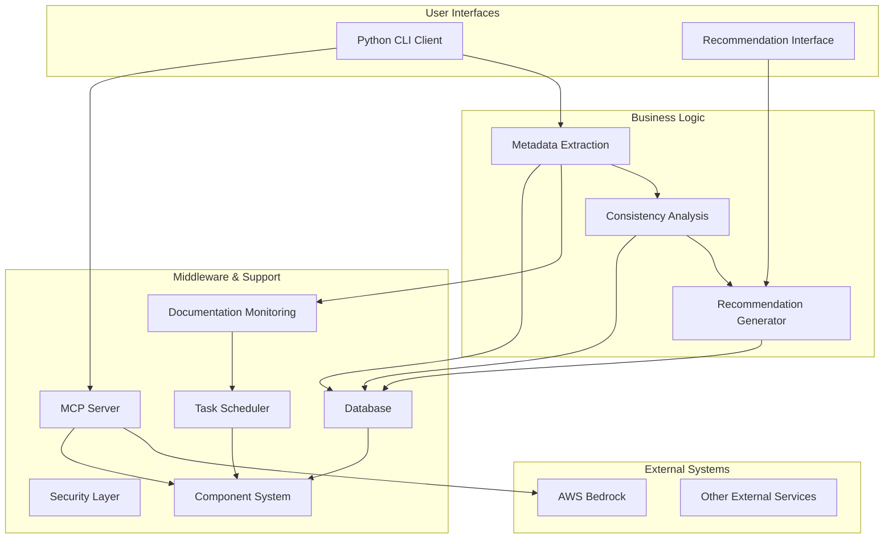
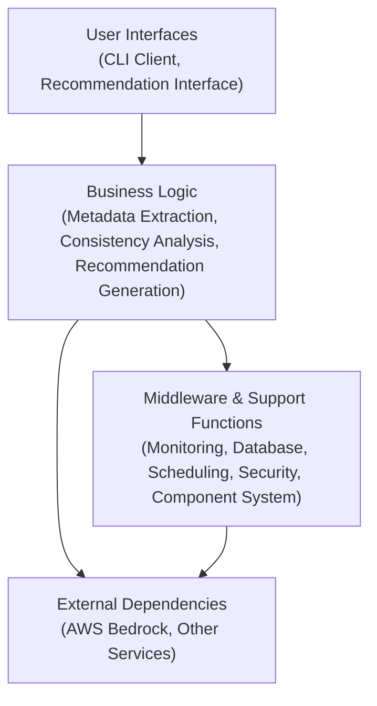
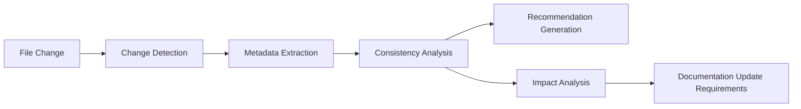
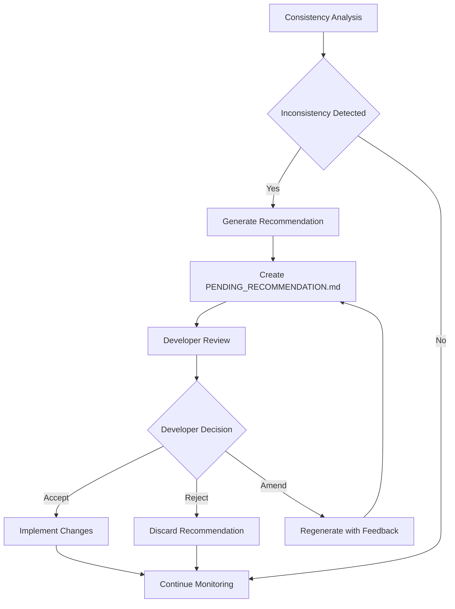
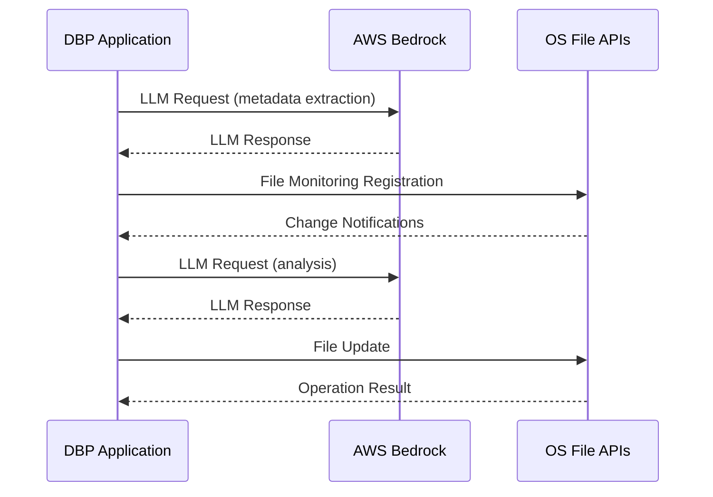

# Documentation-Based Programming System Architecture

This document describes the architectural principles, components, and design decisions for the Documentation-Based Programming system, which treats documentation as the single source of truth in a project.

## 1. General Architecture Overview

The Documentation-Based Programming system is built around the concept of documentation as the single source of truth, with architectural components designed to maintain consistency between documentation and code.

### System Architecture Diagram



### Stack Layers



### Core Architecture Principles

1. **Documentation as Source of Truth**: Documentation takes precedence over code itself for understanding project intent.
2. **Automatic Consistency Maintenance**: System actively ensures consistency between documentation and code.
3. **Global Contextual Awareness**: AI assistants maintain awareness of entire project context.
4. **Design Decision Preservation**: All significant design decisions are captured and maintained.
5. **Reasonable Default Values**: System provides carefully selected default values for all configurable parameters while allowing customization.
6. **Simplified Component Management**: System uses a minimalist component lifecycle approach focused on clarity and maintainability.

### Implementation Principles

1. **Avoid Manual Parsing**: Leverage Python libraries for parsing structured data (dates, times, etc.) rather than implementing custom parsers.
   - **Rationale**: Reduces maintenance burden and improves adaptability
   - **Implementation**: Use standard libraries rather than custom parsing logic
   
2. **Metadata Normalization via LLM**: Allow LLMs to handle metadata extraction and normalization rather than implementing rigid parsing logic.
   - **Rationale**: Leverages LLM capabilities for format adaptation rather than rigid parsing
   - **Implementation**: GenAI header templates are provided as-is in LLM context
   - **Benefits**: Offers greater flexibility despite potentially using more prompt tokens
   
3. **Precise LLM Prompts**: Provide detailed JSON schemas and formats in LLM tool prompts to ensure consistent output.
   - **Requirement**: LLM tool prompts must specify precise JSON formats and expected content
   - **Benefits**: Standardizes output despite relying on LLM output quality and consistency

4. **Thread-Safe Database Access**: Ensure all database operations are thread-safe through proper connection management.

5. **Code Size Governance**: Maintain files with maximum 600 lines, breaking down larger files as needed.
   - **Rationale**: Ensures code maintainability and readability
   - **Implementation**: Files exceeding limit are broken down into smaller files
   - **Implications**: May require additional cross-file references and imports
   
6. **Explicit Error Handling**: Use "throw on error" for all error cases with descriptive error messages.

7. **Centralized Exception Handling**: All exceptions are defined in a single centralized exceptions.py module to prevent circular imports.
   - **Rationale**: Ensures consistent error handling across all modules and eliminates the risk of circular import dependencies
   - **Implementation**: Single exceptions module containing all application exception classes
   - **Benefits**: Simplified import structure, consistent exception hierarchy, easier maintenance

8. **LLM-Exclusive Metadata Extraction**: Metadata extraction from GenAI headers and file headers MUST be performed exclusively by LLM with no programmatic fallback.
   - **Rationale**: Leverages LLM's natural language understanding capabilities to interpret documentation semantics rather than relying on rigid parsing logic
   - **Implementation**: Complete dependency on LLM for metadata extraction operations
   - **Benefits**: Improved adaptability to varied documentation formats, consistent extraction quality

9. **Standardized Logging Format**: All application logs follow a consistent format for ease of parsing and analysis.
   - **Format**: `YYYY-MM-DD HH:MM:SS,mmm - logger.name - LOGLEVEL - message`
   - **Implementation**: Centralized logging setup through `setup_application_logging()` in `log_utils.py`
   - **Components**: All components use the same logging configuration
   - **Benefits**: Easier log correlation, analysis, and troubleshooting across components

10. **Strict Configuration Access**: Component configuration uses direct attribute access on Pydantic models with no fallback mechanisms.
    - **Pattern**: Direct attribute notation (`config.attribute_name`) with no dictionary-style access (`config.get('key', 'default')`)
    - **Validation**: Missing or invalid configuration causes immediate failure with clear error messages
    - **Type Safety**: Preserves Pydantic's type checking benefits throughout the codebase
    - **Explicit Behavior**: All component behavior is directly tied to explicitly accessed configuration

### Out of Scope

- **Code Execution**: System does not execute code on developer's behalf
- **Security Testing**: No security vulnerability scanning capability
- **Performance Profiling**: No code performance analysis
- **External Integration**: No integrations with external systems/APIs

## 2. Provided Services

This section describes the interfaces that deliver the project's value to users.

### Python CLI Client

- **Component Purpose**: Provide a simple command-line interface for interacting with MCP servers
- **Implementation Strategy**: Lightweight Python CLI tool with minimal dependencies
- **Key Features**:
  - Connect to running MCP servers (default port 6231)
  - Issue requests to MCP servers with formatted parameters
  - Display formatted responses from MCP servers
  - Support for interactive and batch modes
  - Configuration through Cline software settings
- **Performance Constraints**: <50MB memory footprint, <100ms response time for local operations
- **Design Decision (2025-04-14)**: Command-based interface pattern for extensibility
  - **Rationale**: Enables easy addition of new commands without modifying core client logic, supports both interactive and script-based usage, provides consistent user experience across different operations
  - **Key Implications**: Command handlers can be developed independently, help documentation is auto-generated from command metadata, users benefit from consistent parameter handling

### Recommendation Interface

The system provides a file-based recommendation interface through the `PENDING_RECOMMENDATION.md` file.

#### Recommendation Workflow

1. **Detection**: System detects documentation or code changes
2. **Analysis**: Changes analyzed for consistency impacts
3. **Generation**: Single recommendation generated directly as `PENDING_RECOMMENDATION.md`
4. **Developer Review**: Developer reviews and sets ACCEPT/REJECT/AMEND
5. **Processing**: System processes the developer decision:
   - ACCEPT: Implements recommendation automatically
   - REJECT: Removes recommendation
   - AMEND: Regenerates recommendation with developer feedback
6. **Invalidation**: Any codebase change automatically invalidates and removes the pending recommendation

#### Developer Feedback System

- **Component Purpose**: Capture and process developer decisions on recommendations
- **Implementation Strategy**: File-based feedback mechanism with ACCEPT/REJECT/AMEND options
- **Processing Logic**: Immediate response to feedback file changes
- **Amendment Handling**: Regeneration of recommendations based on developer guidance
- **Design Decision**: Use file modifications as the primary feedback mechanism
  - **Rationale**: File-based approach integrates seamlessly with existing developer workflows and version control systems without requiring additional UI components
  - **Key Implications**: All recommendation interactions visible in version control history, creating an audit trail of documentation decisions

### MCP Server REST APIs

The MCP server exposes the following tools to MCP clients:

1. **dbp_general_query**
   - **Purpose**: Retrieve various types of codebase metadata
   - **Implementation**: Uses the LLM coordination architecture described in Section 3
   - **Processing**: Coordinator LLM determines which internal tools are required based on query
   - **Response**: Consolidated results from all executed internal tools

2. **dbp_commit_message**
   - **Purpose**: Generate comprehensive commit messages
   - **Identifies and summarizes all changes since the last commit
   - **Provides context-aware descriptions of modifications
   - **Includes impact analysis for structural changes

Please see [API.md](API.md) for detailed API specifications.

### Service Quality and Expectations

- **Response Time**:
  - CLI operations: <100ms for local operations
  - MCP queries: <3s for simple queries, <10s for complex analysis
  - Recommendation generation: <15s for complete processing

- **Reliability Metrics**:
  - 99.9% uptime for local processing components
  - <0.1% error rate for metadata extraction
  - 100% consistency in recommendation processing

- **Scalability Considerations**:
  - Support for codebases up to 100,000 files
  - Automatic resource throttling for large projects
  - Progressive indexing for initial processing

## 3. Business Logic

This section describes the internal logic that delivers the core business value of the project.

### Code Analysis Approach

1. **Claude 3.7 Sonnet-Based Analysis**: The system uses Claude 3.7 Sonnet LLM to analyze codebase files and extract metadata.
2. **Metadata Extraction Capabilities**:
   - Extract header sections from source files
   - Retrieve function lists with associated documentation sections
   - Determine file coding language
3. **Analysis Method**: Claude's natural language understanding is used to perform semantic analysis of code structures without relying on keyword-based parsing.
4. **LLM-Based Language Detection**: No programmatic language detection is needed as the LLM performs language detection inherently through its understanding of code structures and patterns.
5. **Parsing Prohibition**: Keyword-based parsing will never be used in any part of the application.

### Consistency Analysis

- **Component Purpose**: Analyze relationships between documentation and code
- **Implementation Strategy**: In-memory graph representation of document relationships
- **Analysis Types**:
  - Documentation-to-documentation consistency
  - Documentation-to-code alignment
  - Code-to-documentation impact analysis
- **Processing Strategy**: Background incremental processing with priority queuing
- **Design Decision (2025-04-13)**: Process only one codebase file at a time during background tasks
  - **Rationale**: Ensures consistent and predictable system resource usage, prevents resource spikes, simplifies debugging and error isolation, and allows for cleaner implementation of the processing queue
  - **Key Implications**: Processing large codebases will take longer, effective prioritization is required, and progress indicators should clearly show queue position



### Recommendation Generation

- **Component Purpose**: Create actionable recommendations to maintain documentation consistency
- **Implementation Strategy**: Template-based recommendation generation with contextual awareness
- **Recommendation Types**:
  - Documentation updates based on code changes
  - Code refactoring to align with documentation
  - Inconsistency resolution between documentation files
- **File Management**: Single active recommendation file



### MCP Request Processing

The MCP server provides essential tools through a sophisticated LLM coordination architecture that enables efficient processing of queries and requests.

#### Request Processing Workflow

1. **Request Ingestion**: The coordinator LLM receives an incoming MCP request
2. **Context Assembly**: Basic context is assembled including PR-FAQ.md, WORKING_BACKWARDS.md, and codebase file listings
3. **Tool Orchestration**: 
   - The coordinator LLM determines which internal tools are required
   - For each tool, it generates a unique UUID and queues a job internally
   - Multiple tools can execute in parallel across different LLM instances
4. **Result Collection**:
   - The coordinator waits for job completion notifications
   - Each internal tool reports success/error status along with execution context and results
5. **Response Formation**: Once all internal jobs complete, the coordinator formats a structured response
6. **Response Delivery**: The formatted response is sent to the MCP client

#### Internal LLM Tools

The coordinator LLM has access to these specialized internal tools:

1. **coordinator_get_codebase_context**
   - **Purpose**: Extract relevant file header information based on query context
   - **Implementation**: Dedicated Amazon Nova Lite instance
   - **Context Construction**: File headers focusing on "[Source file intent]" and "[Reference documentation]" sections
   - **Metadata Enrichment**: Includes statistics on header compliance, file counts, and organization
   - **Typical Queries**: 
     - "What files are involved in implementing feature X?"
     - "Where should I implement this new feature?"
     - "How is the codebase organized?"
   - **Response Format**: Structured analysis of relevant files with metadata

2. **coordinator_get_codebase_changelog_context**
   - **Purpose**: Analyze historical code changes across the codebase
   - **Implementation**: Dedicated Amazon Nova Lite instance
   - **Context Construction**: All "[GenAI tool change history]" sections from file headers
   - **Typical Queries**:
     - "What were the latest codebase changes?"
     - "What parts of the codebase have been most active recently?"
   - **Response Format**: Temporal analysis of code changes with relevance rankings

3. **coordinator_get_documentation_context**
   - **Purpose**: Answer questions about project documentation
   - **Implementation**: Dedicated Amazon Nova Lite instance
   - **Context Construction**: Content of all documentation markdown files (excluding MARKDOWN_CHANGELOG.md)
   - **Typical Queries**:
     - "If I implement feature X, what document files will be impacted?"
     - "Where is SQL table Y described?"
     - "Generate a dependency graph of documentation files"
     - "Are there inconsistencies in the documentation?"
   - **Response Format**: Documentation analysis with reference links

4. **coordinator_get_documentation_changelog_context**
   - **Purpose**: Analyze historical documentation changes
   - **Implementation**: Dedicated Amazon Nova Lite instance
   - **Context Construction**: All MARKDOWN_CHANGELOG.md file contents
   - **Typical Queries**:
     - "What documentation was recently updated?"
     - "What documentation changes relate to feature X?"
   - **Response Format**: Temporal analysis of documentation changes

5. **coordinator_get_expert_architect_advice**
   - **Purpose**: Provide advanced architectural reasoning and guidance
   - **Implementation**: Anthropic Claude 3.7 Sonnet with 10,000 token context
   - **Context Construction**: All sections from all available file headers
   - **Capabilities**: Uses read_files tool for additional context when needed
   - **Typical Queries**:
     - "What's the best approach to implement feature X?"
     - "How should we modify the architecture to support requirement Y?"
   - **Response Format**: Detailed architectural analysis with rationale

#### Common Internal Tools

All LLM instances have access to:

- **read_files**: 
  - **Operation**: Synchronous
  - **Purpose**: Read file contents from the codebase
  - **Parameters**: List of files to read
  - **Returns**: JSON with file metadata and content
  - **Usage**: Allows LLMs to dynamically retrieve additional context

## 4. External Dependencies toward Cooperating Systems

This section describes the system's integration with external services and APIs.

### AWS Bedrock Integration

The system integrates with AWS Bedrock for LLM services with the following approach:

- **Model Selection**: Different tasks utilize appropriate models:
  - Amazon Nova Lite for request coordination and simple queries
  - Claude 3.x models for more complex analysis tasks
- **Implementation Strategy**: Initially implemented with placeholder functions
  - Actual AWS Bedrock model interactions to be implemented separately
  - Standardized input and response validation in place (currently as placeholders)

### Integration with Cline's Context Management

The Documentation-Based Programming system integrates with Cline's context management in the following ways:
- Provides context enrichment for LLM interactions
- Complements MCP Server architecture
- Enhances Anthropic Claude prompt effectiveness

### External API Dependencies

The system relies on the following external APIs:
- AWS Bedrock API for LLM services
- Local filesystem APIs for file monitoring
- Operating system-specific monitoring APIs:
  - `inotify()` on Linux/WSL environments
  - `FSEvents` on macOS
  - `ReadDirectoryChangesW` on Windows

### Integration Patterns

- **Authentication Approaches**:
  - AWS credentials management via standard AWS SDK mechanisms
  - Local filesystem access using standard OS permissions
  
- **Error Handling Strategy**:
  - Explicit error reporting for all external API failures
  - Retry logic with exponential backoff for transient failures
  - Graceful degradation when external services are unavailable
  
- **Rate Limiting Considerations**:
  - Token budget management for LLM API calls
  - Intelligent batching of similar requests
  - Throttling mechanism for excessive requests
  
- **Fallback Strategies**:
  - Service unavailability reporting with clear error messages
  - Local caching of critical data to reduce API dependency
  - Progressive enhancement approach for non-critical features

### External System Communication Flow



## 5. Middleware and Support Functions

This section describes the technical internal infrastructure that supports the system's operation.

### Component Initialization System

The system implements a minimalist component management approach with:

1. **Simple Component Interface**: Clear lifecycle methods with explicit initialization and shutdown
2. **Centralized Component Registry**: Structured registry that allows registering components and declaring dependencies in one place
3. **Two-Step Process**: Validation followed by initialization for reliable startup
4. **Explicit Error Handling**: Immediate failure with clear error messages when dependency issues are detected
5. **Direct Dependency Injection**: Dependencies are provided directly to components during initialization rather than requiring them to fetch dependencies themselves

#### Component Registration and Dependency Management

The centralized component registration mechanism provides several key benefits:

1. **Improved Visibility**: Having all component dependencies declared in one place makes the system architecture more visible and easier to understand
2. **Reduced Duplication**: Eliminates the need to declare dependencies in multiple places
3. **Enhanced Testability**: Direct dependency injection makes components more testable by allowing easy mocking of dependencies
4. **Simplified Component Implementation**: Components receive their dependencies directly without having to fetch them

#### Dependency Validation Strategy

The system implements explicit dependency validation with:

1. **Immediate Validation**: Dependencies are verified during component initialization
2. **Fail-Fast Behavior**: Any missing dependency triggers immediate initialization failure
3. **Clear Error Messages**: Error messages identify exactly which component and which dependency caused the failure
4. **Improved Diagnostics**: Dependency errors include the exact dependency name to simplify troubleshooting

This approach ensures that dependency issues are caught early in the startup process rather than manifesting as runtime errors, significantly improving system reliability and debuggability.

The system also implements a selective component enablement mechanism:

1. **Configuration-Based Enablement**: Components can be individually enabled or disabled through configuration
2. **Default Configuration**: Essential components (config_manager, file_access, database, llm_coordinator, mcp_server) are enabled by default
3. **Resource Conservation**: Non-essential components are disabled by default to minimize resource usage
4. **LLM-Focused Operation**: Default configuration optimizes for LLM coordinator functionality with minimal footprint
5. **On-Demand Activation**: Additional components can be enabled via configuration as needed

Key principles of this approach:
- Explicit behavior over implicit mechanisms
- Direct component access over layers of abstraction
- Clear error reporting over sophisticated recovery
- Simplicity over feature-rich complexity

For detailed implementation specifics, see [Component Initialization](design/COMPONENT_INITIALIZATION.md).

### Documentation Monitoring

- **Component Purpose**: Detect changes in documentation and code files
- **Implementation Strategy**: 
  - Lightweight file system watcher with debounced updates
  - Persistent SQLite database for metadata storage
  - Background Task Scheduler for continuous monitoring and metadata extraction
- **Performance Constraints**: <5% CPU and <100MB RAM usage
- **Response Time**: Changes detected in real-time, processing initiated after 10-second delay (configurable)
- **Background Processing**:
  - Uses Amazon Nova Lite to extract metadata from codebase files
  - Maintains in-memory metadata cache synchronized with SQLite database
  - Performs extraction only for files missing from database or with changes
  - Initial scan processes all files to populate metadata database
  - After initial scan, transitions to event-based monitoring using system-specific APIs:
    - `inotify()` on Linux/WSL environments
    - `FSEvents` on macOS
    - `ReadDirectoryChangesW` on Windows
  - Reacts to file change events by re-extracting metadata for modified files
  - Progress information returned as part of MCP server tool responses
- **Dynamic File Exclusion Strategy**:
  - System automatically scans for and respects all .gitignore files throughout the codebase
  - Additionally excludes two mandatory patterns regardless of .gitignore contents:
    - `<project_root>/scratchpad/` directory and its contents
    - Any file or directory with "deprecated" in the path
  - When .gitignore files are modified:
    - Database is purged of existing metadata records that fall under newly added exclusions
    - Files in paths that are no longer excluded (removed from .gitignore) are automatically indexed
  - This approach ensures the indexing scope always remains in sync with Git-committable content
  - Rationale: Leverages developer-defined exclusions while maintaining database consistency
- **Design Decision (2025-04-13)**: Implement a persistent SQLite database for metadata storage
  - **Rationale**: Provides persistence across application restarts, reduces repeated metadata extraction, improves performance with incremental updates
  - **Key Implications**: Faster startup times after initial indexing, reduced CPU usage for large codebases, requires database schema migration strategy
- **Design Decision (2025-04-14)**: Implement a dedicated Background Task Scheduler
  - **Rationale**: Ensures continuous monitoring with minimal resource usage, provides thread-safe metadata access, and enables efficient metadata extraction
  - **Key Implications**: Improved responsiveness, better concurrency handling, more efficient resource utilization
  - **For detailed implementation specifics**: See [Background Task Scheduler](design/BACKGROUND_TASK_SCHEDULER.md)
- **Design Decision (2025-04-28)**: Redesign File System Monitor component
  - **Rationale**: Improves efficiency and flexibility with a listener-based architecture and direct config_manager dependency
  - **Key Implications**: Simplified API, better resource utilization, enhanced support for symlinks and directory events
  - **For detailed implementation specifics**: See [File System Monitor](design/FILE_SYSTEM_MONITOR.md)

### Security and Data Handling

The Documentation-Based Programming system implements comprehensive security measures to protect source code and documentation. Key security features include:

- Local processing with no external data transmission
- Complete isolation between indexed projects
- Resource usage limits and intelligent throttling
- Filesystem permission enforcement
- SQLite database protected by filesystem permissions

For detailed security information, architecture, and principles, see [SECURITY.md](SECURITY.md).

### Database Implementation

The system utilizes a SQLite database for persistent metadata storage with:

- **Schema Management**: Alembic-based migrations for schema evolution
- **Repository Pattern**: Data access abstraction through repository classes
- **Connection Management**: Thread-safe connection pooling
- **Transaction Handling**: Explicit transaction boundaries with proper error handling

For detailed database structures and relationships, see [DATA_MODEL.md](DATA_MODEL.md).

### Background Task Scheduler

The Background Task Scheduler provides:

- Thread pooling for concurrent task execution
- Priority-based task scheduling
- Graceful shutdown with task completion
- Task cancellation support
- Health monitoring and reporting

For detailed implementation, see [Background Task Scheduler](design/BACKGROUND_TASK_SCHEDULER.md).

### File System Structure

```
<project_root>/
├── coding_assistant/
│   ├── GENAI_HEADER_TEMPLATE.txt      # Template for file headers
│   └── dbp/                           # Documentation-Based Programming artifacts
│       └── PENDING_RECOMMENDATION.md  # Single active recommendation awaiting review
└── doc/
    ├── DESIGN.md                     # This file - architectural principles
    ├── DATA_MODEL.md                 # Database structures and relationships
    ├── DOCUMENT_RELATIONSHIPS.md     # Documentation dependency graph
    ├── PR-FAQ.md                     # Product requirements as press release and FAQ
    └── WORKING_BACKWARDS.md          # Product vision and customer experience
```

### MCP Server Internal Infrastructure

#### LLM Client Architecture

The system implements a unified architecture for Bedrock LLM clients that eliminates code duplication while maintaining model-specific behaviors:

1. **Common Code Patterns**: 
   - `BedrockRequestFormatter` abstract base class encapsulates model-specific request formatting
   - `BedrockClientMixin` provides reusable methods across all model clients
   - Common utility functions handle model invocation and response processing

2. **Strategy Pattern Implementation**:
   - Each model client delegates request formatting to a specialized formatter class
   - Formatter classes encapsulate model-specific request structures and parameters
   - Common invocation code remains model-agnostic, improving maintainability

3. **Composition Over Inheritance**:
   - Model clients inherit from `BedrockModelClientBase` for interface consistency
   - Common functionality is composed through mixins and utility functions
   - This approach supports different model behaviors without deep inheritance hierarchies

This architecture achieves approximately 50% reduction in model client implementation code while improving maintainability and making it easier to add support for new models.

#### External Prompt Template Files

LLM prompts for internal tools are not hardcoded in the server but read directly from doc/llm/prompts/ with no fallback mechanism:
- **Rationale**: Separates prompt content from code to enable prompt engineering without code changes
- **Implementation**: Server reads prompt templates from documentation directory at runtime
- **Benefits**: Maintains prompt version control within documentation, enables prompt optimization without code changes

#### Budget and Resource Management

To ensure responsible resource utilization:

1. **Per-Tool Cost Budgeting**:
   - Each internal tool execution has a maximum cost budget
   - When budget is reached, the LLM is instructed to conclude the task
   - Responses include "incomplete result" markers with appropriate metadata
   - Response metadata includes budget utilization information

2. **Timeout Management**:
   - Each tool execution has a maximum allowed execution time
   - Timeouts trigger graceful termination of the tool execution
   - LLM is instructed to provide partial results with timeout indication
   - Coordination ensures overall system stability despite individual timeouts

### Middleware Component Relationships

```mermaid
graph TD
    subgraph "Core Infrastructure"
        CONFIG["Config Manager"]
        REGISTRY["Component Registry"]
        FS_ACCESS["File Access"]
        LOG["Logging System"]
    end
    
    subgraph "Data Management"
        DB["Database"]
        REPOS["Repositories"]
        MODELS["Data Models"]
        MIGRATIONS["Schema Migrations"]
    end
    
    subgraph "Task Management"
        SCHEDULER["Background Task Scheduler"]
        QUEUES["Priority Queues"]
        TASKS["Task Definitions"]
        HEALTH["Health Monitor"]
    end
    
    subgraph "File Monitoring"
        WATCHER["File System Watcher"]
        EXCLUSION["Exclusion Manager"]
        EVENTS["Event Debouncer"]
        OS_APIS["OS-Specific APIs"]
    end
    
    CONFIG --> REGISTRY
    REGISTRY --> FS_ACCESS
    REGISTRY --> LOG
    
    DB --> REPOS
    DB --> MODELS
    DB --> MIGRATIONS
    
    SCHEDULER --> QUEUES
    SCHEDULER --> TASKS
    SCHEDULER --> HEALTH
    
    WATCHER --> EXCLUSION
    WATCHER --> EVENTS
    WATCHER --> OS_APIS
    
    CONFIG --> SCHEDULER
    CONFIG --> WATCHER
    FS_ACCESS --> WATCHER
    REPOS --> SCHEDULER
