# Documentation Relationships

This document maps the relationships between documentation files in the project. It serves as a central registry for tracking dependencies and impacts between documentation files, enabling the system to maintain global consistency.

## Relationship Graph

```mermaid
graph TD
    %% Core Documentation Nodes
    DESIGN[DESIGN.md]
    DESIGN_DECISIONS[DESIGN_DECISIONS.md]
    DATA_MODEL[DATA_MODEL.md]
    SECURITY[SECURITY.md]
    CONFIG[CONFIGURATION.md]
    DOC_REL[DOCUMENT_RELATIONSHIPS.md]
    PR_FAQ[PR-FAQ.md]
    WORKING_BACKWARDS[WORKING_BACKWARDS.md]
    
    %% Design Documents
    LLM_COORD[design/LLM_COORDINATION.md]
    INTERNAL_TOOLS[design/INTERNAL_LLM_TOOLS.md]
    COMPONENT_INIT[design/COMPONENT_INITIALIZATION.md]
    BACKGROUND_TASK[design/BACKGROUND_TASK_SCHEDULER.md]
    MCP_DATA_MODEL[design/MCP_SERVER_ENHANCED_DATA_MODEL.md]
    FS_MONITOR_DOC[design/FILE_SYSTEM_MONITOR.md]
    
    %% Code Components
    SCHEDULER[src/dbp/scheduler]
    FS_MONITOR[src/dbp/fs_monitor]
    MCP_SERVER[src/dbp/mcp_server]
    CONFIG_COMP[src/dbp/config]
    LLM_COORD_COMP[src/dbp/llm_coordinator]
    META_EXTRACT[src/dbp/metadata_extraction]
    DATABASE[src/dbp/database]
    ALEMBIC_MGR[src/dbp/database/alembic_manager.py]
    
    %% Other Resources
    LLM_PROMPTS[doc/llm/prompts/]
    
    %% Style definitions
    classDef rootNode fill:#f9f,stroke:#333,stroke-width:2px
    classDef leafNode fill:#bbf,stroke:#333,stroke-width:1px
    classDef designDoc fill:#fbb,stroke:#333,stroke-width:1px
    classDef resource fill:#bfb,stroke:#333,stroke-width:1px
    classDef codeComp fill:#fcf,stroke:#333,stroke-width:1px
    
    %% Root Node Relationships
    DESIGN_DECISIONS --> DESIGN
    DESIGN_DECISIONS --> DATA_MODEL
    DESIGN_DECISIONS --> CONFIG
    DESIGN_DECISIONS --> SECURITY
    DESIGN_DECISIONS --> LLM_PROMPTS
    DESIGN_DECISIONS --> INTERNAL_TOOLS
    DESIGN_DECISIONS --> BACKGROUND_TASK
    
    DESIGN --> DATA_MODEL
    DESIGN --> DOC_REL
    DESIGN --> LLM_COORD
    DESIGN --> SCHEDULER
    DESIGN --> FS_MONITOR
    DESIGN --> MCP_SERVER
    DESIGN --> CONFIG_COMP
    DESIGN --> LLM_COORD_COMP
    
    PR_FAQ --> WORKING_BACKWARDS
    
    %% Mid-level Node Relationships
    LLM_COORD --> INTERNAL_TOOLS
    LLM_COORD --> MCP_DATA_MODEL
    LLM_COORD --> LLM_COORD_COMP
    
    FS_MONITOR_DOC --> DESIGN
    FS_MONITOR_DOC --> CONFIG
    FS_MONITOR_DOC --> FS_MONITOR
    FS_MONITOR_DOC --> SCHEDULER
    
    LLM_PROMPTS --> INTERNAL_TOOLS
    LLM_PROMPTS --> LLM_COORD_COMP
    
    BACKGROUND_TASK --> DESIGN
    BACKGROUND_TASK --> CONFIG
    BACKGROUND_TASK --> COMPONENT_INIT
    BACKGROUND_TASK --> SCHEDULER
    
    COMPONENT_INIT --> DESIGN
    COMPONENT_INIT --> CONFIG
    
    %% Leaf Node Dependencies
    DATA_MODEL --> SECURITY
    DATA_MODEL --> META_EXTRACT
    WORKING_BACKWARDS --> SECURITY
    
    %% Code Component Relationships
    SCHEDULER --> FS_MONITOR
    MCP_SERVER --> LLM_COORD_COMP
    CONFIG_COMP --> MCP_SERVER
    META_EXTRACT --> LLM_COORD_COMP
    DATABASE --> ALEMBIC_MGR
    
    %% Apply styles
    class DESIGN_DECISIONS,DESIGN,PR_FAQ rootNode
    class CONFIG,SECURITY,DATA_MODEL,DOC_REL,WORKING_BACKWARDS leafNode
    class LLM_COORD,INTERNAL_TOOLS,COMPONENT_INIT,BACKGROUND_TASK,MCP_DATA_MODEL designDoc
    class LLM_PROMPTS resource
    class SCHEDULER,FS_MONITOR,MCP_SERVER,CONFIG_COMP,LLM_COORD_COMP,META_EXTRACT codeComp
```

## Database Documentation Relationships
- **DATABASE** (src/dbp/database/database.py) provides database connection management
- **ALEMBIC_MGR** (src/dbp/database/alembic_manager.py) handles schema migrations
- DATABASE depends on ALEMBIC_MGR for schema management
- Both depend on DESIGN_DECISIONS.md for the "Dedicated AlembicManager" design decision

## Code Analysis Documentation Relationships

- **DESIGN.md** contains the high-level approach to using Claude 3.7 Sonnet for code analysis
- **DATA_MODEL.md** defines the structure of metadata extracted by Claude 3.7 Sonnet

## Relationship Types

- **Depends on**: Document A depends on information in Document B. Changes to Document B may require updates to Document A.
- **Impacts**: Document A contains information that may affect Document B. Changes to Document A may require updates to Document B.

This graph structure helps the system determine the correct order for propagating updates and ensuring global consistency.

## Core Documentation

## SECURITY.md
- Depends on: [DESIGN.md](#designmd) - Topic: Security requirements - Scope: System-wide security
- Depends on: [DATA_MODEL.md](#data_modelmd) - Topic: Data protection - Scope: Database security
- Depends on: [WORKING_BACKWARDS.md](#working_backwardsmd) - Topic: Resource constraints - Scope: Performance security
- Impacts: [src/dbp/mcp_server/auth.py] - Topic: Implementation - Scope: Security enforcement

## CONFIGURATION.md
- Depends on: [DESIGN.md](#designmd) - Topic: System components - Scope: Configurable parameters
- Depends on: [DATA_MODEL.md](#data_modelmd) - Topic: CLI Client model - Scope: Configuration structure
- Depends on: [DESIGN_DECISIONS.md](#design_decisionsmd) - Topic: Configuration strategy - Scope: Default values policy
- Depends on: [DESIGN_DECISIONS.md](#design_decisionsmd) - Topic: Centralized Default Configuration Values - Scope: Configuration management
- Depends on: [DESIGN_DECISIONS.md](#design_decisionsmd) - Topic: Configuration Key Reorganization for Clarity - Scope: CLI-related configuration naming
- Impacts: [src/dbp/config/default_config.py] - Topic: Implementation - Scope: Configuration defaults
- Impacts: [src/dbp/config/config_schema.py] - Topic: Implementation - Scope: Configuration schema

## DESIGN_DECISIONS.md
- Depends on: None
- Impacts: [DESIGN.md](#designmd) - Topic: Design decisions - Scope: Project-wide architectural choices
- Impacts: [DATA_MODEL.md](#data_modelmd) - Topic: Design decisions - Scope: Database implementation and persistence strategy
- Impacts: [CONFIGURATION.md](#configurationmd) - Topic: Configuration strategy - Scope: Default values policy
- Impacts: [CONFIGURATION.md](#configurationmd) - Topic: Configuration Key Reorganization for Clarity - Scope: CLI-related configuration naming
- Impacts: [SECURITY.md](#securitymd) - Topic: MCP client security - Scope: Credential management
- Impacts: [DATA_MODEL.md](#data_modelmd) - Topic: Enhanced metadata extraction - Scope: MD5 digest storage
- Impacts: [DATA_MODEL.md](#data_modelmd) - Topic: LLM-Based Metadata Extraction - Scope: Metadata extraction approach
- Impacts: [DESIGN.md](#designmd) - Topic: LLM-Based Metadata Extraction - Scope: Implementation principles
- Impacts: [design/BACKGROUND_TASK_SCHEDULER.md](#designbackground_task_schedulermd) - Topic: LLM-Based Metadata Extraction - Scope: Extraction process
- Impacts: [design/INTERNAL_LLM_TOOLS.md](#designinternal_llm_toolsmd) - Topic: External Prompt Template Files - Scope: Tool implementation
- Impacts: [doc/llm/prompts/](#docllmprompts) - Topic: External Prompt Template Files - Scope: Template structure and usage
- Impacts: [DATA_MODEL.md](#data_modelmd) - Topic: LLM-Based Language Detection - Scope: Language detection approach
- Impacts: [DESIGN.md](#designmd) - Topic: LLM-Based Language Detection - Scope: Programming language support
- Impacts: [SECURITY.md](#securitymd) - Topic: Default Network Binding - Scope: Service binding security
- Impacts: [CONFIGURATION.md](#configurationmd) - Topic: Default Network Binding - Scope: MCP server network configuration
- Impacts: [DESIGN.md](#designmd) - Topic: MCP Server Interface Consistency - Scope: CLI and MCP server integration
- Impacts: [CONFIGURATION.md](#configurationmd) - Topic: MCP Server Interface Consistency - Scope: Shared configuration handling
- Impacts: [DESIGN.md](#designmd) - Topic: Simplified Component Management - Scope: Component lifecycle approach
- Impacts: [DESIGN.md](#designmd) - Topic: Component Initialization System - Scope: Component management implementation
- Impacts: [DESIGN.md](#designmd) - Topic: LLM Client Architecture - Scope: Bedrock client implementation
- Impacts: [src/dbp/config/default_config.py] - Topic: Configuration Key Reorganization - Scope: Configuration structure
- Impacts: [src/dbp/core/log_utils.py] - Topic: Standardized Log Format - Scope: Logging implementation
- Impacts: [src/dbp/core/lifecycle.py] - Topic: Standardized Log Format - Scope: Application logging setup
- Impacts: [src/dbp/core/lifecycle.py] - Topic: Component Enablement System - Scope: Component registration logic
- Impacts: [src/dbp/config/config_schema.py] - Topic: Component Enablement System - Scope: Configuration schema
- Impacts: [src/dbp/config/default_config.py] - Topic: Component Enablement System - Scope: Default component enablement
- Impacts: [CONFIGURATION.md] - Topic: Component Enablement System - Scope: Selective component loading

## DESIGN.md
- Depends on: None
- Impacts: [DATA_MODEL.md](#data_modelmd) - Topic: System architecture - Scope: Entire system design
- Impacts: [DATA_MODEL.md](#data_modelmd) - Topic: Security considerations - Scope: Data protection and access controls
- Impacts: [DOCUMENT_RELATIONSHIPS.md](#document_relationshipsmd) - Topic: Documentation structure - Scope: File structure and workflow
- Impacts: [src/dbp/core/system.py] - Topic: Implementation - Scope: System architecture
- Impacts: [src/dbp/core/lifecycle.py] - Topic: Implementation - Scope: Component lifecycle

## DATA_MODEL.md
- Depends on: [DESIGN.md](#designmd) - Topic: General Architecture Overview - Scope: Entire system design
- Depends on: [DESIGN.md](#designmd) - Topic: Business Logic - Code Analysis Approach - Scope: Metadata extraction structure
- Depends on: [DESIGN.md](#designmd) - Topic: Middleware and Support Functions - Security and Data Handling - Scope: Data protection and access controls
- Depends on: [DESIGN.md](#designmd) - Topic: General Architecture Overview - Implementation Principles - Scope: Data handling approaches (moved from DESIGN_DECISIONS.md)
- Depends on: [DESIGN.md](#designmd) - Topic: Provided Services - Python CLI Client - Scope: Client component design
- Depends on: [DESIGN_DECISIONS.md](#design_decisionsmd) - Topic: LLM-Based Metadata Extraction - Scope: Metadata extraction approach
- Depends on: [DESIGN_DECISIONS.md](#design_decisionsmd) - Topic: LLM-Based Language Detection - Scope: Language detection approach
- Depends on: [DESIGN_DECISIONS.md](#design_decisionsmd) - Topic: Use Alembic for Database Schema Management - Scope: Database migration strategy
- Depends on: [DESIGN_DECISIONS.md](#design_decisionsmd) - Topic: Dedicated AlembicManager for Database Schema Migration - Scope: Database implementation
- Impacts: [src/dbp/database/models.py] - Topic: Implementation - Scope: Database schema
- Impacts: [src/dbp/database/database.py] - Topic: Implementation - Scope: Database connection management
- Impacts: [src/dbp/database/alembic_manager.py] - Topic: Implementation - Scope: Schema migration
- Impacts: [src/dbp/metadata_extraction/data_structures.py] - Topic: Implementation - Scope: Metadata structures

## DOCUMENT_RELATIONSHIPS.md
- Depends on: [DESIGN.md](#designmd) - Topic: Documentation structure - Scope: File structure and workflow

## PR-FAQ.md
- Depends on: None
- Impacts: [WORKING_BACKWARDS.md](#working_backwardsmd) - Topic: Product vision - Scope: User experience and implementation details

## WORKING_BACKWARDS.md
- Depends on: [PR-FAQ.md](#pr-faqmd) - Topic: Product vision - Scope: High-level product concepts
- Impacts: [src/dbp_cli/README.md] - Topic: User interfaces - Scope: CLI design principles

## Recommendation Templates

## Recommendation Files
- Depends on: [DATA_MODEL.md](#data_modelmd) - Topic: Recommendation structure - Scope: File format and data fields
- Impacts: [src/dbp/recommendation_generator/data_models.py] - Topic: Implementation - Scope: Recommendation structures

## Update Workflow

When documentation files are updated:

1. Check this document to identify all related documents that may be impacted
2. Review the identified documents for potential inconsistencies
3. Update this document if new relationships are identified or existing relationships change

## Relationship Management Guidelines

1. **Specificity**: Make relationship topics as specific as possible to aid in impact analysis
2. **Completeness**: Ensure all meaningful relationships are captured
3. **Bidirectionality**: Every "Depends on" should have a corresponding "Impacts" in the target document
4. **Minimalism**: Only record relationships that provide meaningful information for maintaining consistency

## Design Implementation Documents

## design/LLM_COORDINATION.md
- Depends on: [DESIGN.md](#designmd) - Topic: Business Logic - MCP Request Processing - Scope: LLM coordination architecture
- Depends on: [DATA_MODEL.md](#data_modelmd) - Topic: Data structures - Scope: Job tracking and request/response models
- Depends on: [SECURITY.md](#securitymd) - Topic: Security measures - Scope: Multi-LLM security considerations
- Impacts: [design/INTERNAL_LLM_TOOLS.md](#designinternal_llm_toolsmd) - Topic: Tool integration - Scope: Coordination architecture
- Impacts: [design/MCP_SERVER_ENHANCED_DATA_MODEL.md](#designmcp_server_enhanced_data_modelmd) - Topic: Tool data models - Scope: MCP server implementation
- Impacts: [src/dbp/llm_coordinator/component.py] - Topic: Implementation - Scope: LLM coordinator component

## design/INTERNAL_LLM_TOOLS.md
- Depends on: [design/LLM_COORDINATION.md](#designllm_coordinationmd) - Topic: Tool integration - Scope: Coordination architecture
- Depends on: [DESIGN.md](#designmd) - Topic: Business Logic - MCP Request Processing - Internal LLM Tools - Scope: Tool purposes and capabilities
- Depends on: [doc/llm/prompts/](#docllmprompts) - Topic: Prompt templates - Scope: LLM processing approach
- Depends on: [DESIGN_DECISIONS.md](#design_decisionsmd) - Topic: External Prompt Template Files - Scope: Tool implementation
- Impacts: [src/dbp/internal_tools/component.py] - Topic: Implementation - Scope: Internal LLM tool component

## design/MCP_SERVER_ENHANCED_DATA_MODEL.md
- Depends on: [design/LLM_COORDINATION.md](#designllm_coordinationmd) - Topic: MCP-exposed tools - Scope: Implementation details
- Depends on: [DATA_MODEL.md](#data_modelmd) - Topic: Data structures - Scope: Request/response model enhancement
- Depends on: [SECURITY.md](#securitymd) - Topic: Security features - Scope: Input/output validation
- Impacts: [src/dbp/mcp_server/component.py] - Topic: Implementation - Scope: MCP server data models
- Impacts: [src/dbp/mcp_server/data_models.py] - Topic: Implementation - Scope: MCP server data structures

## design/COMPONENT_INITIALIZATION.md
- Depends on: [DESIGN.md](#designmd) - Topic: Middleware and Support Functions - Component Initialization System - Scope: Component dependencies and structure
- Depends on: [DATA_MODEL.md](#data_modelmd) - Topic: Database structures - Scope: Database initialization
- Depends on: [CONFIGURATION.md](#configurationmd) - Topic: Initialization parameters - Scope: Configuration options
- Depends on: [SECURITY.md](#securitymd) - Topic: Security considerations - Scope: Secure initialization process
- Depends on: [design/BACKGROUND_TASK_SCHEDULER.md](#designbackground_task_schedulermd) - Topic: Background processing - Scope: Task scheduling
- Depends on: [design/LLM_COORDINATION.md](#designllm_coordinationmd) - Topic: LLM services - Scope: Service initialization
- Impacts: [DESIGN.md](#designmd) - Topic: System startup - Scope: Component initialization sequence
- Impacts: [CONFIGURATION.md](#configurationmd) - Topic: Initialization parameters - Scope: Configuration structure
- Impacts: [src/dbp/core/component.py] - Topic: Implementation - Scope: Component base class

## design/BACKGROUND_TASK_SCHEDULER.md
- Depends on: [DESIGN.md](#designmd) - Topic: Middleware and Support Functions - Documentation Monitoring - Scope: Background processing architecture
- Depends on: [DATA_MODEL.md](#data_modelmd) - Topic: Metadata Extraction Model - Scope: Metadata structure and storage
- Depends on: [CONFIGURATION.md](#configurationmd) - Topic: Background Task Scheduler - Scope: Configuration parameters
- Depends on: [SECURITY.md](#securitymd) - Topic: Security considerations - Scope: Data protection and permissions
- Depends on: [DESIGN_DECISIONS.md](#design_decisionsmd) - Topic: Enhanced metadata extraction - Scope: MD5 digest storage
- Depends on: [DESIGN_DECISIONS.md](#design_decisionsmd) - Topic: LLM-Based Metadata Extraction - Scope: Extraction process
- Impacts: [DESIGN.md](#designmd) - Topic: Middleware and Support Functions - Documentation Monitoring - Scope: Implementation details
- Impacts: [CONFIGURATION.md](#configurationmd) - Topic: Background Task Scheduler - Scope: Configuration parameters
- Impacts: [design/COMPONENT_INITIALIZATION.md](#designcomponent_initializationmd) - Topic: Background processing - Scope: Task scheduling
- Impacts: [src/dbp/scheduler/component.py] - Topic: Implementation - Scope: Task scheduler component

## doc/llm/prompts/
- Depends on: [DESIGN_DECISIONS.md](#design_decisionsmd) - Topic: Prompt template management - Scope: Template structure and organization
- Depends on: [DESIGN_DECISIONS.md](#design_decisionsmd) - Topic: LLM processing approach - Scope: Template usage guidance
- Depends on: [DESIGN_DECISIONS.md](#design_decisionsmd) - Topic: External Prompt Template Files - Scope: Template structure and usage
- Impacts: [design/INTERNAL_LLM_TOOLS.md](#designinternal_llm_toolsmd) - Topic: Tool integration - Scope: Prompt templates for LLM tools
- Impacts: [src/dbp/llm_coordinator/coordinator_llm.py] - Topic: Implementation - Scope: LLM prompt handling

## Code Component Relationships

## src/dbp/database
- Depends on: [DATA_MODEL.md](#data_modelmd) - Topic: Implementation - Scope: Database structure and schema management
- Depends on: [DESIGN_DECISIONS.md](#design_decisionsmd) - Topic: Implementation - Scope: Database architecture and migration strategy
- Depends on: [DESIGN_DECISIONS.md](#design_decisionsmd) - Topic: Implementation - Scope: Dedicated AlembicManager design decision
- Impacts: None

## src/dbp/scheduler
- Depends on: [design/BACKGROUND_TASK_SCHEDULER.md](#designbackground_task_schedulermd) - Topic: Implementation - Scope: Task scheduler architecture
- Depends on: [src/dbp/fs_monitor] - Topic: Implementation - Scope: Filesystem event handling
- Impacts: None

## design/FILE_SYSTEM_MONITOR.md
- Depends on: [DESIGN.md](#designmd) - Topic: Middleware and Support Functions - Documentation Monitoring - Scope: Filesystem monitoring architecture
- Depends on: [CONFIGURATION.md](#configurationmd) - Topic: Configuration options - Scope: File system monitor settings
- Impacts: [src/dbp/fs_monitor] - Topic: Implementation - Scope: File system monitor component design
- Impacts: [src/dbp/scheduler] - Topic: Implementation - Scope: Event-based task scheduling integration

## src/dbp/fs_monitor
- Depends on: [DESIGN.md](#designmd) - Topic: Middleware and Support Functions - Documentation Monitoring - Scope: Filesystem monitoring strategy
- Depends on: [design/FILE_SYSTEM_MONITOR.md](#designfile_system_monitormd) - Topic: Implementation - Scope: File system monitor component design
- Impacts: [src/dbp/scheduler] - Topic: Implementation - Scope: Event-based task scheduling

## src/dbp/mcp_server
- Depends on: [design/MCP_SERVER_ENHANCED_DATA_MODEL.md](#designmcp_server_enhanced_data_modelmd) - Topic: Implementation - Scope: Server data model
- Depends on: [SECURITY.md](#securitymd) - Topic: Implementation - Scope: Authentication and authorization
- Depends on: [src/dbp/llm_coordinator] - Topic: Implementation - Scope: LLM service coordination
- Impacts: None

## src/dbp/config
- Depends on: [CONFIGURATION.md](#configurationmd) - Topic: Implementation - Scope: Configuration management
- Impacts: [src/dbp/mcp_server] - Topic: Implementation - Scope: Server configuration

## Relationship Graph

The documentation relationship graph forms a directed acyclic graph (DAG) with the following characteristics:

- **DESIGN_DECISIONS.md**: Root node with outgoing edges to multiple documents as design decisions are added
- **DESIGN.md**: Root node with outgoing edges to multiple documents and components
- **PR-FAQ.md**: Root node with outgoing edge to WORKING_BACKWARDS.md
- **design/LLM_COORDINATION.md**: Node with outgoing edges to multiple documents and components
- **Code components**: Represent implementation of design concepts documented in design documents
- **design/COMPONENT_INITIALIZATION.md**: Node with multiple incoming edges and outgoing edges to documents and components
- **design/BACKGROUND_TASK_SCHEDULER.md**: Node with incoming edges from design documents and outgoing edges to implementation components
