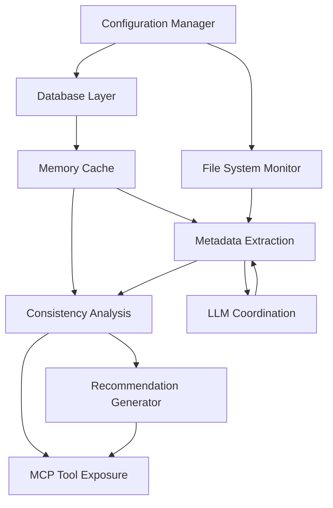
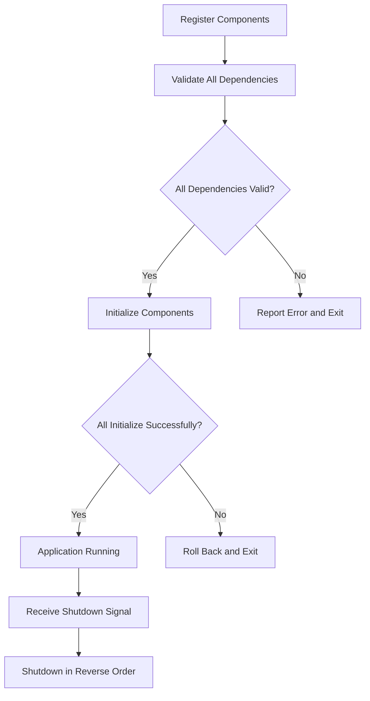

# Component Initialization Sequence - KISS Approach

This document describes the simplified initialization sequence for the Documentation-Based Programming system components, implementing a KISS (Keep It Simple, Stupid) approach to component lifecycle management.

## Overview

The Documentation-Based Programming system consists of multiple interdependent components that must be initialized in a specific sequence to ensure proper operation. This document defines a simplified initialization strategy that:

- Ensures components are started in the correct order based on their dependencies
- Provides clear error handling during initialization
- Defines a straightforward shutdown sequence
- Promotes code simplicity and maintainability

### Key Initialization Principles

1. **Absolute Simplicity**: Minimal code, maximum readability
2. **No Complex Algorithms**: Simple dependency lists with direct validation
3. **Straightforward Error Handling**: Clear errors, minimal recovery logic
4. **Single Responsibility**: Each component manages its own lifecycle
5. **Explicit Dependencies**: No hidden dependencies between components

## System Components and Dependencies

The Documentation-Based Programming system includes these major components with their dependencies:



### Component Initialization Requirements

| Component | Required Dependencies | Optional Dependencies |
|-----------|------------------------|------------------------|
| Configuration Manager | None | None |
| Database Layer | Configuration Manager | None |
| Memory Cache | Database Layer | None |
| File System Monitor | Configuration Manager | None |
| LLM Coordination | Configuration Manager | None |
| Metadata Extraction | Memory Cache, File System Monitor, LLM Coordination | None |
| Consistency Analysis | Memory Cache, Metadata Extraction | None |
| Recommendation Generator | Consistency Analysis | None |
| MCP Tool Exposure | Consistency Analysis, Recommendation Generator | None |

## Component Interface

Each component must implement the Component interface:

```python
class Component:
    def __init__(self):
        self._initialized = False
        self.logger = None
    
    @property
    def name(self) -> str:
        # Must be implemented by concrete components
        raise NotImplementedError("Component must implement name property")
    
    @property
    def is_initialized(self) -> bool:
        return self._initialized
    
    def get_dependency(self, dependencies: Dict[str, 'Component'], name: str) -> Any:
        """
        Safely access a dependency by name from the provided dependencies dictionary.
        
        Args:
            dependencies: Dictionary of dependencies {name: component_instance}
            name: Name of the dependency to retrieve
            
        Returns:
            The requested dependency component
            
        Raises:
            KeyError: If the dependency is not found
        """
        if name not in dependencies:
            raise KeyError(f"Required dependency '{name}' not found in provided dependencies")
        return dependencies[name]
    
    def initialize(self, context: InitializationContext, dependencies: Dict[str, 'Component']) -> None:
        # Must be implemented by concrete components
        # MUST set self._initialized = True when initialization succeeds
        raise NotImplementedError("Component must implement initialize method")
    
    def shutdown(self) -> None:
        # Must be implemented by concrete components
        # MUST set self._initialized = False when shutdown completes
        raise NotImplementedError("Component must implement shutdown method")
```

## Centralized Component Registration

The system now uses a centralized component registration approach to make dependencies more visible and maintainable:

1. Components are registered with the `ComponentRegistry` with explicit dependency declarations
2. Dependencies are resolved and injected during component initialization
3. Component implementation can use the injected dependencies directly

### Component Registration

Components are registered with the `ComponentRegistry` by specifying:
- The component class
- An explicit list of dependency component names
- An optional enabled flag

```python
# Example: Registering a component with explicit dependencies
registry.register_component(
    component_class=DatabaseComponent, 
    dependencies=["config_manager"],
    enabled=True
)
```

### Component Initialization

Components now receive their dependencies directly during initialization:

```python
def initialize(self, context: InitializationContext, dependencies: Dict[str, Component]) -> None:
    # Access dependencies directly from the dependencies dictionary
    config_manager = self.get_dependency(dependencies, "config_manager")
    
    # Use the dependencies
    connection_string = config_manager.get('database.connection_string')
    
    # Continue initialization
    self.connection = sqlite3.connect(connection_string)
    
    self._initialized = True
```

## Initialization Process



### Initialization Algorithm

The initialization algorithm is intentionally simple:

1. Create a set of components that need to be initialized
2. While there are components to initialize:
   - Find a component whose dependencies are all initialized
   - Initialize that component
   - If no component can be initialized, there's a circular dependency
3. If any component fails to initialize:
   - Roll back already initialized components
   - Report clear error message and exit

### Shutdown Process

Shutdown is performed in the exact reverse order of initialization:

1. For each component in reverse initialization order:
   - Call the component's shutdown method
   - Log any errors but continue shutdown process
2. Clear the list of initialized components

## Error Handling

The error handling strategy is intentionally minimalist:

1. **Validation Errors**: Report and exit before initialization begins
2. **Initialization Errors**: Roll back initialized components and exit
3. **Shutdown Errors**: Log but continue with shutdown sequence

## Example Component Implementation

```python
class DatabaseComponent(Component):
    """Database component implementation."""
    
    @property
    def name(self) -> str:
        return "database"
    
    def initialize(self, context: InitializationContext, dependencies: Dict[str, Component]) -> None:
        """
        [Function intent]
        Initializes the database component.
        
        [Implementation details]
        Uses the provided configuration to establish a database connection.
        
        [Design principles]
        Explicit initialization with dependency injection.
        """
        self.logger = context.logger
        self.logger.info("Initializing database connection")
        
        # Get configuration from the config manager dependency
        config_manager = self.get_dependency(dependencies, "config_manager")
        
        # Get typed configuration
        typed_config = context.get_typed_config()
        db_config = typed_config.database
        
        # Simplified initialization
        try:
            self.connection = sqlite3.connect(db_config.path)
            self._initialized = True
            self.logger.info("Database initialized")
        except Exception as e:
            self.logger.error(f"Database initialization failed: {e}")
            raise
    
    def shutdown(self) -> None:
        """
        [Function intent]
        Shuts down the database component.
        
        [Implementation details]
        Closes the database connection if it exists.
        
        [Design principles]
        Clean resource management.
        """
        if hasattr(self, 'connection'):
            self.logger.info("Closing database connection")
            self.connection.close()
        self._initialized = False
```

### Component Registration Example

```python
# In the application startup code:
registry = ComponentRegistry()

# Register components with explicit dependencies
registry.register_component(ConfigManagerComponent, dependencies=[])
registry.register_component(DatabaseComponent, dependencies=["config_manager"])
registry.register_component(MemoryCacheComponent, dependencies=["database"])
registry.register_component(MetadataExtractionComponent, dependencies=["database", "memory_cache"])

# Register components with the system
registry.register_with_system(component_system)
```

## Component System Implementation

The ComponentSystem class provides a centralized mechanism for managing components:

1. **Registration**: Components are registered by name in a simple dictionary
2. **Dependency Validation**: Ensures all component dependencies exist
3. **Initialization Order Calculation**: Determines correct component initialization order
4. **Initialization Execution**: Initializes components in dependency order
5. **Shutdown Management**: Handles graceful shutdown in reverse order

## Shutdown Triggers

The system responds to these shutdown triggers:
- Normal shutdown via API call
- SIGTERM signal (graceful shutdown)
- SIGINT signal (interrupt, attempt graceful)
- MCP server shutdown event
- Host application shutdown

## Relationship to Other Components

This initialization sequence design is related to:

- **[DESIGN.md](../DESIGN.md)**: Overall system architecture containing these components
- **[BACKGROUND_TASK_SCHEDULER.md](BACKGROUND_TASK_SCHEDULER.md)**: Details on background task scheduling after initialization
- **[DATA_MODEL.md](../DATA_MODEL.md)**: Database structures initialized during startup
- **[CONFIGURATION.md](../CONFIGURATION.md)**: Configuration parameters that affect initialization
- **[SECURITY.md](../SECURITY.md)**: Security considerations during initialization
- **[LLM_COORDINATION.md](LLM_COORDINATION.md)**: LLM service initialization details
