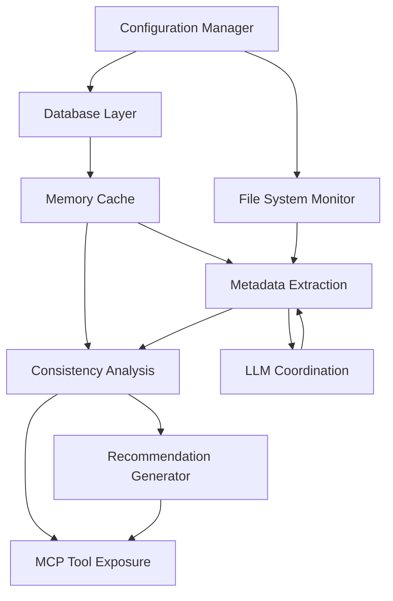

# Component Initialization Sequence

This document describes the initialization sequence and bootstrap process for the Documentation-Based Programming system components, ensuring proper startup order and dependency management.

## Overview

The Documentation-Based Programming system consists of multiple interdependent components that must be initialized in a specific sequence to ensure proper operation. This document defines a robust initialization strategy that:

- Ensures components are started in the correct order based on their dependencies
- Provides clear error handling and recovery mechanisms during initialization
- Defines a graceful shutdown sequence for system termination
- Addresses how configuration impacts the initialization process
- Establishes health monitoring during and after initialization

### Key Initialization Principles

1. **Dependency-Driven Sequence**: Components initialize only after their dependencies are ready
2. **Graceful Failure Handling**: System can recover or gracefully degrade when components fail to initialize
3. **Configuration Validation First**: Configuration validation occurs before component initialization
4. **Resource Allocation Control**: Resources are allocated in controlled manner to prevent overconsumption
5. **Verification Before Proceeding**: Each component verifies its operational status before signaling readiness
6. **Timeout Protection**: Initialization stages have timeouts to prevent indefinite waiting
7. **State Reporting**: System provides clear status reporting during initialization

## System Components and Dependencies

The Documentation-Based Programming system includes these major components with their dependencies:

### Component Initialization Requirements

| Component | Required Dependencies | Optional Dependencies |
|-----------|------------------------|------------------------|
| Configuration Manager | None | None |
| Database Layer | Configuration Manager | None |
| Memory Cache | Database Layer | None |
| File System Monitor | Configuration Manager | None |
| LLM Coordination | Configuration Manager | None |
| Metadata Extraction | Memory Cache, File System Monitor, LLM Coordination | None |
| Consistency Analysis | Memory Cache, Metadata Extraction | None |
| Recommendation Generator | Consistency Analysis | None |
| MCP Tool Exposure | Consistency Analysis, Recommendation Generator | None |

## Initialization Stages

The system initialization occurs in clearly defined stages, where each stage must successfully complete before the next begins:

### Stage 1: Pre-Initialization
- Resource allocation and validation
- Configuration loading and validation
- Logging setup
- Environment verification

### Stage 2: Core Services Initialization
- Database connection establishment
- Schema validation and migration
- Memory cache initialization
- Core service health checks

### Stage 3: Infrastructure Services Initialization
- File system monitor setup
- LLM service connection establishment
- Worker thread pool creation
- Infrastructure services health checks

### Stage 4: Processing Services Initialization
- Metadata extraction service setup
- Initial codebase scanning
- Consistency analysis engine preparation
- Processing services health checks

### Stage 5: User-Facing Services Initialization
- Recommendation generator setup
- MCP tool registration
- User interface components
- User-facing services health checks

### Stage 6: Post-Initialization
- System readiness verification
- Performance baseline establishment
- Initial background task scheduling
- Notification of system readiness

## Initialization Process

### Detailed Sequence

1. **Configuration Loading and Validation**
   - Load configuration from all sources in priority order
   - Validate parameter values against allowed ranges
   - Apply defaults for missing parameters
   - Verify configuration consistency
   - Initialize logging with appropriate levels
   - **Timeout**: 5 seconds
   - **Error Handling**: Fall back to default configuration if loading fails

2. **Database Layer Initialization**
   - Establish database connection (SQLite or PostgreSQL)
   - Verify database accessibility and permissions
   - Check schema version against expected version
   - Perform schema migrations if needed
   - Initialize connection pooling
   - Setup transaction management
   - **Timeout**: 30 seconds
   - **Error Handling**: Retry connection with exponential backoff, create new database if needed (SQLite)

3. **Memory Cache Initialization**
   - Allocate memory for cache structures
   - Verify available system memory
   - Initialize thread-safe access mechanisms
   - Load critical metadata from database
   - Setup cache eviction policies
   - **Timeout**: 20 seconds
   - **Error Handling**: Reduce cache size if memory allocation fails

4. **File System Monitor Initialization**
   - Detect appropriate platform-specific monitor implementation
   - Initialize file notification mechanism
   - Register for directory monitoring
   - Load .gitignore patterns for exclusion
   - Setup change detection queue
   - Initialize debounce timers
   - **Timeout**: 10 seconds
   - **Error Handling**: Fall back to polling if native APIs fail

5. **LLM Coordination Initialization**
   - Initialize coordinator LLM instance
   - Verify model availability
   - Setup internal tools with appropriate models
   - Initialize job management system
   - Prepare asynchronous execution framework
   - **Timeout**: 60 seconds
   - **Error Handling**: Retry with alternative models, disable advanced features if unavailable

6. **Metadata Extraction Service Initialization**
   - Initialize worker thread pool
   - Setup extraction job queue
   - Register file processing handlers
   - Prepare extraction templates
   - Connect to LLM services
   - **Timeout**: 15 seconds
   - **Error Handling**: Reduce worker count if thread creation fails

7. **Consistency Analysis Engine Initialization**
   - Initialize document relationship graph
   - Load relationship templates
   - Setup analysis algorithms
   - Prepare inconsistency detection rules
   - Initialize analysis priority queue
   - **Timeout**: 15 seconds
   - **Error Handling**: Disable advanced analysis if initialization fails

8. **Recommendation Generator Initialization**
   - Load recommendation templates
   - Initialize single recommendation system
   - Setup file monitoring for feedback
   - Prepare recommendation file structure
   - Connect to consistency analysis engine
   - **Timeout**: 10 seconds
   - **Error Handling**: Fall back to basic recommendations if template loading fails

9. **MCP Tool and Resource Registration**
   - Register tools with MCP server
   - Setup resource handlers
   - Initialize request processing
   - Prepare response formatters
   - Connect to internal components
   - **Timeout**: 5 seconds
   - **Error Handling**: Retry registration, disable features if registration fails

10. **System Readiness Verification**
    - Perform cross-component health checks
    - Verify end-to-end operations
    - Signal system readiness
    - Start background processing
    - Enable external interfaces
    - **Timeout**: 10 seconds
    - **Error Handling**: Report partial readiness if some checks fail

### Dependency Validation

Before each component initializes, the system:
1. Verifies all required dependencies are initialized and healthy
2. Checks if any optional dependencies are available
3. Adapts initialization based on available dependencies
4. Reports missing dependencies in logs
5. Attempts to recover from missing dependencies where possible

### Initialization Status Tracking

The system maintains an initialization status registry that:
- Tracks the current initialization state of each component
- Records initialization completion timestamps
- Logs initialization sequence and duration
- Provides status information for monitoring tools
- Enables dependency checking for components

## Error Recovery Strategies

### Database Connection Failures

1. **Primary Strategy**: Retry connection with exponential backoff
   - Initial retry after 1 second
   - Subsequent retries with doubling intervals (max 32 seconds)
   - Maximum 5 retry attempts

2. **Recovery Actions**:
   - For SQLite: Attempt to create new database file if missing
   - For PostgreSQL: Verify connection parameters and credentials
   - Check filesystem permissions and correct if possible

3. **Fallback Mechanism**:
   - If using PostgreSQL and connection fails, fall back to SQLite
   - Report reduced functionality in logs and status

### File System Access Issues

1. **Primary Strategy**: Verify permissions and accessibility
   - Check read/write permissions on directories
   - Verify path existence and validity
   - Attempt to create required directories if missing

2. **Recovery Actions**:
   - Request necessary permissions if possible
   - Use alternative directories if configured
   - Reduce monitoring scope to accessible directories

3. **Fallback Mechanism**:
   - Switch to polling if native file monitoring fails
   - Limit functionality to available directories
   - Provide clear error messaging about limited capabilities

### LLM Service Availability Problems

1. **Primary Strategy**: Verify LLM availability early
   - Test connectivity to LLM services
   - Verify authentication and rate limits
   - Check model availability

2. **Recovery Actions**:
   - Retry connection with backoff strategy
   - Switch to alternative models if primary unavailable
   - Check for local configuration issues

3. **Fallback Mechanism**:
   - Operate with reduced capabilities if LLM unavailable
   - Use cached metadata for critical operations
   - Provide degraded functionality with clear warnings

### Metadata Extraction Failures

1. **Primary Strategy**: Validate extraction capabilities
   - Test extraction on sample files
   - Verify output format compliance
   - Check performance characteristics

2. **Recovery Actions**:
   - Adjust extraction parameters if performance issues detected
   - Reduce batch size if necessary
   - Prioritize critical files

3. **Fallback Mechanism**:
   - Use simplified extraction for problematic file types
   - Skip files that consistently fail extraction
   - Log extraction failures for later analysis

## Graceful Shutdown Sequence

Proper shutdown is performed in reverse initialization order:

1. **MCP Tool Deregistration**
   - Deregister tools from MCP server
   - Complete in-progress requests
   - Reject new requests

2. **Recommendation Generator Shutdown**
   - Finish processing current recommendations
   - Save recommendation state
   - Close file monitors

3. **Consistency Analysis Engine Shutdown**
   - Complete in-progress analyses
   - Save analysis state
   - Release analysis resources

4. **Metadata Extraction Shutdown**
   - Complete current extraction jobs
   - Cancel queued extraction jobs
   - Stop worker threads

5. **LLM Coordination Shutdown**
   - Complete in-progress LLM requests
   - Close LLM connections
   - Release model resources

6. **File System Monitor Shutdown**
   - Deregister from file system notifications
   - Close notification channels
   - Release monitoring resources

7. **Memory Cache Shutdown**
   - Persist critical cache data to database
   - Release cached memory
   - Close cache structures

8. **Database Layer Shutdown**
   - Complete pending transactions
   - Flush data to disk
   - Close database connections
   - Perform final cleanup operations

### Resource Cleanup

During shutdown, the system:
- Ensures all file handles are closed
- Releases all thread pool resources
- Frees allocated memory
- Closes network connections
- Persists critical state information

### Shutdown Triggers

The system responds to these shutdown triggers:
- Normal shutdown via API call
- SIGTERM signal (graceful shutdown)
- SIGINT signal (interrupt, attempt graceful)
- MCP server shutdown event
- Host application shutdown

## Configuration Parameters

| Parameter | Description | Default | Impact on Initialization |
|-----------|-------------|---------|--------------------------|
| `initialization.timeout_seconds` | Maximum time allowed for full initialization | `180` | Controls overall initialization timeout |
| `initialization.retry_attempts` | Number of retry attempts for failed components | `3` | Affects recovery behavior |
| `initialization.retry_delay_seconds` | Delay between retry attempts | `5` | Controls backoff timing |
| `initialization.verification_level` | Level of verification during initialization | `"normal"` | Controls thoroughness of checks |
| `initialization.startup_mode` | System startup mode | `"normal"` | Affects component activation |

### Startup Modes

The system supports multiple startup modes that affect initialization:

1. **Normal Mode**
   - All components initialized
   - Full functionality enabled
   - Regular resource allocation

2. **Maintenance Mode**
   - Minimal component initialization
   - Database accessible for maintenance
   - No background processing
   - Reduced resource allocation

3. **Recovery Mode**
   - Enhanced error recovery
   - Aggressive database repair
   - Metadata rebuilding if needed
   - Additional diagnostic logging

4. **Minimal Mode**
   - Core components only
   - No LLM services
   - Read-only operation
   - Minimal resource usage

## Initialization Monitoring and Metrics

The system tracks these initialization metrics:

- **Total Initialization Time**: Time from start to system readiness
- **Component Initialization Times**: Per-component initialization duration
- **Retry Counts**: Number of retry attempts per component
- **Resource Allocation**: Memory and thread usage during initialization
- **Database Statistics**: Tables, records, and query performance
- **File System Statistics**: Directories, files, and monitoring setup
- **LLM Service Metrics**: Connection time, model loading time

### Progress Reporting

During initialization, the system:
- Updates in-memory initialization status registry
- Emits log entries at appropriate severity levels
- Updates status indicators for monitoring systems
- Reports percentage completion for long-running stages
- Provides estimated time remaining for lengthy operations

## Relationship to Other Components

This initialization sequence design is related to:

- **[DESIGN.md](../DESIGN.md)**: Overall system architecture containing these components
- **[BACKGROUND_TASK_SCHEDULER.md](BACKGROUND_TASK_SCHEDULER.md)**: Details on background task scheduling after initialization
- **[DATA_MODEL.md](../DATA_MODEL.md)**: Database structures initialized during startup
- **[CONFIGURATION.md](../CONFIGURATION.md)**: Configuration parameters that affect initialization
- **[SECURITY.md](../SECURITY.md)**: Security considerations during initialization
- **[LLM_COORDINATION.md](LLM_COORDINATION.md)**: LLM service initialization details
