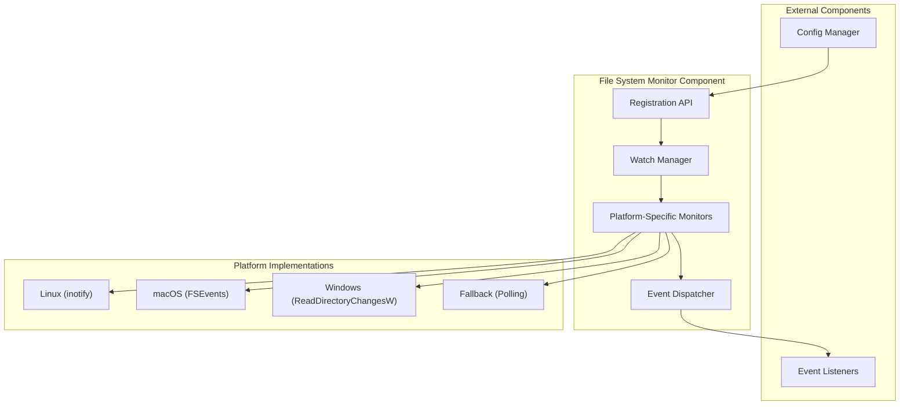

# File System Monitor Design

This document describes the design and implementation of the File System Monitor component in the Documentation-Based Programming system. The component provides efficient, cross-platform file system monitoring capabilities with a clean API for event registration and notification.

## Overview

The File System Monitor component detects changes to documentation and code files in real-time across different operating systems. It provides a unified interface for registering listeners that receive notifications when files matching specific patterns are created, modified, or deleted.



## Core Design Principles

1. **Efficient Resource Usage**: Only one operating system watch per resource, regardless of how many listeners are registered
2. **Listener-Based Architecture**: Clean API for registering and unregistering event listeners
3. **Path Flexibility**: Support for both absolute paths and Git root-relative paths
4. **Pattern Matching**: Unix-like wildcards for path specifications
5. **Customizable Filtering**: Programmatic filtering of events beyond path matching
6. **Debounced Notifications**: Configurable delay to prevent notification storms during rapid changes
7. **Thread Safety**: All operations are thread-safe for concurrent access
8. **Platform Independence**: Consistent behavior across Linux, macOS, and Windows

## Component Dependencies

The redesigned File System Monitor component has minimal dependencies:

- **Depends on**: `config_manager` component for configuration settings
- **No longer depends on**: `change_queue` component (removed in this redesign)

## Listener Registration API

### Abstract Listener Class

```python
class FileSystemEventListener(ABC):
    """
    Abstract base class for file system event listeners.
    
    [Class intent]
    Defines the interface for objects that can receive file system change notifications.
    
    [Design principles]
    - Separation of event specification from event handling
    - Flexible path matching with wildcards
    - Optional programmatic filtering
    - Configurable debounce delay
    - Complete coverage of all filesystem event types
    
    [Implementation details]
    - Abstract class that must be inherited by concrete listeners
    - Path patterns use Unix-style wildcards (*, **, ?)
    - Filter function allows for fine-grained control beyond path matching
    - Handles both file and directory events
    - Provides specific methods for symlink operations
    """
    
    @abstractmethod
    def on_file_created(self, path: str) -> None:
        """Called when a file matching the pattern is created."""
        pass
        
    @abstractmethod
    def on_file_modified(self, path: str) -> None:
        """Called when a file matching the pattern is modified."""
        pass
        
    @abstractmethod
    def on_file_deleted(self, path: str) -> None:
        """Called when a file matching the pattern is deleted."""
        pass
    
    @abstractmethod
    def on_directory_created(self, path: str) -> None:
        """Called when a directory matching the pattern is created."""
        pass
        
    @abstractmethod
    def on_directory_deleted(self, path: str) -> None:
        """Called when a directory matching the pattern is deleted."""
        pass
    
    @abstractmethod
    def on_symlink_created(self, path: str, target: str) -> None:
        """
        Called when a symbolic link matching the pattern is created.
        
        Args:
            path: Path to the symbolic link
            target: Target path that the symlink points to
        """
        pass
        
    @abstractmethod
    def on_symlink_deleted(self, path: str) -> None:
        """Called when a symbolic link matching the pattern is deleted."""
        pass
        
    @abstractmethod
    def on_symlink_target_changed(self, path: str, old_target: str, new_target: str) -> None:
        """
        Called when a symbolic link's target is changed.
        
        Args:
            path: Path to the symbolic link
            old_target: Previous target path
            new_target: New target path
        """
        pass
    
    @property
    @abstractmethod
    def path_pattern(self) -> str:
        """
        Path pattern to watch, supporting Unix-style wildcards.
        Relative paths are interpreted as relative to the Git root.
        """
        pass
    
    @property
    def filter_function(self) -> Optional[Callable[[str], bool]]:
        """
        Optional filter function that takes a path and returns True if the event should be processed.
        Default implementation accepts all paths that match the pattern.
        """
        return None
    
    @property
    def debounce_delay_ms(self) -> int:
        """
        Delay in milliseconds before dispatching events for this listener.
        Default is 100ms to prevent notification storms during rapid changes.
        """
        return 100
```

### Registration Methods

```python
def register_listener(listener: FileSystemEventListener) -> WatchHandle:
    """
    Register a listener for file system events.
    
    [Function intent]
    Registers a listener to receive notifications for file system events matching its path pattern.
    
    [Design principles]
    - Simple registration interface
    - Returns a handle for managing the registration
    - Immediate scanning of matching files
    
    [Implementation details]
    - Scans the path pattern for existing files
    - Sets up OS-specific watches as needed
    - Returns a handle object with methods to manage the registration
    
    Args:
        listener: The listener to register
        
    Returns:
        A WatchHandle object for managing the registration
    """
    pass

def unregister_listener(listener: FileSystemEventListener) -> None:
    """
    Unregister a previously registered listener.
    
    [Function intent]
    Removes a listener from the notification system.
    
    [Design principles]
    - Clean removal of listeners
    - Resource cleanup when no longer needed
    
    [Implementation details]
    - Removes the listener from internal registries
    - Cleans up OS watches if no other listeners are using them
    
    Args:
        listener: The listener to unregister
    """
    pass
```

### Watch Handle

```python
class WatchHandle:
    """
    Handle for a registered file system watch.
    
    [Class intent]
    Provides methods to interact with and manage a registered watch.
    
    [Design principles]
    - Encapsulates watch management operations
    - Provides information about watched resources
    
    [Implementation details]
    - Returned by register_listener
    - Maintains reference to internal watch data
    """
    
    def list_watched_paths(self) -> List[str]:
        """
        List all paths currently being watched by this handle.
        
        Returns:
            List of absolute paths being watched
        """
        pass
    
    def is_active(self) -> bool:
        """
        Check if this watch is still active.
        
        Returns:
            True if the watch is active, False if it has been unregistered
        """
        pass
    
    def unregister(self) -> None:
        """
        Unregister this watch.
        
        Equivalent to calling unregister_listener with the associated listener.
        """
        pass
```

## Internal Architecture

### Watch Manager

The Watch Manager is responsible for:

1. Maintaining the registry of listeners and their path patterns
2. Creating and managing OS-specific file system watches
3. Ensuring resource efficiency by sharing watches across listeners
4. Scanning directories to populate the initial file list
5. Handling wildcard expansion and path normalization

### Event Dispatcher

The Event Dispatcher is responsible for:

1. Running in a dedicated thread to process file system events
2. Applying debounce logic based on listener preferences
3. Filtering events based on path patterns and filter functions
4. Invoking the appropriate listener methods for matching events
5. Handling thread safety for concurrent operations

### Platform-Specific Implementations

The component includes platform-specific implementations for:

1. **Linux**: Using `inotify` for efficient file system monitoring
2. **macOS**: Using `FSEvents` for native macOS monitoring
3. **Windows**: Using `ReadDirectoryChangesW` for Windows monitoring
4. **Fallback**: Using polling for platforms without native monitoring support

Each implementation adheres to a common interface but leverages platform-specific optimizations.

## Path Handling

### Path Resolution

1. Absolute paths are used as-is
2. Relative paths are resolved relative to the Git repository root
3. Path normalization ensures consistent handling across platforms
4. Symlinks are followed by default (configurable)

### Wildcard Support

The component supports standard Unix-style wildcards:

- `*`: Matches any sequence of characters within a path segment
- `**`: Matches any sequence of characters across path segments (recursive)
- `?`: Matches any single character

Examples:
- `src/*.py`: Matches all Python files in the src directory
- `src/**/*.md`: Matches all Markdown files in the src directory and its subdirectories
- `doc/design/?.md`: Matches single-character named Markdown files in the doc/design directory

## Resource Management

### Watch Sharing

To minimize system resource usage, the component ensures that only one OS-level watch is created per directory, regardless of how many listeners are registered for that directory or its contents:

1. When a listener is registered, the component identifies the minimal set of directories that need to be watched
2. If a directory is already being watched, the existing watch is shared
3. Reference counting ensures watches are maintained as long as needed
4. When the last listener for a directory is unregistered, the watch is removed

### Internal Caching

The component maintains an internal cache of:

1. Watched directories and their associated OS watches
2. Listeners registered for each directory
3. Path patterns and their expanded file lists
4. Active debounce timers for each path

This caching improves performance and reduces resource usage.

## Symlink Handling

The component provides comprehensive support for symbolic links:

1. **Detection**: Identifies symlinks during initial scanning and when new symlinks are created
2. **Target Resolution**: Resolves symlink targets and tracks them for changes
3. **Event Propagation**: Generates appropriate events when symlinks or their targets change
4. **Circular Reference Protection**: Detects and handles circular symlink references
5. **Configuration Options**: Allows controlling whether symlinks are followed

### Symlink-Specific Methods

The component provides utility methods for working with symlinks:

```python
def is_symlink(path: str) -> bool:
    """
    Check if a path is a symbolic link.
    
    [Function intent]
    Determines whether the specified path is a symbolic link.
    
    [Design principles]
    - Platform-independent symlink detection
    - Consistent behavior across operating systems
    
    [Implementation details]
    - Uses os.path.islink on all platforms
    - Handles both absolute and relative paths
    
    Args:
        path: Path to check
        
    Returns:
        True if the path is a symbolic link, False otherwise
    """
    pass

def get_symlink_target(path: str) -> str:
    """
    Get the target of a symbolic link.
    
    [Function intent]
    Resolves the target path of a symbolic link.
    
    [Design principles]
    - Platform-independent symlink resolution
    - Consistent behavior across operating systems
    
    [Implementation details]
    - Uses os.readlink on all platforms
    - Returns absolute paths for consistency
    - Raises FileNotFoundError if the path doesn't exist
    - Raises NotASymlinkError if the path is not a symlink
    
    Args:
        path: Path to the symbolic link
        
    Returns:
        Absolute path to the symlink target
        
    Raises:
        FileNotFoundError: If the path doesn't exist
        NotASymlinkError: If the path is not a symbolic link
    """
    pass
```

## Directory Event Handling

The component provides specific support for directory events:

1. **Creation Detection**: Identifies when new directories are created
2. **Deletion Detection**: Identifies when directories are deleted
3. **Recursive Monitoring**: Automatically monitors new subdirectories in watched paths
4. **Content Tracking**: Maintains lists of files within directories for efficient change detection

### Directory-Specific Methods

```python
def is_directory(path: str) -> bool:
    """
    Check if a path is a directory.
    
    [Function intent]
    Determines whether the specified path is a directory.
    
    [Design principles]
    - Platform-independent directory detection
    - Consistent behavior across operating systems
    
    [Implementation details]
    - Uses os.path.isdir on all platforms
    - Handles both absolute and relative paths
    - Follows symlinks by default (configurable)
    
    Args:
        path: Path to check
        
    Returns:
        True if the path is a directory, False otherwise
    """
    pass

def list_directory(path: str, recursive: bool = False) -> List[str]:
    """
    List the contents of a directory.
    
    [Function intent]
    Lists files and subdirectories in the specified directory.
    
    [Design principles]
    - Platform-independent directory listing
    - Optional recursive listing
    
    [Implementation details]
    - Uses os.scandir for efficient directory listing
    - Returns absolute paths for consistency
    - Optionally recurses into subdirectories
    - Raises FileNotFoundError if the path doesn't exist
    - Raises NotADirectoryError if the path is not a directory
    
    Args:
        path: Path to the directory
        recursive: Whether to list contents recursively
        
    Returns:
        List of absolute paths to files and subdirectories
        
    Raises:
        FileNotFoundError: If the path doesn't exist
        NotADirectoryError: If the path is not a directory
    """
    pass
```

## Configuration Options

The following configuration options are available through the `config_manager`:

| Option | Description | Default | Valid Values |
|--------|-------------|---------|-------------|
| `fs_monitor.enabled` | Enable file system monitoring | `true` | `true`, `false` |
| `fs_monitor.follow_symlinks` | Whether to follow symbolic links | `true` | `true`, `false` |
| `fs_monitor.max_watches` | Maximum number of OS watches to create | `1000` | `1-10000` |
| `fs_monitor.default_debounce_ms` | Default debounce delay in milliseconds | `100` | `0-10000` |
| `fs_monitor.thread_priority` | Priority of the event dispatcher thread | `normal` | `low`, `normal`, `high` |
| `fs_monitor.symlink_max_depth` | Maximum depth for symlink resolution | `10` | `1-100` |
| `fs_monitor.directory_scan_batch_size` | Number of entries to process in each directory scan batch | `1000` | `100-10000` |

## Error Handling

The component implements robust error handling:

1. Watch creation failures are reported with specific error messages
2. Resource exhaustion (e.g., too many watches) is handled gracefully
3. Platform-specific errors are translated into consistent exceptions
4. Listener exceptions are caught and logged without affecting other listeners
5. Symlink resolution errors are handled appropriately
6. Directory access permission issues are reported clearly

## Performance Considerations

The redesigned component offers several performance improvements:

1. **Reduced Resource Usage**: By sharing watches across listeners
2. **Efficient Event Dispatching**: Through a dedicated thread and debouncing
3. **Minimal Scanning**: Initial scanning only for directories that match patterns
4. **Optimized Path Matching**: Fast path matching algorithms for wildcard patterns
5. **Lazy Initialization**: Resources are allocated only when needed
6. **Batched Directory Scanning**: Processing directory contents in batches to avoid blocking

## Migration Guide

### Migrating from the Previous Implementation

The previous implementation relied on the `change_queue` component, which has been removed in this redesign. To migrate existing code:

1. Replace direct usage of `change_queue` with listener registration
2. Implement the `FileSystemEventListener` interface for event handling
3. Update configuration to use the new options

Example migration:

**Before:**
```python
from dbp.fs_monitor.queue import get_change_queue

queue = get_change_queue()
queue.register_path("src/**/*.py")

while True:
    change = queue.get_next_change()
    if change:
        process_change(change)
```

**After:**
```python
from dbp.fs_monitor import register_listener, FileSystemEventListener

class MyListener(FileSystemEventListener):
    @property
    def path_pattern(self) -> str:
        return "src/**/*.py"
        
    def on_file_created(self, path: str) -> None:
        process_change(("created", path))
        
    def on_file_modified(self, path: str) -> None:
        process_change(("modified", path))
        
    def on_file_deleted(self, path: str) -> None:
        process_change(("deleted", path))
        
    def on_directory_created(self, path: str) -> None:
        # Handle directory creation if needed
        pass
        
    def on_directory_deleted(self, path: str) -> None:
        # Handle directory deletion if needed
        pass
        
    def on_symlink_created(self, path: str, target: str) -> None:
        # Handle symlink creation if needed
        pass
        
    def on_symlink_deleted(self, path: str) -> None:
        # Handle symlink deletion if needed
        pass
        
    def on_symlink_target_changed(self, path: str, old_target: str, new_target: str) -> None:
        # Handle symlink target changes if needed
        pass

handle = register_listener(MyListener())
```

## Relationship to Other Components

The File System Monitor component interacts with several other system components:

1. **Config Manager**: For configuration settings
2. **Metadata Extraction**: Consumes file change events to trigger metadata extraction
3. **Consistency Analysis**: Consumes file change events to trigger consistency analysis
4. **Document Relationships**: Consumes file change events to update relationship graphs

## Future Enhancements

Potential future enhancements to the File System Monitor component include:

1. **Event Batching**: Grouping related events for more efficient processing
2. **Content-Based Filtering**: Filtering events based on file content changes
3. **Change Diffing**: Providing detailed information about what changed in a file
4. **Watch Prioritization**: Prioritizing watches for frequently changing directories
5. **Event History**: Maintaining a history of recent file system events
