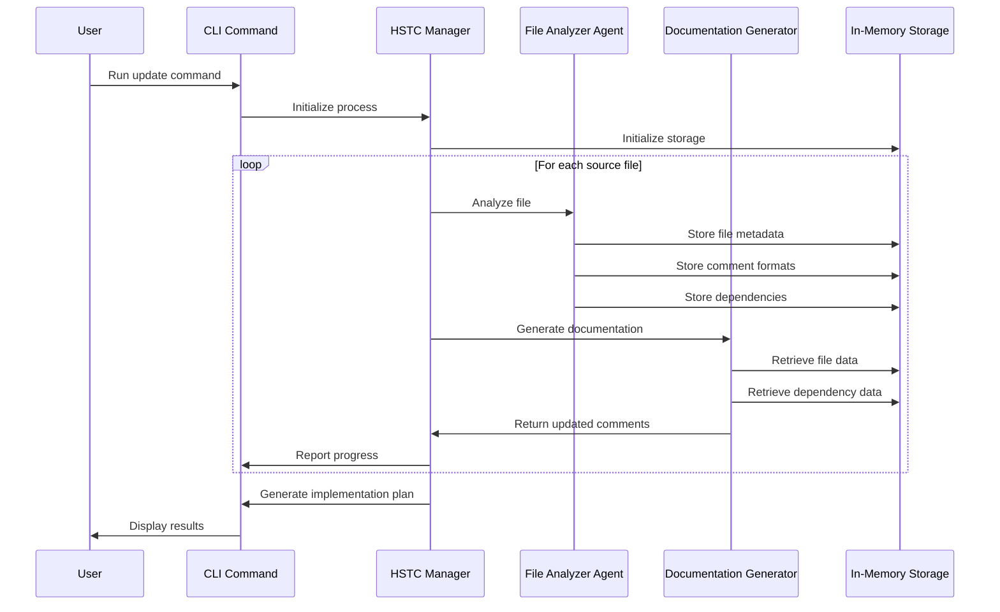

# HSTC Implementation Architecture with Agno

## Overview

This document outlines the architecture for implementing the Hierarchical Semantic Tree Context (HSTC) feature using the Agno framework. The HSTC feature creates a navigable semantic tree in the form of HSTC.md files by extracting and processing specially formatted comments from source code files.

## System Components

### 1. File Analyzer Agent

A Nova Micro-based agent responsible for:
- Identifying file types and programming languages
- Detecting comment syntax for different languages
- Extracting dependencies from source files
- Providing basic metadata about files

### 2. Documentation Generator Agent

A Claude 3.7-based agent responsible for:
- Processing extracted comments and code context
- Generating or updating documentation for source files
- Ensuring documentation meets HSTC standards
- Reasoning about code structure and relationships

### 3. HSTC Manager

Coordinates the workflow between agents:
- Processes file dependencies
- Manages the hierarchical structure
- Coordinates agent interactions
- Handles intermediate data storage

### 4. CLI Integration

A new command group in the `dbp_cli` that:
- Exposes HSTC functionality to users
- Handles command-line arguments
- Controls execution flow
- Reports results to the user

## Data Flow

## Component Interaction

The components interact through a shared in-memory datastore provided by Agno. The system follows these steps:

1. User initiates the HSTC update through the CLI
2. The HSTC Manager takes control of the process
3. The File Analyzer Agent processes each file:
   - Identifies file type and language
   - Extracts comments and dependencies
   - Stores results in-memory
4. For each file, the Documentation Generator Agent:
   - Retrieves file data and dependency information
   - Processes comments according to HSTC standards
   - Returns updated documentation
5. The HSTC Manager generates an implementation plan as markdown
6. The CLI presents results to the user

## Technical Design Decisions

### Agno Agent Design

We'll use Agno's Agent class to create two specialized agents:

1. **File Analyzer Agent (Nova Micro)**
   - Lightweight model for simple classification and extraction tasks
   - Efficient for quick language identification and comment syntax detection
   - Lower token usage for processing many files

2. **Documentation Generator Agent (Claude 3.7)**
   - More powerful model for understanding code context and generating documentation
   - Better reasoning capabilities for documentation structure
   - Higher quality output for comments and documentation

### In-Memory Data Store

Agno's session state will be used to store intermediate results:
- File metadata keyed by file path
- Extracted comments and dependencies
- Processing status for each file
- Aggregated data for HSTC generation

### Error Handling

- Individual file parsing failures won't stop the entire process
- Errors will be logged and reported in the implementation plan
- User can retry specific files or address issues before proceeding

## Integration with Existing Codebase

The implementation will:
- Create a new command group in src/dbp_cli
- Access the existing file system for source files
- Generate implementation plans that can be executed by agentic editors
- Avoid modifying the existing HSTC implementation based on LangChain

## Next Steps

The following context documents provide more detailed information about:
1. The File Analyzer Agent implementation
2. The Documentation Generator Agent implementation
3. The overall HSTC workflow
4. Implementation details including code snippets and examples
