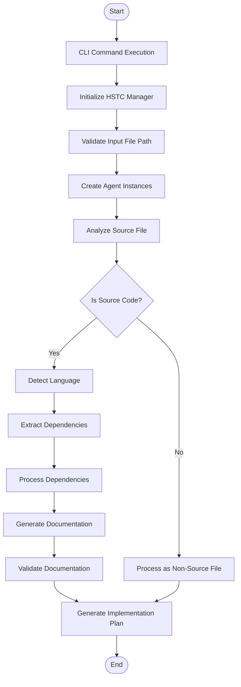

# HSTC Workflow with Agno Framework

## Overview

This document describes the complete workflow for the HSTC feature implemented using Agno. The workflow encompasses the end-to-end process from command initiation to the generation of an implementation plan.

## Workflow Components

The HSTC workflow involves these key components:

1. **CLI Interface** - User entry point for commands
2. **HSTC Manager** - Central orchestration component
3. **File Analyzer Agent** - Nova-based file analysis
4. **Documentation Generator Agent** - Claude-based documentation generation
5. **Implementation Plan Generator** - Markdown-based plan creation

## End-to-End Process Flow



## Step-by-Step Workflow

### 1. Command Execution

The process begins when the user executes the CLI command:

```python
def execute_hstc_command(file_path: str, options: Dict[str, Any]) -> None:
    """
    Execute the HSTC command
    
    Args:
        file_path: Path to the source file to process
        options: Command options
    """
    # Create HSTC Manager
    hstc_manager = HSTCManager()
    
    # Process the file
    result = hstc_manager.process_file(file_path, options)
    
    # Display result summary
    print(f"HSTC processing completed for {file_path}")
    print(f"Implementation plan generated at: {result['plan_path']}")
```

### 2. HSTC Manager Initialization

The HSTC Manager initializes the agents and prepares the environment:

```python
def __init__(self, base_dir: Optional[Path] = None, **kwargs):
    """Initialize the HSTC Manager"""
    self.base_dir = base_dir or Path.cwd()
    self.file_analyzer = None
    self.doc_generator = None
    self.processed_files = {}
    self.dependency_cache = {}
    
def initialize_agents(self):
    """Initialize the File Analyzer and Documentation Generator agents"""
    # Create File Analyzer Agent with Nova model
    self.file_analyzer = FileAnalyzerAgent(base_dir=self.base_dir)
    
    # Create Documentation Generator Agent with Claude model
    self.doc_generator = DocumentationGeneratorAgent()
```

### 3. File Path Validation

The manager validates the input file path:

```python
def validate_file_path(self, file_path: str) -> bool:
    """
    Validate that the file path exists
    
    Args:
        file_path: Path to validate
        
    Returns:
        bool: True if valid, False otherwise
    """
    path = Path(file_path)
    if not path.exists():
        print(f"Error: File not found: {file_path}")
        return False
        
    if not path.is_file():
        print(f"Error: Not a file: {file_path}")
        return False
        
    return True
```

### 4. Source File Analysis

The manager delegates file analysis to the File Analyzer Agent:

```python
def analyze_file(self, file_path: str) -> Dict[str, Any]:
    """
    Analyze a source file
    
    Args:
        file_path: Path to the file to analyze
        
    Returns:
        Dict containing analysis results
    """
    # Check if already processed
    if file_path in self.processed_files:
        return self.processed_files[file_path]
        
    # Analyze the file
    file_metadata = self.file_analyzer.analyze_file(file_path)
    self.processed_files[file_path] = file_metadata
    
    # Process dependencies if source code
    if file_metadata.get("file_type") == "source_code":
        self._process_dependencies(file_path, file_metadata)
        
    return file_metadata
```

### 5. Dependency Processing

Dependencies are processed recursively:

```python
def _process_dependencies(self, file_path: str, file_metadata: Dict[str, Any]) -> None:
    """
    Process dependencies of a file
    
    Args:
        file_path: Path to the file
        file_metadata: Metadata about the file
    """
    # Extract dependencies
    dependencies = file_metadata.get("dependencies", [])
    
    # Process each dependency
    for dep in dependencies:
        dep_type = dep.get("kind")
        dep_path = dep.get("path_or_package")
        
        # Only process codebase dependencies
        if dep_type == "codebase" and dep_path:
            # Resolve path relative to current file
            resolved_path = Path(file_path).parent / dep_path
            resolved_path = resolved_path.resolve()
            
            # Skip if already processed or doesn't exist
            if str(resolved_path) in self.dependency_cache or not resolved_path.exists():
                continue
                
            # Analyze dependency
            dep_metadata = self.analyze_file(str(resolved_path))
            
            # Cache the result
            self.dependency_cache[str(resolved_path)] = dep_metadata
```

### 6. Documentation Generation

The manager delegates documentation generation to the Documentation Generator Agent:

```python
def generate_documentation(self, file_path: str) -> Dict[str, Any]:
    """
    Generate documentation for a file
    
    Args:
        file_path: Path to the file
        
    Returns:
        Dict containing generated documentation
    """
    # Get file metadata
    file_metadata = self.processed_files.get(file_path)
    if not file_metadata:
        file_metadata = self.analyze_file(file_path)
    
    # Get dependency metadata for related files
    dependency_metadata = {}
    for dep_path, dep_meta in self.dependency_cache.items():
        dependency_metadata[dep_path] = dep_meta
    
    # Generate documentation
    documentation = self.doc_generator.process_file_documentation(
        file_path, file_metadata, dependency_metadata
    )
    
    return documentation
```

### 7. Documentation Validation

The generated documentation is validated against HSTC standards:

```python
def validate_documentation(self, file_path: str) -> Dict[str, Any]:
    """
    Validate generated documentation
    
    Args:
        file_path: Path to the file
        
    Returns:
        Dict containing validation results
    """
    return self.doc_generator.validate_documentation(file_path)
```

### 8. Implementation Plan Generation

Finally, the system generates an implementation plan:

```python
def generate_implementation_plan(self, file_path: str, documentation: Dict[str, Any]) -> str:
    """
    Generate markdown implementation plan
    
    Args:
        file_path: Path to the processed file
        documentation: Generated documentation
        
    Returns:
        Path to the generated implementation plan
    """
    # Create output directory
    plan_dir = self.base_dir / "scratchpad" / f"hstc_update_{Path(file_path).stem}"
    plan_dir.mkdir(parents=True, exist_ok=True)
    
    # Create overview plan
    overview_path = plan_dir / "plan_overview.md"
    with overview_path.open("w") as f:
        f.write(self._generate_overview_markdown(file_path, documentation))
    
    # Create implementation plan
    impl_path = plan_dir / "plan_implementation.md"
    with impl_path.open("w") as f:
        f.write(self._generate_implementation_markdown(file_path, documentation))
    
    # Create progress tracker
    progress_path = plan_dir / "plan_progress.md"
    with progress_path.open("w") as f:
        f.write(self._generate_progress_markdown(file_path))
    
    return str(plan_dir)
```

## Data Flow Between Components

### From CLI to HSTC Manager

```python
# CLI entry point
@click.command()
@click.argument("file_path", type=str)
@click.option("--output", "-o", help="Output directory for implementation plan")
@click.option("--recursive/--no-recursive", default=False, help="Process dependencies recursively")
def hstc_update(file_path, output, recursive):
    """Update HSTC documentation for a source file."""
    options = {
        "output": output,
        "recursive": recursive
    }
    
    # Pass control to HSTC Manager
    execute_hstc_command(file_path, options)
```

### From HSTC Manager to File Analyzer Agent

```python
# HSTC Manager delegates to File Analyzer
file_metadata = self.file_analyzer.analyze_file(file_path)

# File Analyzer performs analysis and returns structured data
{
    "path": "example/file.py",
    "size": 1024,
    "last_modified": 1620000000.0,
    "file_type": "source_code",
    "language": "python",
    "confidence": 95,
    "comment_formats": {
        "inline_comment": "#",
        "block_comment_start": '"""',
        "block_comment_end": '"""',
        "docstring_format": "triple quotes",
        "docstring_start": '"""',
        "docstring_end": '"""',
        "has_documentation_comments": True
    },
    "dependencies": [
        {
            "name": "utils",
            "kind": "codebase",
            "path_or_package": "../utils.py",
            "function_names": ["helper_function"]
        }
    ],
    "definitions": [
        {
            "name": "main_function",
            "type": "function",
            "line_number": 10,
            "comments": "# This function does something\ndef main_function():"
        }
    ]
}
```

### From HSTC Manager to Documentation Generator Agent

```python
# HSTC Manager passes data to Documentation Generator
documentation = self.doc_generator.process_file_documentation(
    file_path, file_metadata, dependency_metadata
)

# Documentation Generator returns documentation structure
{
    "path": "example/file.py",
    "file_type": "source_code",
    "language": "python",
    "file_header": {
        "intent": "This file provides functionality for...",
        "design_principles": "- Clear separation of concerns\n- Single responsibility principle",
        "constraints": "Requires Python 3.8+",
        "dependencies": [
            {"kind": "codebase", "dependency": "../utils.py"}
        ],
        "change_history": ["2023-06-15: Initial documentation"]
    },
    "definitions": [
        {
            "name": "main_function",
            "type": "function",
            "original_comment": "# This function does something",
            "updated_comment": '"""\n[Function intent]\nThis function processes data and returns results.\n\n[Design principles]\nUses functional approach with immutability.\n\n[Implementation details]\nImplements algorithm X with O(n) complexity.\n"""'
        }
    ],
    "documentation_updated": True
}
```

## Orchestration Logic

The HSTC workflow is orchestrated by the HSTC Manager, which acts as the central controller:

### Main Processing Logic

```python
def process_file(self, file_path: str, options: Dict[str, Any]) -> Dict[str, Any]:
    """
    Process a file through the entire HSTC workflow
    
    Args:
        file_path: Path to the file
        options: Processing options
        
    Returns:
        Dict containing processing results
    """
    # Initialize agents if not already done
    if not self.file_analyzer:
        self.initialize_agents()
    
    # Validate file path
    if not self.validate_file_path(file_path):
        return {"error": f"Invalid file path: {file_path}"}
    
    # Step 1: Analyze the file
    file_metadata = self.analyze_file(file_path)
    
    # Step 2: Generate documentation
    documentation = self.generate_documentation(file_path)
    
    # Step 3: Validate documentation
    validation = self.validate_documentation(file_path)
    
    # Step 4: Generate implementation plan
    plan_path = self.generate_implementation_plan(file_path, documentation)
    
    # Return results
    return {
        "file_path": file_path,
        "file_metadata": file_metadata,
        "documentation": documentation,
        "validation": validation,
        "plan_path": plan_path
    }
```

## Error Handling and Recovery

The workflow incorporates robust error handling mechanisms:

### Graceful Error Handling

```python
def safe_process_file(self, file_path: str, options: Dict[str, Any]) -> Dict[str, Any]:
    """
    Process a file with error handling
    
    Args:
        file_path: Path to the file
        options: Processing options
        
    Returns:
        Dict containing processing results or error information
    """
    try:
        return self.process_file(file_path, options)
    except Exception as e:
        import traceback
        error_info = {
            "error": str(e),
            "traceback": traceback.format_exc(),
            "file_path": file_path
        }
        
        # Log error
        print(f"Error processing {file_path}: {e}")
        
        # Generate error report
        self._generate_error_report(file_path, error_info)
        
        return error_info
```

### Partial Results Handling

```python
def _generate_error_report(self, file_path: str, error_info: Dict[str, Any]) -> str:
    """
    Generate an error report when processing fails
    
    Args:
        file_path: Path to the file
        error_info: Information about the error
        
    Returns:
        Path to the error report
    """
    # Create output directory
    error_dir = self.base_dir / "scratchpad" / f"hstc_error_{Path(file_path).stem}"
    error_dir.mkdir(parents=True, exist_ok=True)
    
    # Create error report
    error_path = error_dir / "error_report.md"
    with error_path.open("w") as f:
        f.write(f"# HSTC Error Report\n\n")
        f.write(f"File: {file_path}\n\n")
        f.write(f"Error: {error_info['error']}\n\n")
        f.write("## Traceback\n\n```\n")
        f.write(error_info["traceback"])
        f.write("\n```\n\n")
        
        # Include partial results if available
        if "file_metadata" in self.processed_files.get(file_path, {}):
            f.write("## Partial Analysis Results\n\n")
            f.write("```json\n")
            f.write(json.dumps(self.processed_files[file_path], indent=2))
            f.write("\n```\n\n")
    
    return str(error_path)
```

## Implementation Plan Format

The output of the workflow is a set of markdown files that describe the implementation plan:

### Overview Plan Format

```markdown
# HSTC Update Implementation Plan

## Overview

This plan outlines the steps to update documentation for `{file_path}` to comply with HSTC standards.

## File Analysis

- **File Type**: {file_type}
- **Language**: {language} (Confidence: {confidence}%)
- **Definitions**: {len(definitions)} functions/classes found
- **Dependencies**: {len(dependencies)} dependencies found

## Documentation Status

{validation_summary}

## Implementation Steps

1. Update file header with standardized documentation
2. Update {len(definitions)} function/class/method definitions with proper documentation
3. Verify documentation meets HSTC requirements

## Required Files

- `plan_implementation.md`: Detailed implementation steps
- `plan_progress.md`: Implementation progress tracker
```

### Implementation Plan Format

```markdown
# HSTC Implementation Details

## File Header Update

```{language}
{file_header["raw_header"]}
```

## Function/Class Documentation Updates

{for each definition in definitions:}

### {definition["name"]} ({definition["type"]})

Original documentation:
```{language}
{definition["original_comment"]}
```

Updated documentation:
```{language}
{definition["updated_comment"]}
```

{end for}
```

### Progress Tracker Format

```markdown
# HSTC Implementation Progress

## Status Legend

- ❌ Not started
- 🔄 In progress
- ✅ Completed

## Tasks

- ❌ Update file header
- ❌ Update function/class documentation
  {for each definition in definitions:}
  - ❌ {definition["name"]} ({definition["type"]})
  {end for}
- ❌ Final validation
```

## Integration with Agno Framework

This workflow leverages several Agno features:

### Agent Communication

```python
# In HSTC Manager
def _transfer_data_between_agents(self, file_path: str) -> None:
    """
    Transfer data between File Analyzer and Documentation Generator
    
    Args:
        file_path: Path to the file being processed
    """
    # Get file metadata from File Analyzer
    file_metadata = self.file_analyzer.get_file_metadata(file_path)
    
    # Get dependency metadata from File Analyzer
    dependency_metadata = {}
    for dep_path, dep_meta in self.dependency_cache.items():
        dependency_metadata[dep_path] = dep_meta
    
    # Make data available to Documentation Generator
    self.doc_generator.set_context_data("file_metadata", file_metadata)
    self.doc_generator.set_context_data("dependency_metadata", dependency_metadata)
```

### Agno Session State

```python
# In File Analyzer Agent
def analyze_file(self, file_path: str) -> Dict[str, Any]:
    """Analyze a file with persisted results"""
    # Check session state for cached results
    if self.session_state and "analyzed_files" in self.session_state:
        if file_path in self.session_state["analyzed_files"]:
            return self.session_state["analyzed_files"][file_path]
    
    # Perform analysis
    result = self._perform_file_analysis(file_path)
    
    # Store in session state
    if not self.session_state:
        self.session_state = {}
    if "analyzed_files" not in self.session_state:
        self.session_state["analyzed_files"] = {}
    self.session_state["analyzed_files"][file_path] = result
    
    return result
```

### Agno Model Management

```python
# In HSTC Manager
def _select_appropriate_model(self, file_size: int) -> None:
    """
    Select appropriate models based on file size
    
    Args:
        file_size: Size of the file in bytes
    """
    if file_size > 1_000_000:  # 1 MB
        # For large files, use more efficient models
        self.file_analyzer.model = BedrockNovaModel(id="anthropic.claude-3-haiku-20240307-v1:0")
        self.doc_generator.model = Claude(id="claude-3-haiku-20240307-v1:0")
    else:
        # For smaller files, use higher quality models
        self.file_analyzer.model = BedrockNovaModel(id="anthropic.claude-3-haiku-20240307-v1:0")  # Still efficient enough
        self.doc_generator.model = Claude(id="claude-3-5-sonnet-20241022")  # Better quality
```

## Optimization Strategies

The workflow incorporates several optimization strategies:

### Caching and Memoization

```python
# In HSTC Manager
def _cache_file_analysis(self, file_path: str, result: Dict[str, Any]) -> None:
    """
    Cache file analysis results
    
    Args:
        file_path: Path to the file
        result: Analysis results
    """
    # Calculate cache key
    import hashlib
    file_stat = os.stat(file_path)
    cache_key = f"{file_path}_{file_stat.st_size}_{file_stat.st_mtime}"
    cache_key = hashlib.md5(cache_key.encode()).hexdigest()
    
    # Save to cache
    cache_dir = self.base_dir / ".hstc_cache"
    cache_dir.mkdir(exist_ok=True)
    
    cache_file = cache_dir / f"{cache_key}.json"
    with cache_file.open("w") as f:
        json.dump(result, f)
```

### Parallel Processing for Multiple Files

```python
def process_multiple_files(self, file_paths: List[str], options: Dict[str, Any]) -> List[Dict[str, Any]]:
    """
    Process multiple files in parallel
    
    Args:
        file_paths: List of file paths to process
        options: Processing options
        
    Returns:
        List of processing results
    """
    import concurrent.futures
    
    results = []
    with concurrent.futures.ThreadPoolExecutor() as executor:
        # Submit all file processing tasks
        future_to_path = {
            executor.submit(self.safe_process_file, path, options): path
            for path in file_paths
        }
        
        # Process results as they complete
        for future in concurrent.futures.as_completed(future_to_path):
            path = future_to_path[future]
            try:
                result = future.result()
                results.append(result)
                print(f"Completed processing {path}")
            except Exception as e:
                print(f"Error processing {path}: {e}")
                results.append({"file_path": path, "error": str(e)})
    
    return results
```

## Conclusion

The HSTC workflow leverages Agno's capabilities to create a complete system for analyzing source files, generating documentation, and producing implementation plans. The workflow is designed to be:

1. **Modular** - Each component has a specific responsibility
2. **Scalable** - Support for processing single files or entire directories
3. **Optimized** - Uses appropriate models for different tasks
4. **Robust** - Handles errors gracefully and provides detailed reports
5. **Flexible** - Adapts to different programming languages and file types

This system demonstrates how Agno can be used to create sophisticated LLM-based workflows that solve real development tasks like documentation management.
