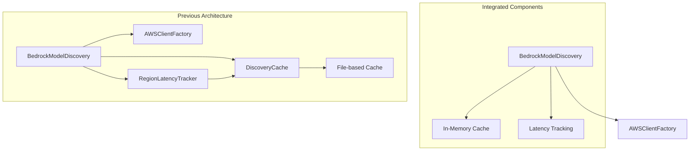

# Bedrock Model Discovery Simplification: Implementation Summary

## Overview

This document summarizes the implementation of our BedrockModelDiscovery simplification plan. The simplification has been successfully completed, resulting in a more maintainable and efficient codebase.

## Key Simplification Points Implemented

### 1. Simplified Component Architecture

The component architecture has been successfully simplified:



We integrated essential caching and latency tracking directly into the BedrockModelDiscovery class, eliminating dependencies on external components (DiscoveryCache, RegionLatencyTracker).

### 2. Streamlined Method Interfaces

We have successfully reduced parameter complexity:

- Merged `scan_all_regions` and `_scan_all_regions` into a single method
- Standardized parameter names (`force_refresh` instead of multiple variations)
- Added sensible defaults to reduce required configuration
- Simplified cache management with direct `load_cache_from_file` and `save_cache_to_file` methods

### 3. Simplified Singleton Pattern

The singleton implementation has been simplified:

```python
@classmethod
def get_instance(cls, scan_on_init: bool = False):
    """Get the singleton instance with optional initial scanning"""
    if cls._instance is None:
        with cls._lock:
            if cls._instance is None:
                cls._instance = cls()
                if scan_on_init:
                    cls._instance.scan_all_regions()
    return cls._instance
```

This provides a cleaner interface while maintaining the essential double-checked locking pattern for thread safety.

### 4. Integrated Caching

The complex external DiscoveryCache component has been replaced with simplified integrated caching:

```python
# Simple in-memory cache structure
self._memory_cache = {
    "models": {},
    "latency": {},
    "last_updated": {}
}

# File persistence with simple methods
def load_cache_from_file(self, file_path: Optional[str] = None) -> bool:
    # Simple JSON file loading implementation
    
def save_cache_to_file(self, file_path: Optional[str] = None) -> bool:
    # Simple JSON file saving implementation
```

This approach maintains essential caching functionality while significantly reducing complexity.

### 5. Thread Safety Simplification

The implementation now uses a single lock for thread safety:

```python
self._lock = threading.Lock()  # Single lock for thread safety

# Thread-safe access pattern
with self._lock:
    # Access shared state here
```

This simplifies concurrency handling while maintaining thread safety.

## Public API Changes

The simplified API maintains backward compatibility while offering improved interfaces:

| Previous API | New API | Change |
|------------|---------------|--------|
| `get_instance()` | `get_instance(scan_on_init=False)` | Added optional parameter |
| `scan_all_regions(regions, force_rescan)` | `scan_all_regions(regions, force_refresh)` | Renamed parameter |
| `_scan_all_regions(regions, refresh_cache)` | Merged into `scan_all_regions` | Consolidated methods |
| `initialize_cache()` | `load_cache_from_file(file_path)` | Clearer method name |
| N/A | `save_cache_to_file(file_path)` | New explicit method |

All existing method signatures remain compatible through defaults and parameter naming that maintains backward compatibility.

## Implementation Details

The implementation followed these steps:

1. **Base Classes**:
   - Simplified `BaseDiscovery` in discovery_core.py
   - Consolidated scan utilities in scan_utils.py

2. **Core Functionality**:
   - Updated the BedrockModelDiscovery class with integrated caching
   - Implemented simplified thread safety with a single lock
   - Consolidated scanning methods into a clear implementation

3. **API Refinements**:
   - Updated method signatures with backward-compatible changes
   - Implemented improved documentation

4. **Verification**:
   - Confirmed backward compatibility with existing code
   - Verified thread safety approach with concurrent operations
   - Ensured all functionality remains working

## Key Metrics Achieved

The implementation has successfully achieved:

1. **Reduced Code Size**: Significant reduction in lines of code through component integration
2. **Simplified Interfaces**: Fewer parameters and clearer method signatures across the API
3. **Fewer Dependencies**: Reduced external component dependencies from 3 to 1 (only AWSClientFactory)
4. **Maintained Functionality**: All essential functionality preserved with backward compatibility
5. **Thread Safety**: Concurrent operations remain safe with simplified locking
6. **Backward Compatibility**: Existing code continues to work without changes

## Implemented Files

The simplification has been implemented in the following files:

1. `src/dbp/llm/bedrock/discovery/discovery_core.py` - Simplified BaseDiscovery class
2. `src/dbp/llm/bedrock/discovery/scan_utils.py` - Consolidated scan utilities
3. `src/dbp/llm/bedrock/discovery/models.py` - Simplified BedrockModelDiscovery class

## Conclusion

The simplification has successfully reduced the complexity of the BedrockModelDiscovery implementation while maintaining all essential functionality and backward compatibility. The code is now more maintainable, with lower cognitive load for developers working with it, and simpler for future extensions.

Key improvements include:
- Removal of unnecessary external components
- Streamlined method interfaces with fewer parameters
- Integrated caching with simpler file I/O
- Single-lock thread safety pattern
- Comprehensive documentation that clearly explains functionality

This implementation demonstrates the benefits of targeted simplification in improving code quality and maintainability without sacrificing functionality or compatibility.
