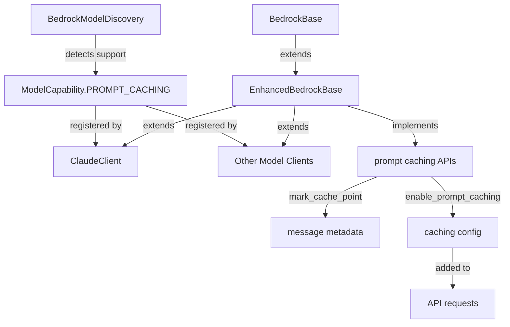

# Amazon Bedrock Prompt Caching Implementation Summary

## Overview

This document provides a comprehensive summary of the implementation plan for integrating Amazon Bedrock prompt caching functionality into the DBP library. The implementation follows a phased approach to ensure clean architecture, maintainability, and backward compatibility.

## Key Features

The implementation adds the following capabilities to the DBP library:

1. **Model Support Detection**: API to check if a specific model supports prompt caching
2. **Prompt Caching Toggle**: API to enable/disable prompt caching for a conversation
3. **Cache Point Marking**: API to mark cache points in conversations
4. **Graceful Degradation**: All APIs succeed without errors even if a model doesn't support caching

## Implementation Architecture

The implementation leverages the existing capability system to seamlessly integrate prompt caching:



## Public API

### Check Model Support

```python
# Check if a model supports prompt caching
client = ClaudeClient("anthropic.claude-3-5-haiku-20241022-v1:0")
await client.initialize()

supports_caching = client.has_capability(ModelCapability.PROMPT_CACHING)
print(f"Model supports prompt caching: {supports_caching}")
```

### Enable/Disable Prompt Caching

```python
# Enable prompt caching
caching_enabled = client.enable_prompt_caching(True)
print(f"Prompt caching enabled: {caching_enabled}")

# Disable prompt caching
client.enable_prompt_caching(False)
```

### Mark Cache Points

```python
# Create messages
messages = [
    {"role": "system", "content": "You are a helpful assistant."},
    {"role": "user", "content": "Tell me about AWS Bedrock"}
]

# Mark a cache point
result = client.mark_cache_point(messages)

# Use the marked messages
response = await client.stream_chat(result["messages"])
```

## Implementation Phases

### Phase 1: Model Capability System Enhancement

This phase adds the prompt caching capability type and implements model detection for prompt caching support. Key deliverables:

- Add `ModelCapability.PROMPT_CACHING` enum value
- Implement `supports_prompt_caching` method in `BedrockModelDiscovery`
- Add methods to get and filter prompt caching supported models

### Phase 2: Core API Implementation

This phase implements the core APIs for enabling prompt caching and marking cache points. Key deliverables:

- Add `enable_prompt_caching` and `is_prompt_caching_enabled` methods
- Implement `mark_cache_point` method for adding cache markers
- Update request formatting to include caching configuration

### Phase 3: Model-Specific Integration

This phase updates model-specific clients to register the prompt caching capability when supported. Key deliverables:

- Update `ClaudeClient` initialization to check for prompt caching support
- Update other model clients (Nova, etc.) as needed
- Add helper method for getting prompt caching supported models

### Phase 4: Testing and Documentation

This phase adds comprehensive testing, documentation, and example code. Key deliverables:

- Create example script demonstrating prompt caching
- Add unit tests for prompt caching functionality
- Write documentation for the prompt caching feature
- Create verification script to ensure requirements are met
- Update README to mention prompt caching support

## Compatibility Considerations

The implementation ensures backward compatibility by:

1. Making capability-based checks before enabling features
2. Providing graceful fallbacks when features aren't supported
3. Keeping APIs consistent with existing patterns
4. Not modifying existing client behavior unless explicitly requested
5. Using non-destructive operations (e.g., copying messages before modifying)

## Performance Impact

Prompt caching can significantly improve performance:

- Reduce costs by up to 90% for repetitive prompts
- Reduce latency by up to 85% by avoiding token reprocessing
- Optimize memory usage through efficient caching

## Best Practices

For optimal use of prompt caching:

- Place static content at the beginning of prompts
- Keep system prompts and instructions consistent
- Mark cache points before dynamic content
- Organize prompts with reusable components
- Use custom cache IDs for fine-grained control

## Verification Strategy

The implementation will be verified through:

- Unit tests for individual components
- Integration tests for component interactions
- Example scripts demonstrating real-world usage
- Verification script confirming requirements are met
- Code review for quality and standards compliance

## Next Steps

After implementation:

1. Deploy to test environment
2. Monitor performance improvements
3. Gather feedback on API usability
4. Consider additional optimizations
5. Update documentation based on user feedback

## Conclusion

This implementation provides a clean, consistent API for leveraging Amazon Bedrock's prompt caching feature, following the library's existing design patterns while ensuring backward compatibility and ease of use.
