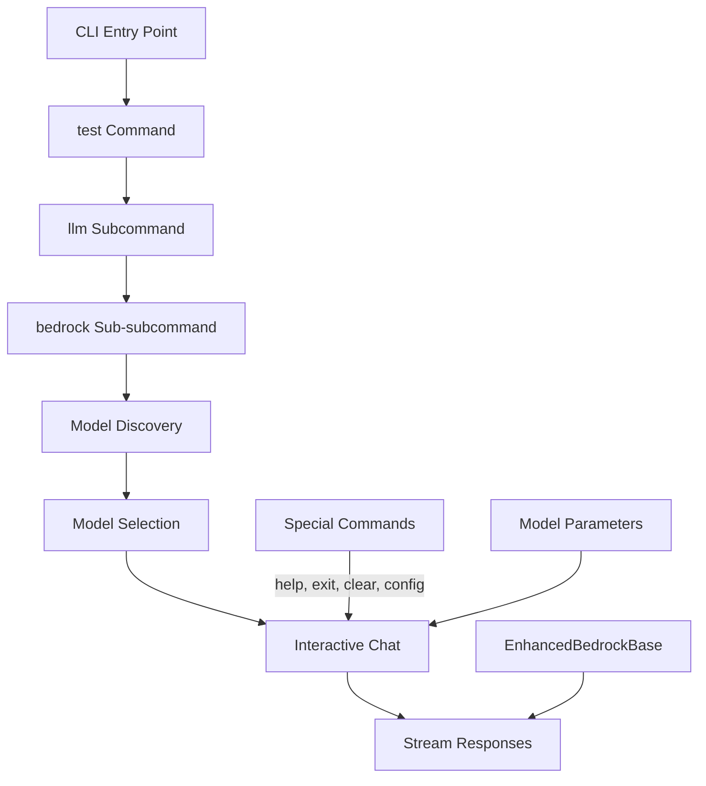

# CLI Test Command for Langchain/Langgraph Integration

## Directory Purpose
This implementation plan outlines the design and implementation steps for adding a new CLI command structure (`test llm bedrock`) that enables direct testing of the langchain/langgraph framework through the DBP CLI. The test command will provide an interactive chat interface for testing supported Bedrock models, allowing users to interact with models directly using the stream-based converse API from the EnhancedBedrockBase classes.

⚠️ CRITICAL: CODING ASSISTANT MUST READ THESE DOCUMENTATION FILES COMPLETELY BEFORE EXECUTING ANY TASKS IN THIS PLAN

## Documentation References

### Core Documentation
- `src/dbp/llm/HSTC.md` - Overview of the LLM system architecture
- `src/dbp/llm/langchain/HSTC.md` - LangChain integration components
- `src/dbp/llm/langgraph/HSTC.md` - LangGraph integration components
- `src/dbp/llm/bedrock/HSTC.md` - Bedrock model integration
- `src/dbp/llm/bedrock/models/HSTC.md` - Bedrock model implementations
- `src/dbp_cli/cli.py` - Main CLI implementation

### Technical Implementation References
- `src/dbp/llm/bedrock/enhanced_base.py` - Base class for Bedrock model clients
- `src/dbp/llm/bedrock/converse_client.py` - Streaming response interface
- `src/dbp/llm/common/streaming.py` - Streaming utilities
- `src/dbp_cli/commands/base.py` - Base command handler

## Implementation Overview

The implementation will follow this logical structure:



## Implementation Plan Files

1. `plan_overview.md` - This overview document
2. `plan_command_structure.md` - Command structure and CLI integration
3. `plan_model_discovery.md` - Dynamic model discovery implementation
4. `plan_interactive_chat.md` - Interactive chat interface implementation
5. `plan_special_commands.md` - Implementation of special chat commands
6. `plan_progress.md` - Implementation tracking and progress

## Key Components to Implement

### 1. Command Structure
- `TestCommandHandler` base class in `src/dbp_cli/commands/test.py`
- `LLMTestCommandHandler` in `src/dbp_cli/commands/test/llm.py`
- `BedrockTestCommandHandler` in `src/dbp_cli/commands/test/bedrock.py`
- Integration with main CLI in `src/dbp_cli/cli.py`

### 2. Model Discovery and Selection
- Dynamic model discovery by inspecting Bedrock model implementations
- Interactive model selection interface when no model specified
- Model family grouping for easier navigation

### 3. Interactive Chat Interface
- Stream-based response display using the model's streaming capabilities
- Support for multi-turn conversations with message history
- Special commands for configuration and control

### 4. Model Parameter Configuration
- Support for common model parameters (temperature, max_tokens, etc.)
- Dynamic parameter configuration during chat session

## Implementation Approach

The implementation will follow these phases:

1. **Setup Command Structure**: Create the command handler classes and integrate with CLI
2. **Implement Model Discovery**: Add dynamic model discovery from Bedrock implementations
3. **Build Interactive Chat**: Implement the interactive chat interface with streaming support
4. **Add Special Commands**: Implement special commands for configuration and control
5. **Testing and Refinement**: Test with different models and refine the interface

## Success Criteria

- Users can launch an interactive chat session with any supported Bedrock model
- The interface dynamically discovers available models without hardcoding
- Users can configure model parameters before and during chat sessions
- The chat interface properly displays streaming responses
- Special commands provide control over the session

## Dependencies

- `prompt_toolkit`: For enhanced CLI input experience
- `asyncio`: For handling asynchronous streaming responses
- Existing Bedrock model implementations in `src/dbp/llm/bedrock/models/`

## Usage Examples

```bash
# Basic usage - will prompt for model selection
dbp test llm bedrock

# Specify a model directly
dbp test llm bedrock --model anthropic.claude-3-sonnet-20240229-v1:0

# With model parameters
dbp test llm bedrock --temperature 0.8 --max_tokens 2048
