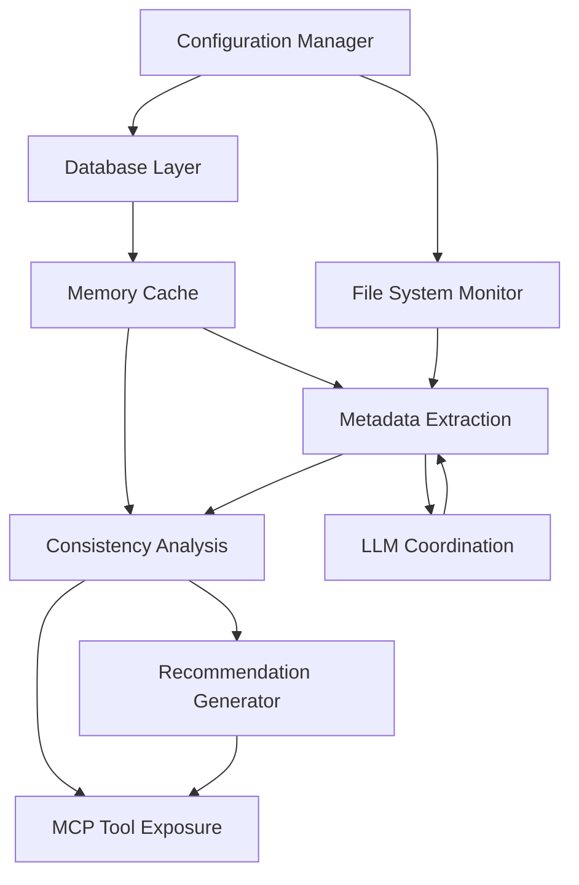

# Phase 3: Cleanup & Final Implementation

This document details the final cleanup steps required after all components have been successfully migrated to the new dependency injection approach, ensuring a clean and consistent codebase.

## 1. Remove Backward Compatibility Code

Once all components have been updated to use the new dependency injection system, we can remove the backward compatibility code to simplify the system and ensure consistency.

### Component Base Class Cleanup

File: `src/dbp/core/component.py`

1. Remove the deprecated `dependencies` property:

```python
# Remove this property:
@property
def dependencies(self) -> List[str]:
    """
    [Function intent]
    Returns a list of component names that this component depends on.
    
    [Implementation details]
    Default implementation returns an empty list (no dependencies).
    This property is deprecated and will be removed in a future version.
    Dependencies should now be declared during component registration.
    
    [Design principles]
    Explicit dependency declaration for clear initialization order.
    
    Returns:
        List[str]: List of component names this component depends on
    """
    return []
```

2. Update the initialize method docstring to reflect that dependencies are now required:

```python
def initialize(self, context: 'InitializationContext', dependencies: Dict[str, 'Component']) -> None:
    """
    [Function intent]
    Initializes the component with context information and resolved dependencies.
    
    [Implementation details]
    Must be implemented by concrete component classes.
    Dependencies are provided as a dictionary of pre-resolved component instances.
    MUST set self._initialized = True when initialization succeeds.
    
    [Design principles]
    Explicit initialization with clear success/failure indication.
    Direct dependency injection for improved performance and testability.
    
    Args:
        context: Initialization context with configuration and resources
        dependencies: Dictionary of pre-resolved dependencies {name: component_instance}
        
    Raises:
        NotImplementedError: If not implemented by concrete component
    """
    raise NotImplementedError("Component must implement initialize method")
```

### ComponentSystem Cleanup

File: `src/dbp/core/system.py`

1. Update methods to require explicit dependencies:

```python
def register(self, component: Component, dependencies: List[str]) -> None:
    """
    [Function intent]
    Registers a component with the system by name and defines its dependencies.
    
    [Implementation details]
    Stores the component in the components dictionary with its name as key.
    Stores the dependencies for use during initialization.
    
    [Design principles]
    Simple dictionary-based registration with explicit dependency declaration.
    
    Args:
        component: Component instance to register
        dependencies: List of dependency names
        
    Raises:
        ValueError: If a component with the same name is already registered
    """
    name = component.name
    if name in self.components:
        raise ValueError(f"Component '{name}' already registered")
    
    # Enhanced logging for component registration
    self.logger.info(f"Registering component: '{name}' with dependencies: {dependencies}")
    self.components[name] = component
    self.dependencies[name] = dependencies
```

2. Remove dependency property access:

```python
# Remove any code that accesses component.dependencies directly
# For example, in validate_dependencies or _calculate_init_order
```

### LifecycleManager Cleanup

File: `src/dbp/core/lifecycle.py`

1. Remove the old `_register_components` method, which is now replaced with `_register_components_with_registry`.

2. Simplify the registration process by removing fallback code:

```python
# Clean up the register_if_enabled helper function and any related code
```

## 2. Update Documentation

### Update Component Initialization Documentation

File: `doc/design/COMPONENT_INITIALIZATION.md`

Add a new section describing the centralized component registration and dependency injection approach:

```markdown
## Centralized Component Registration

The system now uses a centralized component registration approach to make dependencies more visible and maintainable:

1. Components are registered with the `ComponentRegistry` with explicit dependency declarations
2. Dependencies are resolved and injected during component initialization
3. Component implementation can use the injected dependencies directly

### Component Registration

Components are registered with the `ComponentRegistry` by specifying:
- The component class
- An explicit list of dependency component names
- An optional enabled flag

```python
# Example: Registering a component with explicit dependencies
registry.register_component(
    component_class=MyComponent, 
    dependencies=["database", "config_manager"],
    enabled=True
)
```

### Component Initialization

Components now receive their dependencies directly during initialization:

```python
def initialize(self, context: InitializationContext, dependencies: Dict[str, Component]) -> None:
    # Access dependencies directly from the dependencies dictionary
    db_component = self.get_dependency(dependencies, "database")
    config_component = self.get_dependency(dependencies, "config_manager")
    
    # Use the dependencies
    db_manager = db_component.get_manager()
    config = config_component.get_config()
    
    # Continue initialization
    # ...
    
    self._initialized = True
```

### Component Dependency Graph

The centralized registration approach makes it easier to understand the component dependency graph:



This graph is now explicitly defined in the code, rather than scattered across multiple components.
```

### Add Entry to Design Decisions

File: `doc/DESIGN_DECISIONS.md`

Add an entry describing the new centralized component registration approach:

```markdown
# Design Decisions

## 2025-04-19: Centralized Component Registration with Dependency Injection

### Context
Previously, components defined their dependencies through a `dependencies` property in each component class. Each component was also responsible for manually fetching its dependencies using `context.get_component()` during initialization. This approach scattered essential configuration across many files, making it difficult to understand the dependency graph and increasing the chance of errors.

### Decision
Implement a centralized component registration mechanism that allows registering components and declaring dependencies in one place, combined with direct dependency injection during initialization.

### Rationale
- **Centralized Configuration**: Having all component dependencies declared in one place makes the system architecture more visible and easier to understand.
- **Reduced Duplication**: Eliminates the need to declare dependencies in multiple places.
- **Improved Testability**: Direct dependency injection makes components more testable by allowing easy mocking of dependencies.
- **Simplified Component Implementation**: Components receive their dependencies directly without having to fetch them.

### Implementation
1. Created a `ComponentRegistry` class for centralized component registration
2. Enhanced the `Component` base class to accept dependencies during initialization
3. Updated the `ComponentSystem` to resolve and inject dependencies
4. Modified component implementations to use the injected dependencies

### Implications
- All component implementations needed to be updated to accept and use injected dependencies
- The system now has a clearer separation between component registration and implementation
- Testing is simplified due to easier dependency mocking
- New components will be easier to integrate with explicit dependency declaration

### Alternatives Considered
- **Service Locator Pattern**: Continue with the existing approach where components fetch dependencies themselves. Rejected due to reduced visibility and testability.
- **Complex Dependency Injection Framework**: Implementing a full DI container with autowiring, scopes, etc. Rejected as overly complex for our needs.
- **Constructor Injection**: Passing dependencies at component construction time. Rejected due to the need for deeper changes to the component lifecycle.

### Related Components
- `ComponentSystem`
- `Component` base class
- `ComponentRegistry` (new)
- All concrete component implementations
```

## 3. Final Testing

### Component Integration Testing

Develop comprehensive tests to verify:

1. All components are correctly registered with their dependencies
2. Components receive their dependencies correctly during initialization
3. Components function properly with the injected dependencies
4. The system correctly handles circular dependencies
5. Error handling for missing or disabled dependencies works as expected

### System Testing

Perform full system testing to ensure:

1. All components initialize in the correct order
2. The system starts up and shuts down correctly
3. Components continue to function as expected after the refactoring
4. No regressions are introduced by the dependency changes

### Performance Testing

Verify that the new approach doesn't negatively impact:

1. System startup time
2. Memory usage
3. Overall system performance

## 4. Final Cleanup Tasks

1. Update API documentation for any public-facing interfaces
2. Remove any TODOs or temporary code added during the migration
3. Update developer guidelines to reflect the new component registration approach
4. Run static code analysis tools to ensure code quality
5. Review logging to ensure appropriate levels and helpful messages

## Implementation Checklist

- [ ] Remove backward compatibility code from Component base class
- [ ] Update Component base class documentation
- [ ] Remove backward compatibility code from ComponentSystem
- [ ] Simplify LifecycleManager registration process
- [ ] Update Component Initialization documentation
- [ ] Add entry to Design Decisions
- [ ] Execute comprehensive test suite
- [ ] Perform final code cleanup and quality checks

## Benefits of the Final Implementation

1. **Clear Architecture**: The component dependency graph is explicitly defined in one place
2. **Simplified Components**: Components receive their dependencies directly
3. **Improved Maintainability**: Easier to understand and modify the component structure
4. **Better Testing**: Components can be tested more easily with mocked dependencies
5. **Reduced Error Potential**: Explicit dependency declaration reduces the chance of missing dependencies
6. **Cleaner Code**: Removing compatibility code improves readability and maintainability
