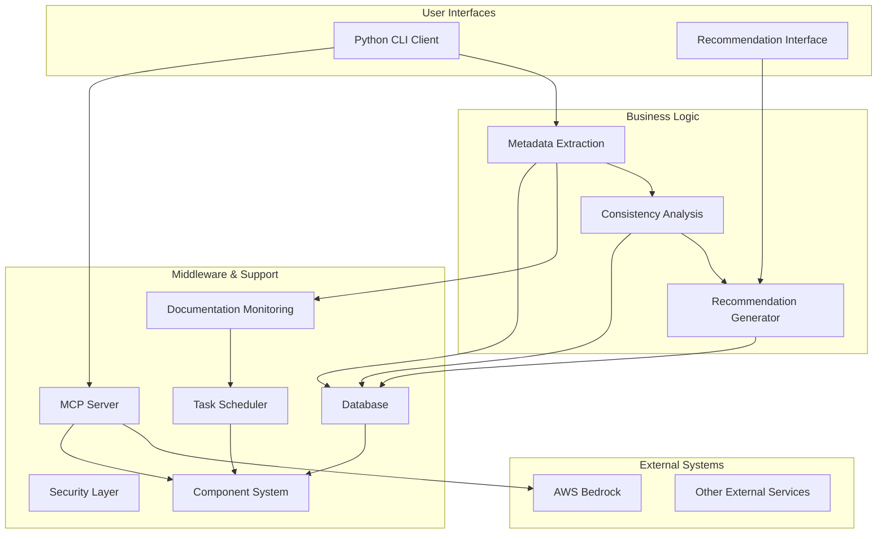
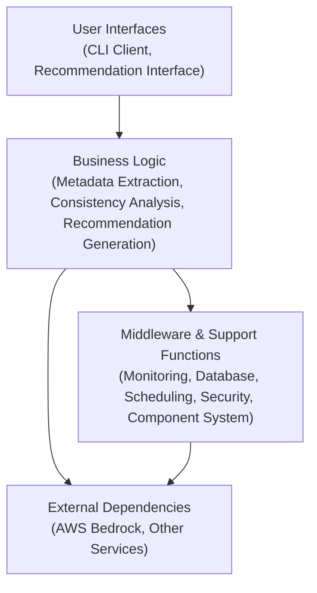

# Restructured DESIGN.md Plan

This document outlines the detailed plan for restructuring DESIGN.md according to the required chapter structure. The new document will maintain all existing content while organizing it into the specified chapters.

## Document Header

The new DESIGN.md will begin with this header:

```markdown
# Documentation-Based Programming System Architecture

This document describes the architectural principles, components, and design decisions for the Documentation-Based Programming system, which treats documentation as the single source of truth in a project.
```

## New Document Structure

### 1. General Architecture Overview

This section will present a high-level overview of the system architecture with mermaid diagrams.

#### Content from Current Document:
- Introduction paragraph
- Core Architecture Principles (6 principles)
- Implementation Principles (10 principles)
- High-level description of component initialization

#### New Content to Add:

- System architecture mermaid diagram:



- Stack layers visualization:



#### Structure:

```markdown
## 1. General Architecture Overview

[Introduction paragraph - from current document]

### System Architecture Diagram

[Insert mermaid diagram showing overall system architecture]

### Stack Layers

[Insert mermaid diagram showing stack layers]

### Core Architecture Principles

[Copy all 6 principles from current document]

### Implementation Principles

[Copy all 10 implementation principles from current document]

### Out of Scope

[Copy out of scope section from current document]
```

### 2. Provided Services

This section will describe all interfaces that deliver project value.

#### Content from Current Document:
- Python CLI Client component description
- MCP Server exposed tools section
- Recommendation interface details
- User-facing aspects of Recommendation Workflow

#### New Content to Add:
- Service quality metrics and expectations
- Interface consistency patterns
- Service interaction diagram

#### Structure:

```markdown
## 2. Provided Services

This section describes the interfaces that deliver the project's value to users.

### Python CLI Client

[Copy Python CLI Client component description]

### Recommendation Interface

[Copy Recommendation interface details]
[Copy user-facing aspects of Recommendation Workflow]

### MCP Server REST APIs

[Copy MCP Server exposed tools section]
[Reference to API.md for detailed API specifications]

### Service Quality and Expectations

- Response time expectations
- Reliability metrics
- Scalability considerations
```

### 3. Business Logic

This section will describe internal logic delivering the business value.

#### Content from Current Document:
- Code Analysis Approach (complete)
- Consistency Analysis Engine component
- Core parts of Recommendation Workflow
- Business logic aspects of MCP Server Implementation
- Recommendation Generator component

#### New Content to Add:
- Process flow diagrams for key business processes
- Clearer separation of business logic from infrastructure

#### Structure:

```markdown
## 3. Business Logic

This section describes the internal logic that delivers the core business value of the project.

### Code Analysis Approach

[Copy Code Analysis Approach section]

### Consistency Analysis

[Copy Consistency Analysis Engine component details]
[Add process flow diagram]

### Recommendation Generation

[Copy core parts of Recommendation Workflow]
[Copy Recommendation Generator details]
[Add process flow diagram]

### MCP Request Processing

[Copy business logic aspects of MCP Server Implementation]
```

### 4. External Dependencies toward Cooperating Systems

This section will describe API calls toward other business systems.

#### Content from Current Document:
- AWS Bedrock integration mentions
- External API dependencies from MCP Server Implementation
- Relevant parts of "Relationship to Other Components" section

#### New Content to Add:
- Explicit listing of all external dependencies
- Integration patterns with external systems
- Fallback strategies for external services

#### Structure:

```markdown
## 4. External Dependencies toward Cooperating Systems

This section describes the system's integration with external services and APIs.

### AWS Bedrock Integration

[Copy AWS Bedrock integration details]

### Integration with Cline's Context Management

[Copy relevant parts from "Relationship to Other Components"]

### External API Dependencies

[List and describe other external API dependencies]

### Integration Patterns

- Authentication approaches
- Error handling strategy
- Rate limiting considerations
- Fallback strategies

### External System Communication Flow

[Add mermaid diagram showing communication with external systems]
```

### 5. Middleware and Support Functions

This section will describe technical internal infrastructure.

#### Content from Current Document:
- Documentation Monitoring component details
- Component Initialization System (details)
- Security and Data Handling
- Database implementation details
- Background Task Scheduler information
- File Structure section
- Internal parts of MCP server not exposed as services

#### New Content to Add:
- Clearer middleware patterns and their implementation
- Infrastructure component relationships

#### Structure:

```markdown
## 5. Middleware and Support Functions

This section describes the technical internal infrastructure that supports the system's operation.

### Component Initialization System

[Copy Component Initialization System details]

### Documentation Monitoring

[Copy Documentation Monitoring component details]

### Security and Data Handling

[Copy Security and Data Handling section]

### Database Implementation

[Copy Database implementation details]
[Reference to DATA_MODEL.md for detailed data structures]

### Background Task Scheduler

[Copy Background Task Scheduler information]
[Reference to design/BACKGROUND_TASK_SCHEDULER.md for details]

### File System Structure

[Copy File Structure section]

### MCP Server Internal Infrastructure

[Copy internal parts of MCP server not exposed as services]

### Middleware Component Relationships

[Add mermaid diagram showing relationships between middleware components]
```

## Implementation Approach

The implementation of the restructured DESIGN.md will proceed as follows:

1. Create a new version of DESIGN.md with the structure outlined above
2. Copy relevant content from the current DESIGN.md to appropriate sections
3. Add new content as specified (diagrams, clearer explanations)
4. Update cross-references to maintain document integrity
5. Review for completeness to ensure no content is lost

## Content Preservation and Migration

The restructuring will ensure:
- All existing content is preserved
- Content is placed in the most appropriate section
- Cross-references to other documents are maintained
- New content enhances rather than replaces existing documentation
