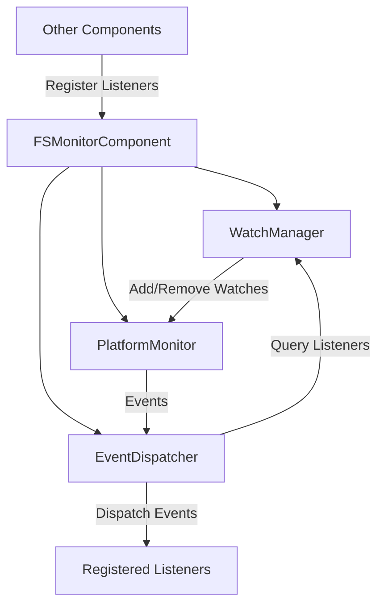

# File System Monitor Redesign: Component Integration Plan

⚠️ CRITICAL: CODING ASSISTANT MUST READ THESE DOCUMENTATION FILES COMPLETELY BEFORE EXECUTING ANY TASKS IN THIS PLAN

## Documentation References

- [File System Monitor Design](../../doc/design/FILE_SYSTEM_MONITOR.md) - Detailed design document for the redesigned fs_monitor component
- [Design](../../doc/DESIGN.md) - Core architectural principles and design decisions
- [Configuration](../../doc/CONFIGURATION.md) - Configuration options for the fs_monitor component

## Overview

This plan details the integration of all fs_monitor subcomponents into a cohesive system, focusing on:

1. Configuration definition updates
2. Component class implementation
3. Initialization and shutdown logic
4. Integration with the broader system via component_dependencies.py
5. Migration from the change_queue approach to the new listener-based model

## Configuration Updates

### Default Configuration Updates (default_config.py)

The default configuration needs to be updated to include new parameters for the fs_monitor component:

```python
# File system monitoring settings - updated for the redesigned component
MONITOR_DEFAULTS = {
    "enabled": True,
    "ignore_patterns": ["*.tmp", "*.log", "*.swp", "*~", ".git/", ".hg/", ".svn/", "__pycache__/"],
    "recursive": True,
    "thread_count": 1,
    "thread_priority": "normal",
    "default_debounce_ms": 100,
    "polling_fallback": {
        "enabled": True,
        "poll_interval": 1.0,
        "hash_size": 4096
    }
}
```

### Configuration Schema Updates (config_schema.py)

The schema needs to be updated to match the new configuration structure:

```python
class PollingFallbackConfig(BaseModel):
    """Configuration for the polling fallback monitor."""
    enabled: bool = Field(default=MONITOR_DEFAULTS["polling_fallback"]["enabled"], description="Enable polling fallback when native APIs are unavailable")
    poll_interval: float = Field(default=MONITOR_DEFAULTS["polling_fallback"]["poll_interval"], ge=0.1, le=60.0, description="Polling interval in seconds")
    hash_size: int = Field(default=MONITOR_DEFAULTS["polling_fallback"]["hash_size"], ge=0, le=1048576, description="Number of bytes to hash for file change detection")

class FSMonitorConfig(BaseModel):
    """File system monitoring settings."""
    enabled: bool = Field(default=MONITOR_DEFAULTS["enabled"], description="Enable file system monitoring")
    ignore_patterns: List[str] = Field(default=MONITOR_DEFAULTS["ignore_patterns"], description="Glob patterns to ignore during monitoring")
    recursive: bool = Field(default=MONITOR_DEFAULTS["recursive"], description="Monitor subdirectories recursively")
    thread_count: int = Field(default=MONITOR_DEFAULTS["thread_count"], ge=1, le=16, description="Number of worker threads for event dispatching")
    thread_priority: str = Field(default=MONITOR_DEFAULTS["thread_priority"], description="Priority for worker threads")
    default_debounce_ms: int = Field(default=MONITOR_DEFAULTS["default_debounce_ms"], ge=0, le=10000, description="Default debounce delay in milliseconds")
    polling_fallback: PollingFallbackConfig = Field(default_factory=PollingFallbackConfig, description="Polling fallback configuration")
    
    @validator('thread_priority')
    def validate_thread_priority(cls, v):
        allowed = ["low", "normal", "high"]
        if v not in allowed:
            raise ValueError(f"Thread priority must be one of: {allowed}")
        return v
```

## Component Class Implementation

### File Structure

The component class will be defined in:

```
src/dbp/fs_monitor/component.py
```

### Component Class Implementation

```python
# src/dbp/fs_monitor/component.py

import logging
import os
import threading
from typing import Dict, List, Optional, Set, Any

from ..core.component import Component
from ..config.config_manager import ConfigManager
from .watch_manager import WatchManager
from .event_dispatcher import EventDispatcher
from .factory import create_platform_monitor
from .listener import FileSystemEventListener

logger = logging.getLogger(__name__)

class FSMonitorComponent(Component):
    """
    [Class intent]
    Main component class for the file system monitor.
    
    [Design principles]
    - Centralized coordination of fs_monitor subcomponents
    - Simplified interface for other components
    - Configuration-driven behavior
    - Clean lifecycle management
    
    [Implementation details]
    - Manages watch_manager, event_dispatcher, and platform_monitor
    - Handles component configuration
    - Provides registration methods for other components
    """
    
    def __init__(self, config_manager: ConfigManager) -> None:
        """
        [Function intent]
        Initialize the FSMonitorComponent.
        
        [Design principles]
        - Component-based architecture
        - Dependency injection
        
        [Implementation details]
        - Stores reference to config_manager
        - Initializes internal state
        
        Args:
            config_manager: Reference to the application's configuration manager
        """
        super().__init__(name="fs_monitor", dependencies=["config", "filter"])
        self._config_manager = config_manager
        self._watch_manager = None
        self._event_dispatcher = None
        self._platform_monitor = None
        self._lock = threading.RLock()
        self._started = False
    
    def initialize(self) -> None:
        """
        [Function intent]
        Initialize the component.
        
        [Design principles]
        - Clean initialization sequence
        - Order-dependent initialization
        
        [Implementation details]
        - Creates watch_manager, event_dispatcher, and platform_monitor
        - Does not start monitoring (start() must be called separately)
        """
        with self._lock:
            logger.info("Initializing FSMonitorComponent")
            
            # Create watch manager
            self._watch_manager = WatchManager()
            
            # Get configuration
            config = self._config_manager.get_config()
            fs_monitor_config = config.fs_monitor
            
            # Create event dispatcher with configuration from the start
            self._event_dispatcher = EventDispatcher(
                self._watch_manager,
                thread_count=fs_monitor_config.thread_count,
                thread_priority=fs_monitor_config.thread_priority,
                default_debounce_ms=fs_monitor_config.default_debounce_ms
            )
            
            # Create platform-specific monitor
            self._platform_monitor = create_platform_monitor(
                self._watch_manager, 
                self._event_dispatcher,
                polling_fallback_enabled=fs_monitor_config.polling_fallback.enabled,
                polling_interval=fs_monitor_config.polling_fallback.poll_interval,
                hash_size=fs_monitor_config.polling_fallback.hash_size
            )
            
            logger.info("FSMonitorComponent initialized")
    
    def start(self) -> None:
        """
        [Function intent]
        Start the component.
        
        [Design principles]
        - Clean startup sequence
        
        [Implementation details]
        - Starts event dispatcher and platform monitor
        - Sets started flag
        """
        with self._lock:
            if self._started:
                logger.warning("FSMonitorComponent already started")
                return
            
            if not self._platform_monitor or not self._event_dispatcher:
                raise RuntimeError("FSMonitorComponent not initialized")
            
            # Check if component is enabled in configuration
            config = self._config_manager.get_config()
            if not config.fs_monitor.enabled:
                logger.info("FSMonitorComponent is disabled in configuration, not starting")
                return
                
            logger.info("Starting FSMonitorComponent")
            
            # Start event dispatcher
            self._event_dispatcher.start()
            
            # Start platform monitor
            self._platform_monitor.start()
            
            self._started = True
            
            logger.info("FSMonitorComponent started")
    
    def stop(self) -> None:
        """
        [Function intent]
        Stop the component.
        
        [Design principles]
        - Clean shutdown sequence
        - Resource cleanup
        
        [Implementation details]
        - Stops platform monitor and event dispatcher
        - Clears started flag
        """
        with self._lock:
            if not self._started:
                logger.debug("FSMonitorComponent already stopped")
                return
            
            logger.info("Stopping FSMonitorComponent")
            
            # Stop platform monitor (this will stop watching all directories)
            if self._platform_monitor:
                self._platform_monitor.stop()
            
            # Stop event dispatcher
            if self._event_dispatcher:
                self._event_dispatcher.stop()
            
            self._started = False
            
            logger.info("FSMonitorComponent stopped")
    
    def shutdown(self) -> None:
        """
        [Function intent]
        Shut down the component.
        
        [Design principles]
        - Clean shutdown sequence
        - Complete resource cleanup
        
        [Implementation details]
        - Ensures component is stopped
        - Releases all resources
        """
        with self._lock:
            logger.info("Shutting down FSMonitorComponent")
            
            # Make sure we're stopped
            self.stop()
            
            # Clear references
            self._watch_manager = None
            self._event_dispatcher = None
            self._platform_monitor = None
            
            logger.info("FSMonitorComponent shut down")
    
    def register_listener(self, listener: FileSystemEventListener, patterns: List[str] = None) -> int:
        """
        [Function intent]
        Register a file system event listener.
        
        [Design principles]
        - Simple public API
        - Delegation to specialized components
        
        [Implementation details]
        - Delegates to watch_manager for listener registration
        - Returns listener ID for future reference
        
        Args:
            listener: The listener to register
            patterns: List of path patterns to watch
            
        Returns:
            Listener ID
            
        Raises:
            RuntimeError: If the component is not initialized
        """
        if not self._watch_manager:
            raise RuntimeError("FSMonitorComponent not initialized")
        
        return self._watch_manager.register_listener(listener, patterns)
    
    def unregister_listener(self, listener_id: int) -> None:
        """
        [Function intent]
        Unregister a file system event listener.
        
        [Design principles]
        - Simple public API
        - Resource cleanup
        
        [Implementation details]
        - Delegates to watch_manager for listener unregistration
        
        Args:
            listener_id: ID of the listener to unregister
            
        Raises:
            RuntimeError: If the component is not initialized
        """
        if not self._watch_manager:
            raise RuntimeError("FSMonitorComponent not initialized")
        
        self._watch_manager.unregister_listener(listener_id)
    
    def update_listener_patterns(self, listener_id: int, patterns: List[str]) -> None:
        """
        [Function intent]
        Update the patterns for a registered listener.
        
        [Design principles]
        - Dynamic configuration
        - Simple public API
        
        [Implementation details]
        - Delegates to watch_manager for pattern update
        
        Args:
            listener_id: ID of the listener
            patterns: New list of path patterns
            
        Raises:
            RuntimeError: If the component is not initialized
        """
        if not self._watch_manager:
            raise RuntimeError("FSMonitorComponent not initialized")
        
        self._watch_manager.update_listener_patterns(listener_id, patterns)
    
    def configure(self) -> None:
        """
        [Function intent]
        Handle configuration changes.
        
        [Design principles]
        - Dynamic configuration
        - Configuration-driven behavior
        
        [Implementation details]
        - Reinitializes component with new configuration if needed
        - Otherwise updates subcomponent configurations
        """
        with self._lock:
            if not self._started:
                # If not started, just reinitialize
                self.initialize()
                return
                
            # If already started, update configurations dynamically
            config = self._config_manager.get_config()
            fs_monitor_config = config.fs_monitor
            
            # Update event dispatcher configuration
            if self._event_dispatcher:
                self._event_dispatcher.configure(
                    thread_count=fs_monitor_config.thread_count,
                    thread_priority=fs_monitor_config.thread_priority,
                    default_debounce_ms=fs_monitor_config.default_debounce_ms
                )
            
            # Update platform monitor configuration (if applicable)
            if self._platform_monitor and hasattr(self._platform_monitor, "configure"):
                self._platform_monitor.configure(
                    poll_interval=fs_monitor_config.polling_fallback.poll_interval,
                    hash_size=fs_monitor_config.polling_fallback.hash_size
                )
```

### Factory Updates for Configuration Parameters

The factory needs to be updated to accept the new configuration parameters:

```python
# src/dbp/fs_monitor/factory.py

import platform
import logging
from typing import Optional

from .monitor_base import MonitorBase
from .watch_manager import WatchManager
from .event_dispatcher import EventDispatcher

logger = logging.getLogger(__name__)

def create_platform_monitor(
    watch_manager: WatchManager, 
    event_dispatcher: EventDispatcher,
    polling_fallback_enabled: bool = True,
    polling_interval: float = 1.0,
    hash_size: int = 4096
) -> MonitorBase:
    """
    [Function intent]
    Create a platform-specific file system monitor.
    
    [Design principles]
    - Platform detection
    - Graceful fallback
    
    [Implementation details]
    - Detects the current platform
    - Tries to import the platform-specific monitor
    - Falls back to the polling monitor if needed
    
    Args:
        watch_manager: The watch manager instance
        event_dispatcher: The event dispatcher instance
        polling_fallback_enabled: Whether to fall back to polling if platform-specific monitor fails
        polling_interval: Polling interval in seconds for the fallback monitor
        hash_size: Number of bytes to hash for the fallback monitor
        
    Returns:
        A platform-specific monitor instance or fallback monitor
    """
    system = platform.system().lower()
    
    try:
        if system == "linux":
            from .linux import LinuxMonitor
            return LinuxMonitor(watch_manager, event_dispatcher)
        elif system == "darwin":
            from .macos import MacOSMonitor
            return MacOSMonitor(watch_manager, event_dispatcher)
        elif system == "windows":
            from .windows import WindowsMonitor
            return WindowsMonitor(watch_manager, event_dispatcher)
        else:
            logger.warning(f"Unsupported platform: {system}, using fallback monitor")
            from .fallback import FallbackMonitor
            monitor = FallbackMonitor(watch_manager, event_dispatcher)
            monitor.configure(poll_interval=polling_interval)
            return monitor
    except Exception as e:
        logger.error(f"Error creating platform-specific monitor for {system}: {e}")
        if not polling_fallback_enabled:
            raise
        
        logger.warning("Falling back to polling monitor")
        from .fallback import FallbackMonitor
        monitor = FallbackMonitor(watch_manager, event_dispatcher)
        monitor.configure(poll_interval=polling_interval)
        return monitor
```

## Integration with Component Registry

The component should be updated in the component_dependencies.py file:

```python
# Part of COMPONENT_DECLARATIONS in src/dbp/core/component_dependencies.py

# Current entry:
{
    "import_path": "dbp.fs_monitor.component",
    "component_class": "FileSystemMonitorComponent",
    "name": "fs_monitor",
    "dependencies": ["config_manager", "change_queue", "filter"]
},

# Updated entry:
{
    "import_path": "dbp.fs_monitor.component",
    "component_class": "FSMonitorComponent",
    "name": "fs_monitor",
    "dependencies": ["config_manager"]
},
```

This update removes the dependency on `change_queue` and updates the component class name to match our new implementation.

## Migration from Change Queue to Listener Model

### Migration Strategy

1. **Identify Components Using Change Queue**:
   - Analyze the codebase to find all components that interact with the fs_monitor's change_queue
   - For each component, determine the event types they're interested in

2. **Create Listener Implementations**:
   - For each component that uses change_queue, implement a corresponding FileSystemEventListener

3. **Update Component Initialization Code**:
   - Update component initialization to register listeners with FSMonitorComponent

### Example Listener Implementation

For a component that previously used the change_queue:

```python
# Original code using change_queue
def process_changes(self):
    changes = self._fs_monitor.get_changes()
    for change in changes:
        if change.event_type == 'created' and change.is_file:
            self._handle_new_file(change.path)
        elif change.event_type == 'modified' and change.is_file:
            self._handle_modified_file(change.path)
```

The new listener implementation would be:

```python
class ComponentNameListener(FileSystemEventListener):
    """
    [Class intent]
    File system event listener for ComponentName.
    
    [Design principles]
    - Event-driven architecture
    - Focused handler for specific events
    
    [Implementation details]
    - Implements FileSystemEventListener interface
    - Handles specific event types
    - Calls appropriate component methods
    """
    
    def __init__(self, component_instance):
        """
        [Function intent]
        Initialize the listener.
        
        [Design principles]
        - Clean initialization
        - Component reference
        
        [Implementation details]
        - Stores reference to component instance
        
        Args:
            component_instance: Reference to the component instance
        """
        self._component = component_instance
    
    def on_file_created(self, path: str) -> None:
        """
        [Function intent]
        Handle file creation events.
        
        [Design principles]
        - Event-specific handling
        
        [Implementation details]
        - Delegates to component's handler method
        
        Args:
            path: Path of the created file
        """
        self._component._handle_new_file(path)
    
    def on_file_modified(self, path: str) -> None:
        """
        [Function intent]
        Handle file modification events.
        
        [Design principles]
        - Event-specific handling
        
        [Implementation details]
        - Delegates to component's handler method
        
        Args:
            path: Path of the modified file
        """
        self._component._handle_modified_file(path)
```

### Registration in Component Initialization

```python
def initialize(self):
    # Other initialization code...
    
    # Create and register listener
    listener = ComponentNameListener(self)
    patterns = ["/path/to/watch/*.py", "/another/path/*"]
    self._listener_id = self._fs_monitor.register_listener(listener, patterns)
```

### Cleanup in Component Shutdown

```python
def shutdown(self):
    # Unregister listener
    if hasattr(self, "_listener_id"):
        self._fs_monitor.unregister_listener(self._listener_id)
    
    # Other cleanup code...
```

## Component Interaction Diagram



## Unit Testing Approach

1. **Component Tests**:
   - Test component lifecycle (initialize, start, stop, shutdown)
   - Test configuration handling
   - Test listener registration and unregistration

2. **Integration Tests**:
   - Test interaction between subcomponents
   - Test with mock listeners
   - Test configuration changes

3. **Migration Tests**:
   - Verify that components previously using change_queue work correctly with the new listener model

## Next Steps

1. Update plan_progress.md to mark component integration plan as completed
2. Begin implementation phase
3. Follow the implementation phases outlined in plan_progress.md
