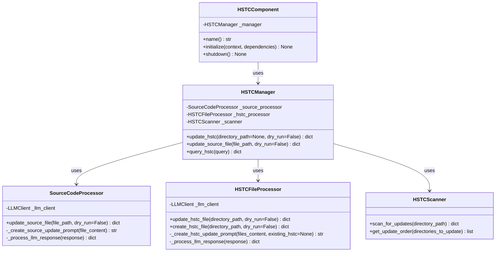
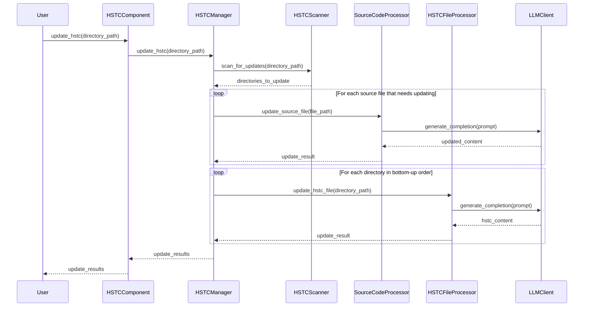

# HSTC Implementation Plan Overview

⚠️ CRITICAL: CODING ASSISTANT MUST READ THESE DOCUMENTATION FILES COMPLETELY BEFORE EXECUTING ANY TASKS IN THIS PLAN

## Documentation References

- [`src/dbp/core/component.py`](../src/dbp/core/component.py) - Component base class for integration
- [`src/dbp/core/file_access.py`](../src/dbp/core/file_access.py) - DBPFile class for file access
- [`src/dbp/llm/bedrock/client_factory.py`](../src/dbp/llm/bedrock/client_factory.py) - LLM client factory
- [`coding_assistant/scripts/get_design_mode_context.py`](../coding_assistant/scripts/get_design_mode_context.py) - MIME message creation
- [`coding_assistant/scripts/identify_hstc_updates.py`](../coding_assistant/scripts/identify_hstc_updates.py) - HSTC update scanner

## Introduction

This implementation plan outlines the steps to create the HSTC (Hierarchical Semantic Tree Context) module located at `src/dbp/hstc`. The module will be responsible for managing HSTC.md files across the project, initially focusing on updating existing files and later supporting advanced queries.

The HSTC module will:

1. Use LLM models to update source file comments to match documentation standards
2. Generate/update HSTC.md files based on source file contents
3. Follow a bottom-up approach when updating the HSTC hierarchy
4. Support both batch processing and individual file processing
5. Include dry-run capabilities for preview before applying changes

## Architecture Overview



## Implementation Process Flow



## Key Features and Requirements

1. **Module Structure**:
   - Component-based architecture integrating with the existing DBP component system
   - Clean separation of concerns between scanning, source processing, and HSTC generation

2. **LLM Integration**:
   - Claude models (`anthropic.claude-3-7-sonnet-20250219-v1` by default) for source code documentation
   - Nova models (`amazon.nova-lite-v1` by default) for HSTC.md file generation
   - JSON-based structured outputs for reliable parsing

3. **File Processing**:
   - Source file documentation compliance checking and updating
   - HSTC.md file generation and updating based on directory contents
   - Bottom-up directory processing to maintain hierarchy consistency

4. **Error Handling**:
   - Continue-on-error approach for batch processing
   - Detailed logging and feedback on processing results
   - Clean error messages with appropriate context

5. **User Experience**:
   - Dry-run mode for previewing changes
   - Basic logging for tracking processing status
   - Support for both individual file and batch directory processing

## Module File Structure

```
src/dbp/hstc/
├── __init__.py
├── component.py       # Component integration
├── manager.py         # Core orchestration logic
├── source_processor.py # Source file processing
├── hstc_processor.py  # HSTC file processing
├── scanner.py         # Directory scanning logic
├── HSTC.md            # Module's own HSTC file
├── prompts/           # LLM prompts
│   ├── source_update_prompt.md
│   └── hstc_update_prompt.md
└── exceptions.py      # Custom exceptions
```

## Implementation Phases

This implementation plan is divided into the following phases:

1. **Component Structure**: Base component architecture and interfaces
2. **Scanner**: Implementation of the HSTC scanner for finding files that need updates
3. **Source Processor**: Implementation of source code file processing with LLM
4. **HSTC Processor**: Implementation of HSTC.md file processing with LLM
5. **Manager**: Implementation of the manager for orchestrating the update process
6. **Prompts**: Implementation of the LLM prompts for source and HSTC processing
7. **Documentation**: Documentation and examples for the HSTC module
8. **Entry Point**: Implementation of the entry point for CLI integration

Each phase is detailed in its own file in this directory.
