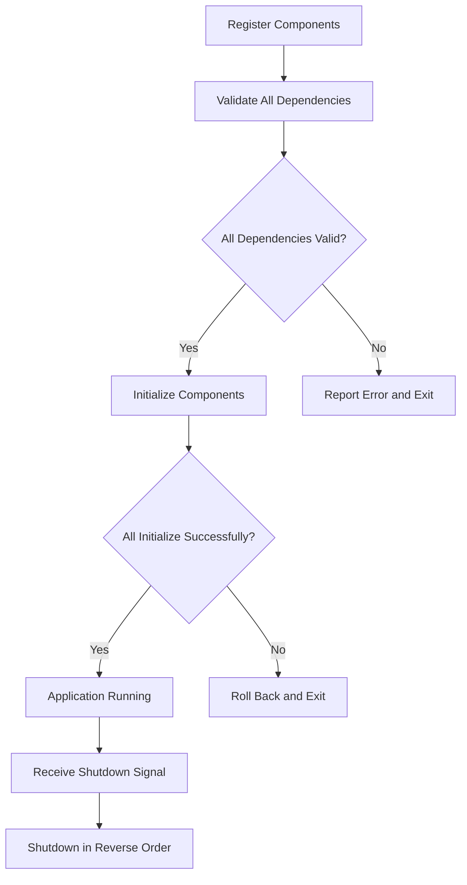

# Component Initialization - KISS Approach

## Overview

This document describes the minimalist approach for component initialization in the Documentation-Based Programming system.

## Core Principles

1. **Absolute Simplicity**: Minimal code, maximum readability
2. **No Complex Algorithms**: Simple dependency lists with direct validation
3. **Straightforward Error Handling**: Clear errors, minimal recovery logic
4. **Single Responsibility**: Each component manages its own lifecycle
5. **Explicit Dependencies**: No hidden dependencies between components

## Component System

### Component Interface
- Each component has a name property
- Each component declares dependencies as a simple list
- Each component implements initialize() and shutdown() methods
- Initialization status is tracked with a simple boolean flag

### Registry and Initialization
1. Components register in a simple dictionary by name
2. System validates that all dependencies exist before initialization
3. Components initialize in a simple dependency order
4. Components shut down in reverse order
5. Clear error reporting for initialization failures

## Initialization Process



### Initialization Algorithm

The initialization algorithm is intentionally simple:

1. Create a set of components that need to be initialized
2. While there are components to initialize:
   - Find a component whose dependencies are all initialized
   - Initialize that component
   - If no component can be initialized, there's a circular dependency
3. If any component fails to initialize:
   - Roll back already initialized components
   - Report clear error message and exit

### Shutdown Process

Shutdown is performed in the exact reverse order of initialization:

1. For each component in reverse initialization order:
   - Call the component's shutdown method
   - Log any errors but continue shutdown process
2. Clear the list of initialized components

## Error Handling

The error handling strategy is intentionally minimalist:

1. **Validation Errors**: Report and exit before initialization begins
2. **Initialization Errors**: Roll back initialized components and exit
3. **Shutdown Errors**: Log but continue with shutdown sequence

## Component Example

```python
class DatabaseComponent(Component):
    """Database component implementation."""
    
    @property
    def name(self) -> str:
        return "database"
    
    @property
    def dependencies(self) -> list[str]:
        return ["config_manager"]
    
    def initialize(self, config: Any) -> None:
        self.logger = logging.getLogger(f"DBP.{self.name}")
        self.logger.info("Initializing database connection")
        
        # Simplified initialization
        try:
            self.connection = sqlite3.connect(config.database.path)
            self._initialized = True
            self.logger.info("Database initialized")
        except Exception as e:
            self.logger.error(f"Database initialization failed: {e}")
            raise
    
    def shutdown(self) -> None:
        if hasattr(self, 'connection'):
            self.logger.info("Closing database connection")
            self.connection.close()
        self._initialized = False
