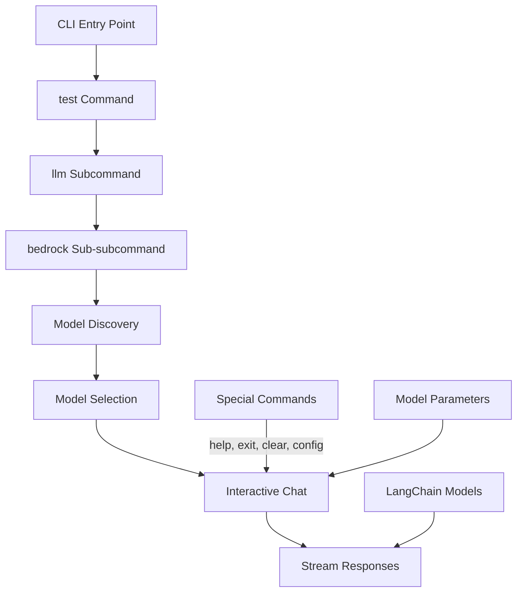

# CLI Test Command for LangChain Bedrock Implementation

## Directory Purpose
This implementation plan outlines the design and implementation steps for updating the CLI command structure (`test llm bedrock`) to leverage the current LangChain implementation in `src/dbp/llm/bedrock`. The test command will provide an interactive chat interface for testing supported Bedrock models using the LangChain wrapper classes (ClaudeEnhancedChatBedrockConverse and NovaEnhancedChatBedrockConverse) rather than the older EnhancedBedrockBase approach.

⚠️ CRITICAL: CODING ASSISTANT MUST READ THESE DOCUMENTATION FILES COMPLETELY BEFORE EXECUTING ANY TASKS IN THIS PLAN

## Documentation References

### Core Documentation
- `src/dbp/llm/HSTC.md` - Overview of the LLM system architecture
- `src/dbp/llm/bedrock/HSTC.md` - Bedrock model integration
- `src/dbp/llm/bedrock/models/HSTC.md` - Bedrock model implementations
- `src/dbp_cli/cli.py` - Main CLI implementation

### Technical Implementation References
- `src/dbp/llm/bedrock/langchain_wrapper.py` - Base LangChain wrapper
- `src/dbp/llm/bedrock/models/claude3.py` - Claude model implementation
- `src/dbp/llm/bedrock/models/nova.py` - Nova model implementation
- `src/dbp_cli/commands/base.py` - Base command handler

## Implementation Overview

The implementation will follow this logical structure:



## Implementation Files to Create

1. `src/dbp_cli/commands/test/__init__.py` - Package initialization
2. `src/dbp_cli/commands/test.py` - TestCommandHandler implementation
3. `src/dbp_cli/commands/test/llm.py` - LLMTestCommandHandler implementation
4. `src/dbp_cli/commands/test/bedrock.py` - BedrockTestCommandHandler implementation

## Implementation Files to Update

1. `src/dbp_cli/cli.py` - Update to register test command

## Key Components to Implement

### 1. Command Structure
- `TestCommandHandler` base class in `src/dbp_cli/commands/test.py`
- `LLMTestCommandHandler` in `src/dbp_cli/commands/test/llm.py`
- `BedrockTestCommandHandler` in `src/dbp_cli/commands/test/bedrock.py`
- Integration with main CLI in `src/dbp_cli/cli.py`

### 2. Model Discovery and Selection
- Dynamic model discovery by inspecting LangChain model classes' `SUPPORTED_MODELS` attributes
- Interactive model selection interface when no model specified
- Model family grouping for easier navigation

### 3. Interactive Chat Interface
- Stream-based response display using the models' `astream_text` method
- Support for multi-turn conversations with message history
- Special commands for configuration and control

### 4. Model Parameter Configuration
- Support for common model parameters (temperature, max_tokens, etc.)
- Dynamic parameter configuration during chat session

## Implementation Details

### Command Structure Implementation

The command structure follows a hierarchical pattern supporting nested subcommands:

```
test (TestCommandHandler)
└── llm (LLMTestCommandHandler)
    └── bedrock (BedrockTestCommandHandler)
```

Each command handler is responsible for:
- Defining its command-line arguments
- Processing user input
- Delegating to subcommands as appropriate
- Providing appropriate help text and error messages

### Model Discovery Implementation

The model discovery implementation will use Python's reflection capabilities to:
1. Import model modules (claude3, nova, etc.)
2. Find model client classes (subclasses of EnhancedChatBedrockConverse)
3. Extract supported model IDs from SUPPORTED_MODELS class attributes
4. Organize models by family for display to the user

This allows the CLI to dynamically discover all supported models without hardcoding.

### Interactive Chat Implementation

The interactive chat interface will:
1. Initialize the appropriate LangChain model class for the selected model
2. Provide a command-line interface for user input
3. Stream model responses using the `astream_text` method
4. Support multi-turn conversations by maintaining chat history
5. Handle special commands for help, configuration, and exit

The implementation will use `prompt_toolkit` for an enhanced CLI experience and `asyncio` for handling streaming responses.

### Special Commands Implementation

The chat interface will support special commands:
- `help` - Display available commands
- `exit` / `quit` - Exit the chat session
- `clear` - Clear the chat history
- `config` - View or modify model parameters

These commands will provide users with control over the chat session and model parameters.

## Dependencies

- `prompt_toolkit`: For enhanced CLI input experience
- `asyncio`: For handling asynchronous streaming responses
- Access to the LangChain model classes via import
- AWS configuration via ConfigurationManager

## Implementation Plan Files

- `plan_overview.md` - This overview document
- `plan_command_structure.md` - Command structure implementation
- `plan_model_discovery.md` - Model discovery implementation
- `plan_interactive_chat.md` - Interactive chat implementation
- `plan_special_commands.md` - Special commands implementation
- `plan_progress.md` - Progress tracking

## Success Criteria

- Users can launch an interactive chat session with any supported Bedrock model
- The interface dynamically discovers available models from LangChain implementations
- Users can configure model parameters before and during chat sessions
- The chat interface properly displays streaming responses
- Special commands provide control over the session

## Usage Examples

```bash
# Basic usage - will prompt for model selection
dbp test llm bedrock

# Specify a model directly
dbp test llm bedrock --model anthropic.claude-3-5-sonnet-20240620-v1:0

# With model parameters
dbp test llm bedrock --temperature 0.8 --max_tokens 2048
