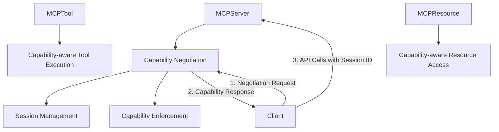

# MCP Capability Negotiation Implementation Plan

## Overview

This document outlines a comprehensive implementation plan for adding capability negotiation to our Model Context Protocol (MCP) server implementation. Capability negotiation is a core part of the MCP specification that allows clients and servers to explicitly declare their supported features at the beginning of a session. This ensures both parties understand what protocol features can be used during their interaction.

## Background

According to the MCP specification, capability negotiation is a process where:

1. Clients declare which capabilities they support (e.g., sampling, notifications, progress tracking)
2. Servers declare which features they provide (e.g., tools, resources, subscriptions)
3. Both parties use this information to determine the available protocol features for the session

Our current implementation lacks formal capability negotiation, which limits the server's ability to adapt to different client capabilities and makes it harder for clients to discover available features.

## Goals

1. Implement MCP capability negotiation protocol compliant with the Anthropic specification
2. Provide session-based capability tracking and enforcement
3. Maintain backward compatibility with existing clients
4. Enable feature discovery for clients
5. Support extensibility for future capabilities

## Technical Architecture

### 1. Component Additions



### 2. Data Models

#### 2.1 Capability Definitions

```python
# src/dbp/mcp_server/mcp/negotiation.py

from enum import Enum
from typing import Dict, List, Any, Optional, Set
from pydantic import BaseModel, Field

class ServerCapabilityType(Enum):
    """Server capabilities as defined in MCP specification"""
    TOOLS = "tools"
    RESOURCES = "resources"
    SUBSCRIPTIONS = "subscriptions"
    PROMPTS = "prompts"
    STREAMING = "streaming"
    NOTIFICATIONS = "notifications"
    
    # Additional capabilities beyond core spec
    BATCH_OPERATIONS = "batch_operations"
    HISTORY = "history"
    METRICS = "metrics"

class ClientCapabilityType(Enum):
    """Client capabilities as defined in MCP specification"""
    SAMPLING = "sampling"
    NOTIFICATIONS = "notifications"
    PROGRESS_TRACKING = "progress_tracking"
    CANCELLATION = "cancellation"
    STREAMING = "streaming"
    
    # Additional capabilities beyond core spec
    BATCH_REQUESTS = "batch_requests"
    SESSION_RESUME = "session_resume"

class CapabilityDetail(BaseModel):
    """Detailed information about a capability"""
    name: str
    version: str
    description: str
    parameters: Optional[Dict[str, Any]] = None

class NegotiationRequest(BaseModel):
    """Client capability declaration sent at session initialization"""
    client_name: str
    client_version: str
    supported_capabilities: List[str]
    capability_details: Optional[Dict[str, CapabilityDetail]] = None
    extensions: Optional[Dict[str, Any]] = None

class NegotiationResponse(BaseModel):
    """Server capability declaration sent as response to negotiation request"""
    server_name: str
    server_version: str
    supported_capabilities: List[str]
    available_tools: List[str]
    available_resources: List[str]
    capability_details: Optional[Dict[str, CapabilityDetail]] = None
    extensions: Optional[Dict[str, Any]] = None
```

#### 2.2 Session Management

```python
# src/dbp/mcp_server/mcp/session.py

import time
import uuid
from typing import Dict, Any, Set, Optional
from pydantic import BaseModel

class MCPSession(BaseModel):
    """
    [Class intent]
    Represents an active MCP client session with negotiated capabilities.
    
    [Design principles]
    - Maintains state for client capabilities across requests
    - Tracks session activity for cleanup
    - Provides authentication context
    
    [Implementation details]
    - Uses unique ID for session tracking
    - Stores full capability details
    - Maintains activity timestamps for session expiration
    """
    id: str
    client_name: str
    client_version: str
    client_capabilities: Set[str]
    created_at: float
    last_activity: float
    auth_context: Optional[Dict[str, Any]] = None
    
    @classmethod
    def create(cls, client_name: str, client_version: str, capabilities: Set[str],
               auth_context: Optional[Dict[str, Any]] = None) -> "MCPSession":
        """Create a new session with a unique ID"""
        now = time.time()
        return cls(
            id=str(uuid.uuid4()),
            client_name=client_name,
            client_version=client_version,
            client_capabilities=capabilities,
            created_at=now,
            last_activity=now,
            auth_context=auth_context
        )
    
    def update_activity(self) -> None:
        """Update the last activity timestamp"""
        self.last_activity = time.time()
    
    def has_capability(self, capability: str) -> bool:
        """Check if the client has a specific capability"""
        return capability in self.client_capabilities
```

### 3. Implementation Plan

#### 3.1 Core Negotiation Module

File: `src/dbp/mcp_server/mcp/negotiation.py`

This module will contain the core data models and logic for capability negotiation:

1. Capability enumerations as defined above
2. Negotiation request and response models
3. Helper functions for capability validation

#### 3.2 Session Management Module

File: `src/dbp/mcp_server/mcp/session.py`

This module will handle session tracking and management:

1. Session class as defined above
2. Functions for session creation, retrieval, and validation
3. Session expiration and cleanup logic

#### 3.3 MCPServer Updates

File: `src/dbp/mcp_server/server.py`

Update the MCPServer class to add:

1. Session storage and management
2. Negotiation endpoint 
3. Capability enforcement middleware
4. Helper methods for capability checking

The key methods to add:

```python
class MCPServer:
    def __init__(self, ...):
        # Existing initialization
        
        # Add session management
        self._sessions: Dict[str, MCPSession] = {}
        self._session_lock = threading.RLock()
        self._server_capabilities = self._determine_server_capabilities()
        
    def _determine_server_capabilities(self) -> Set[str]:
        """Determine the server's capabilities based on configuration"""
        capabilities = {
            ServerCapabilityType.TOOLS.value,
            ServerCapabilityType.RESOURCES.value,
        }
        
        # Add additional capabilities based on config
        if getattr(self, '_supports_subscriptions', False):
            capabilities.add(ServerCapabilityType.SUBSCRIPTIONS.value)
            
        if getattr(self, '_supports_streaming', False):
            capabilities.add(ServerCapabilityType.STREAMING.value)
            
        # Add more capability checks as needed
        
        return capabilities
        
    def register_negotiation_endpoint(self):
        """Register the capability negotiation endpoint"""
        @self._app.post("/mcp/negotiate")
        async def negotiate_capabilities(request: Request, negotiation: NegotiationRequest):
            # Process client capabilities
            client_capabilities = set(negotiation.supported_capabilities)
            
            # Create session
            session = MCPSession.create(
                client_name=negotiation.client_name,
                client_version=negotiation.client_version,
                capabilities=client_capabilities,
                auth_context=self._extract_auth_context(request)
            )
            
            # Store session
            with self._session_lock:
                self._sessions[session.id] = session
                
            # Prepare response with server capabilities
            available_tools = list(self._registered_tools.keys())
            available_resources = list(self._registered_resources.keys())
            
            response = NegotiationResponse(
                server_name=self.name,
                server_version=self.version,
                supported_capabilities=list(self._server_capabilities),
                available_tools=available_tools,
                available_resources=available_resources,
                capability_details=self._get_capability_details()
            )
            
            # Return response with session ID in header
            return JSONResponse(
                content=response.dict(),
                headers={"X-MCP-Session-ID": session.id}
            )
            
    def register_session_middleware(self):
        """Register middleware to handle session validation"""
        @self._app.middleware("http")
        async def session_middleware(request: Request, call_next):
            # Skip session check for negotiation endpoint
            if request.url.path == "/mcp/negotiate":
                return await call_next(request)
                
            # Get session ID from header
            session_id = request.headers.get("X-MCP-Session-ID")
            if not session_id:
                return JSONResponse(
                    status_code=401,
                    content={"error": "Missing session ID. Please negotiate capabilities first."}
                )
                
            # Validate session
            session = self.get_session(session_id)
            if not session:
                return JSONResponse(
                    status_code=401,
                    content={"error": "Invalid session ID. Please negotiate capabilities again."}
                )
                
            # Update session activity
            session.update_activity()
            
            # Store session in request state for handlers
            request.state.session = session
            
            # Check capabilities for specific endpoints
            path = request.url.path
            
            if path.startswith("/mcp/tool/") and not session.has_capability("sampling"):
                return JSONResponse(
                    status_code=403,
                    content={"error": "Client does not support required capability: sampling"}
                )
                
            if path.startswith("/mcp/subscription/") and not session.has_capability("notifications"):
                return JSONResponse(
                    status_code=403,
                    content={"error": "Client does not support required capability: notifications"}
                )
                
            # Continue with request
            return await call_next(request)
            
    def get_session(self, session_id: str) -> Optional[MCPSession]:
        """Get a session by ID"""
        with self._session_lock:
            return self._sessions.get(session_id)
            
    def cleanup_sessions(self, max_age: int = 3600) -> int:
        """Clean up expired sessions"""
        now = time.time()
        expired_ids = []
        
        with self._session_lock:
            for session_id, session in self._sessions.items():
                if now - session.last_activity > max_age:
                    expired_ids.append(session_id)
                    
            for session_id in expired_ids:
                del self._sessions[session_id]
                
        return len(expired_ids)
        
    def start_session_cleanup_task(self):
        """Start a background task to clean up expired sessions"""
        # Implementation of periodic cleanup task
```

#### 3.4 Tool and Resource Handler Updates

Update the tool and resource handler methods to use session information:

```python
# Update MCPTool.handle_json_rpc
def handle_json_rpc(self, request: Dict[str, Any], session: Optional[MCPSession] = None) -> Dict[str, Any]:
    # Existing code...
    
    # Check for required capabilities
    if session and not session.has_capability("progress_tracking") and progress_reporter:
        # Disable progress reporting for this client
        progress_reporter = None
        
    if session and not session.has_capability("cancellation") and cancellation_token:
        # Disable cancellation for this client
        cancellation_token = None
```

Similar updates should be made to `MCPResource.handle_json_rpc`.

#### 3.5 Server Endpoint Updates

Update the server's tool and resource endpoints to extract session information:

```python
async def tool_endpoint(request: Request, tool_data: Dict[str, Any] = Body({})):
    # Get session from request state (set by middleware)
    session = getattr(request.state, "session", None)
    
    # Extract headers from FastAPI request
    headers = dict(request.headers)
    
    try:
        # Call the tool's handler method with session
        result = tool.handle_json_rpc(tool_data, session=session)
        return JSONResponse(content=result)
    except Exception as e:
        # Error handling...
```

### 4. Backward Compatibility

To maintain backward compatibility with clients that don't support negotiation:

1. Add a configuration option `require_negotiation` (default: False)
2. When set to False, create an anonymous session with minimal capabilities for requests without a session ID
3. When set to True, enforce negotiation and reject requests without valid session IDs

```python
# Add to session middleware
if not session_id:
    if self.require_negotiation:
        return JSONResponse(
            status_code=401,
            content={"error": "Missing session ID. Please negotiate capabilities first."}
        )
    else:
        # Create anonymous session with minimal capabilities
        session = MCPSession.create(
            client_name="anonymous",
            client_version="unknown",
            capabilities={"basic"}
        )
        request.state.session = session
```

### 5. Testing Strategy

#### 5.1 Unit Tests

Create unit tests for:

1. Capability negotiation data models
2. Session creation, validation, and expiration
3. Capability checking logic

#### 5.2 Integration Tests

Create integration tests for:

1. Negotiation endpoint
2. Session management and persistence
3. Capability enforcement
4. Different capability combinations

#### 5.3 Client Examples

Create example clients that:

1. Perform proper capability negotiation
2. Use sessions with different capability sets
3. Handle capability-specific features

### 6. Documentation

#### 6.1 Developer Documentation

Create documentation for developers:

1. Overview of capability negotiation
2. Available server capabilities
3. Required client capabilities for different features
4. Example negotiation flow

#### 6.2 Client Integration Guide

Create a guide for client developers on how to integrate with the capability negotiation:

1. How to initiate negotiation
2. How to handle session IDs
3. How to adapt to available server capabilities

#### 6.3 API Documentation

Update API documentation to include:

1. Negotiation endpoint details
2. Session ID header requirements
3. Capability-specific behaviors

### 7. Future Extensions

Design the implementation to support future extensions:

1. Custom capability types
2. Version-specific capabilities
3. Capability parameters for complex feature configuration
4. Session resumption and persistence

## Implementation Phases

### Phase 1: Core Implementation

1. Create negotiation and session data models
2. Add session storage to MCPServer
3. Implement negotiation endpoint
4. Add basic session validation middleware
5. Update tool and resource handlers to use session information
6. Add session cleanup functionality

### Phase 2: Capability Enforcement

1. Add detailed capability requirements for each endpoint
2. Implement capability checking in middleware
3. Update handlers to adapt behavior based on capabilities
4. Add configuration for required vs. optional capabilities

### Phase 3: Testing and Documentation

1. Create comprehensive unit and integration tests
2. Write developer documentation
3. Create client integration guide
4. Update API documentation

### Phase 4: Advanced Features

1. Add capability versioning
2. Implement capability parameters
3. Add session persistence
4. Develop extension mechanism for custom capabilities

## Risks and Mitigations

| Risk | Impact | Mitigation |
|------|--------|------------|
| Breaking existing clients | High | Implement backward compatibility mode with anonymous sessions |
| Performance impact of session checks | Medium | Use efficient session lookup and caching |
| Session management complexity | Medium | Clear documentation and comprehensive testing |
| Overly strict capability requirements | Medium | Make most capabilities optional with graceful degradation |
| Session leaks or security issues | High | Implement proper session cleanup and security controls |

## Timeline

| Phase | Tasks | Estimated Duration |
|-------|-------|-------------------|
| Phase 1 | Core Implementation | 1-2 weeks |
| Phase 2 | Capability Enforcement | 1-2 weeks |
| Phase 3 | Testing and Documentation | 1 week |
| Phase 4 | Advanced Features | 2-3 weeks |

## Conclusion

Implementing formal capability negotiation will enhance our MCP server by allowing dynamic adaptation to client capabilities while maintaining protocol compliance. The session-based approach provides a clean way to track capabilities and enforce requirements, with opportunities for future extensions.
