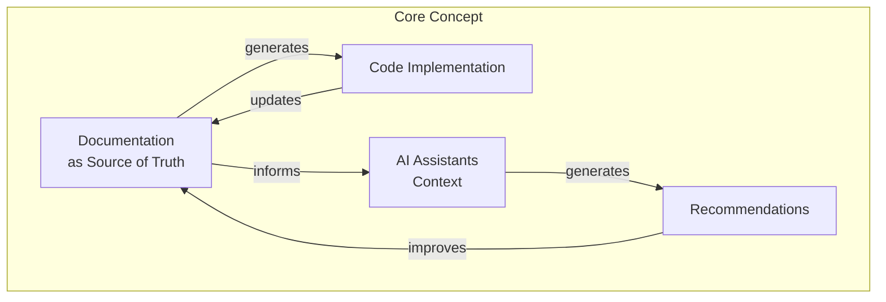
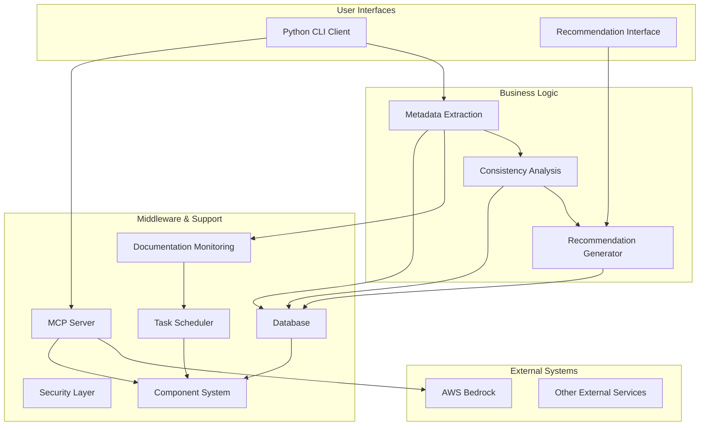

# Documentation-Based Programming System
## Onboarding Overview

Welcome to the Documentation-Based Programming (DBP) system project! This onboarding kit will help you quickly understand the project's purpose, architecture, and how its components work together.

## What is Documentation-Based Programming?

Documentation-Based Programming (DBP) is an architecture that treats documentation as a primary project asset and the **single source of truth**. It ensures consistency between code and documentation, provides rich context for AI tools, and enforces project standards through automated analysis and recommendations.

## Key Problems Solved

Documentation-Based Programming solves these critical problems:

1. **Repetitive Context Explanations**: Developers no longer need to repeatedly explain project structure, coding standards, and documentation practices to AI assistants
2. **Inconsistent Recommendations**: AI assistants have persistent knowledge of project context, ensuring consistent suggestions
3. **Lost Design Decisions**: Critical design decisions are properly tracked and maintained
4. **Documentation-Code Drift**: As projects evolve, documentation and code remain in sync
5. **Context Window Limitations**: LLMs no longer need the complete codebase to make informed decisions

## Main Benefits

- **Documentation-First Development**: Features begin with documentation updates, ensuring well-thought-out designs
- **Consistent Source of Truth**: Code and documentation remain in sync
- **Reduced LLM Context Requirements**: AI assistants understand project context without parsing complex code
- **Automatic Synchronization**: When code changes, documentation updates automatically
- **Focus on Design Intent**: Developers communicate design intent clearly

## Key Features

- **Documentation Monitoring**: Detects changes in files within 10 seconds
- **Metadata Extraction**: Uses Amazon Nova Lite LLM to extract structured metadata from code files
- **Consistency Analysis**: Detects inconsistencies between code and documentation
- **Recommendation Generation**: Creates actionable recommendations to maintain documentation consistency
- **MCP Server Integration**: Exposes functionality to AI assistants through standardized tools

## System Components at a Glance

## Onboarding Kit Structure

This onboarding kit includes:

1. **Overview** (this document): High-level introduction to DBP
2. **System Architecture**: Detailed explanation of system components and relationships
3. **Key Workflows**: How the system processes changes and generates recommendations
4. **Data Models**: Core data structures and relationships
5. **Development Guide**: How to start working with the DBP system 

## Key Resources

- [DESIGN.md](../../doc/DESIGN.md) - Comprehensive system architecture
- [DATA_MODEL.md](../../doc/DATA_MODEL.md) - Data structures and relationships
- [DOCUMENT_RELATIONSHIPS.md](../../doc/DOCUMENT_RELATIONSHIPS.md) - Documentation dependencies
- [PR-FAQ.md](../../doc/PR-FAQ.md) - Product requirements as press release and FAQ
- [WORKING_BACKWARDS.md](../../doc/WORKING_BACKWARDS.md) - Product vision and customer experience

Next, read the [System Architecture](02_system_architecture.md) document to understand the technical design in detail.
