# System Architecture

## Technical Architecture Overview

The Documentation-Based Programming (DBP) system follows a modular component-based architecture. Each component has clearly defined responsibilities and interfaces, focusing on specific aspects of maintaining documentation consistency.

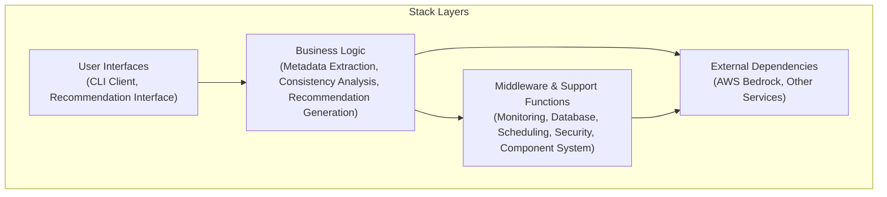

## Core Architecture Principles

1. **Documentation as Source of Truth**: Documentation takes precedence over code itself for understanding project intent
2. **Automatic Consistency Maintenance**: System actively ensures consistency between documentation and code
3. **Global Contextual Awareness**: AI assistants maintain awareness of entire project context
4. **Design Decision Preservation**: All significant design decisions are captured and maintained
5. **Reasonable Default Values**: System provides carefully selected default values while allowing customization
6. **Simplified Component Management**: System uses a minimalist component lifecycle approach for clarity

## Component System

The DBP system uses a component-based architecture with centralized registration and dependency management:

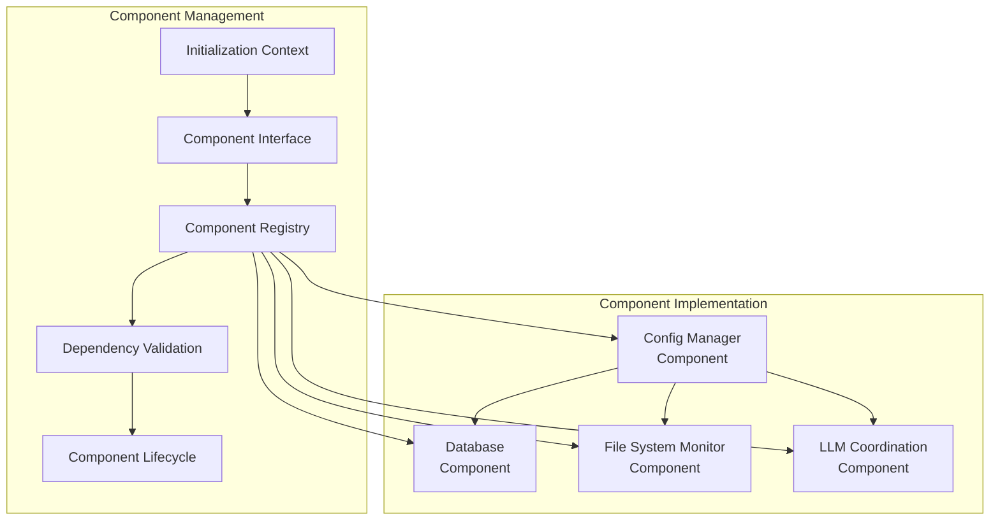

### Initialization Sequence

The component initialization follows a simple and explicit sequence:

1. **Registration**: Components register with dependencies in the ComponentRegistry
2. **Validation**: All dependencies are validated before initialization begins
3. **Initialization**: Components are initialized in dependency order
4. **Shutdown**: Components are shut down in reverse initialization order

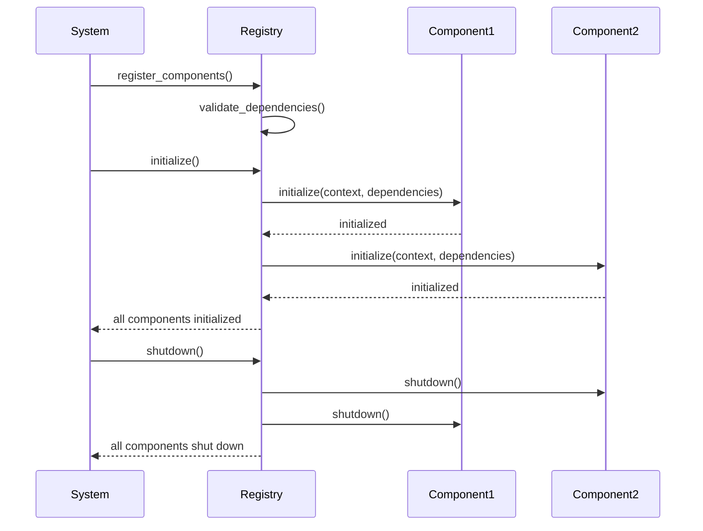

## Key Components

### 1. File System Monitor

Monitors the codebase for file changes in near real-time:

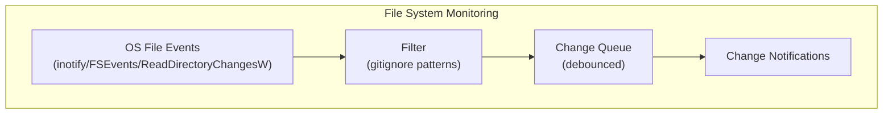

Key features:
- Uses native OS notification APIs for efficiency
- Respects .gitignore patterns and exclusion rules
- Implements debouncing to handle rapid changes
- Queue-based processing with configurable delays

### 2. Metadata Extraction

Extracts metadata from codebase files using LLM capabilities:

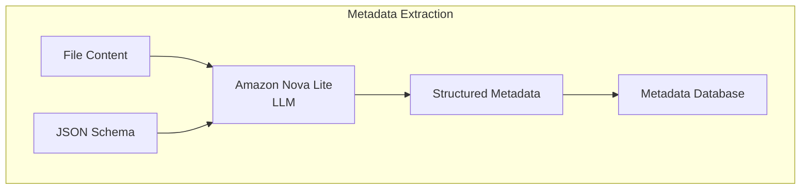

Key features:
- Uses Amazon Nova Lite for efficient metadata extraction
- Extracts file header sections, function documentation, and relationships
- Normalizes metadata into structured JSON format
- Stores metadata in SQLite database for persistence
- Implements in-memory caching for performance

### 3. Consistency Analysis

Analyzes relationships and detects inconsistencies:

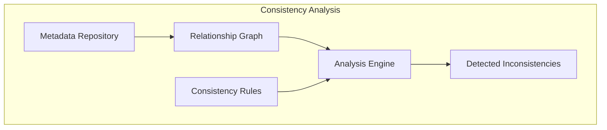

Key features:
- Builds in-memory graph of document relationships
- Applies consistency rules to detect misalignments
- Analyzes code-documentation relationships
- Tracks dependency graph between documentation files
- Identifies contradictions between documentation files

### 4. Recommendation Generator

Creates actionable recommendations from detected inconsistencies:

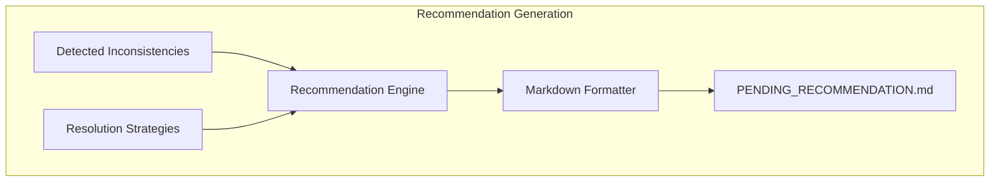

Key features:
- Generates single active recommendation file
- Uses markdown format for easy developer review
- Supports ACCEPT/REJECT/AMEND developer decisions
- Automatically invalidates when code changes
- Implements recommendations when accepted

### 5. LLM Coordination Architecture

Orchestrates multiple LLM instances for efficient processing:

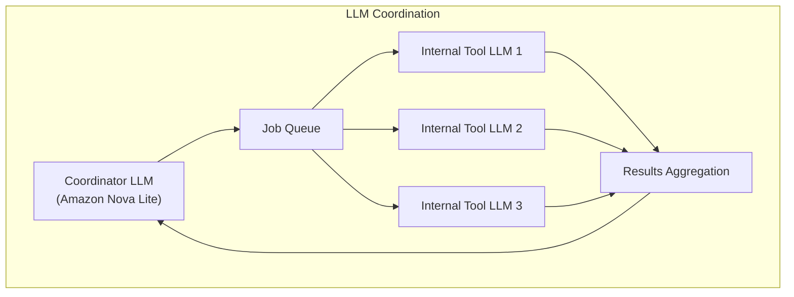

Key features:
- Uses coordinator LLM to manage request processing
- Dispatches specialized internal tools for specific contexts
- Implements asynchronous job-based architecture
- Manages cost budgets and timeout constraints
- Aggregates results from multiple tools

### 6. MCP Server

Exposes DBP capabilities through MCP protocol:

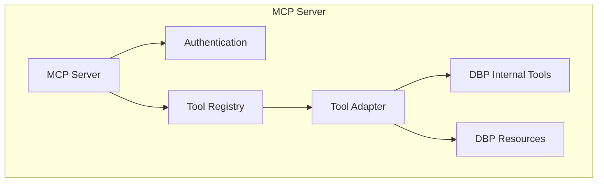

Key features:
- Implements MCP protocol for AI assistant integration
- Exposes dbp_general_query and dbp_commit_message tools
- Provides access to documentation resources
- Implements authentication and authorization
- Manages resource limits and budgets

### 7. Database Layer

Persists metadata and system state:

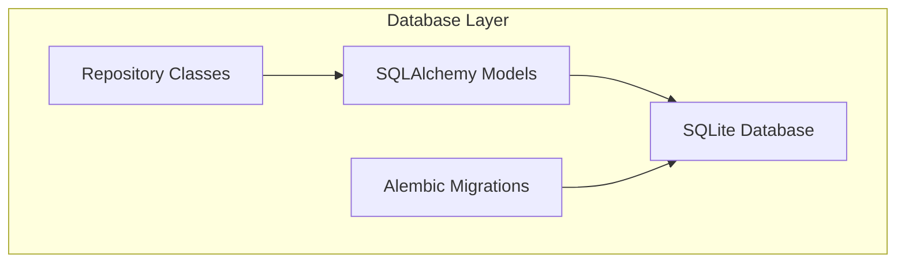

Key features:
- Uses SQLite for zero-dependency local storage
- Implements repository pattern for data access
- Manages schema evolution with Alembic migrations
- Provides thread-safe access through connection pooling
- Optimized for metadata storage and retrieval

### 8. Background Task Scheduler

Manages asynchronous background tasks:

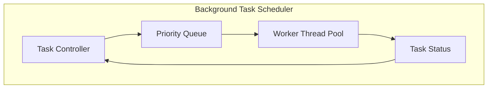

Key features:
- Implements thread pool for concurrent task execution
- Prioritizes tasks based on importance and dependencies
- Provides status tracking and monitoring
- Implements graceful shutdown handling
- Manages resource usage constraints

## End-to-End Workflow

Here's how the components work together in a typical workflow:

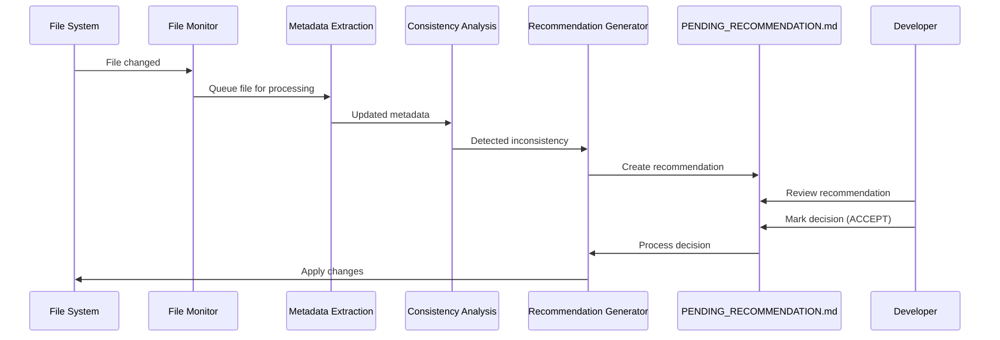

## MCP Client Integration

The DBP system integrates with AI assistants through the MCP protocol:

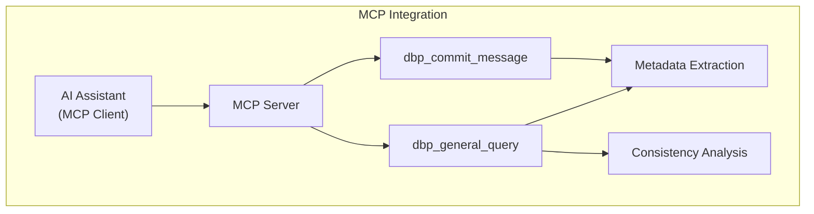

## Security Architecture

The security architecture follows these principles:

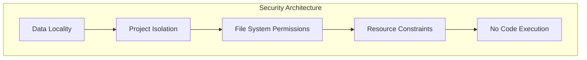

Key security features:
- All processing performed locally, no data leaves the system
- Complete separation between indexed projects
- Follows existing filesystem permissions for file access
- System never executes code from monitored files
- Limited CPU and memory usage with intelligent throttling

## Documentation Relationship Management

Documentation relationships are tracked through a graph structure:

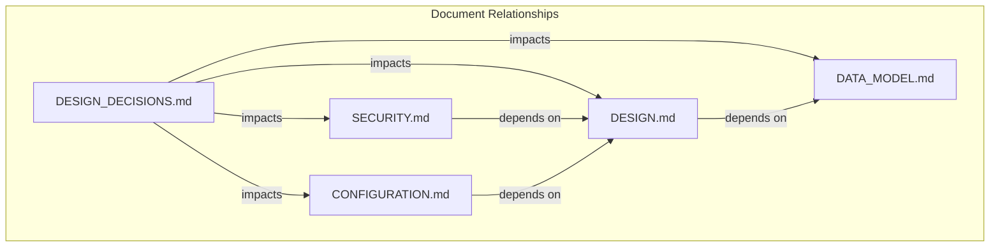

This graph enables:
- Understanding which documents depend on others
- Identifying impact when documentation changes
- Maintaining global consistency across documentation
- Tracking documentation update requirements

## Next Steps

Continue to the [Key Workflows](03_key_workflows.md) document to understand how the system processes changes and generates recommendations.
