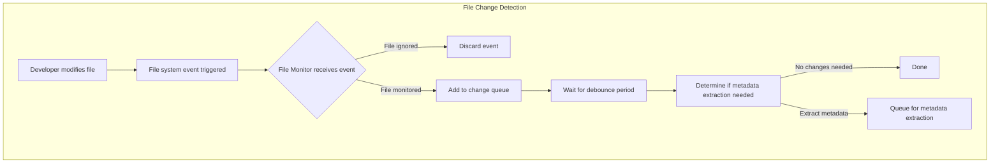
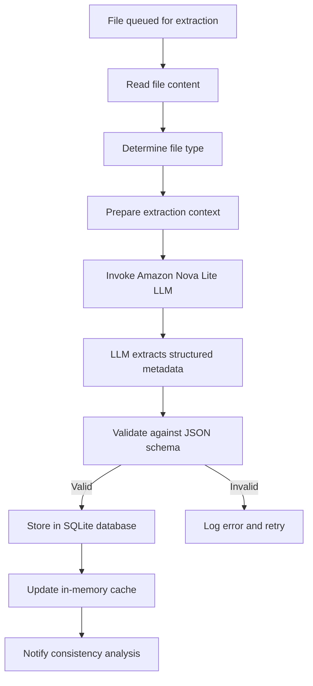
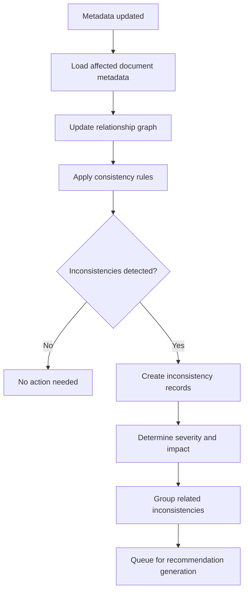
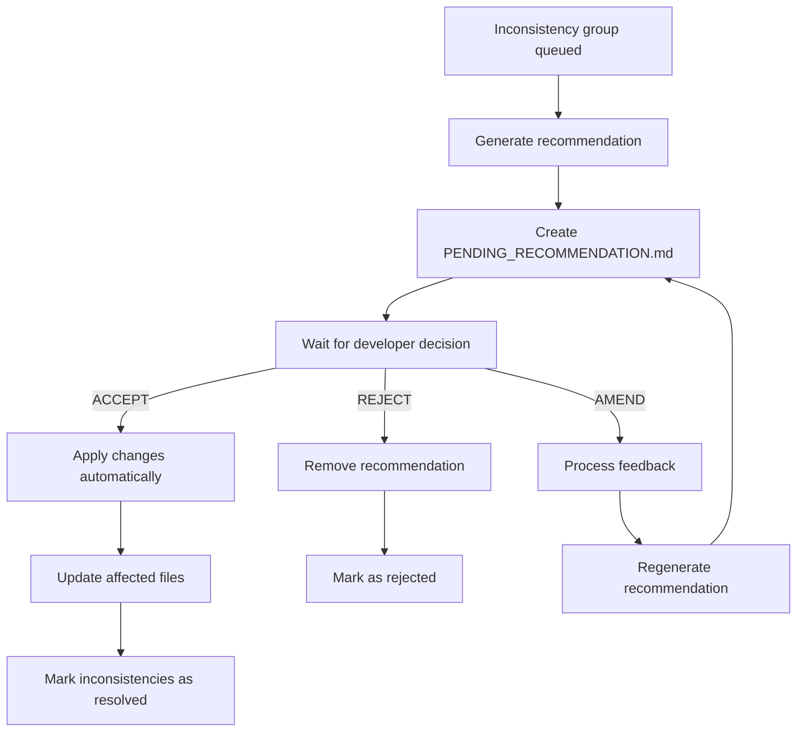
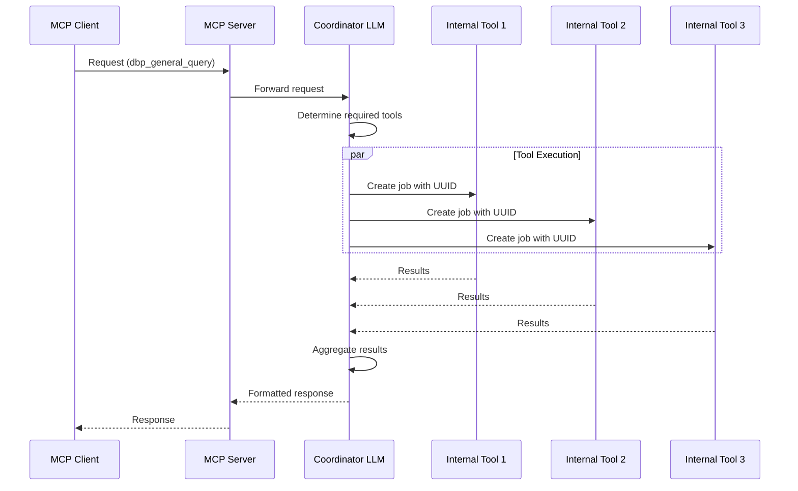
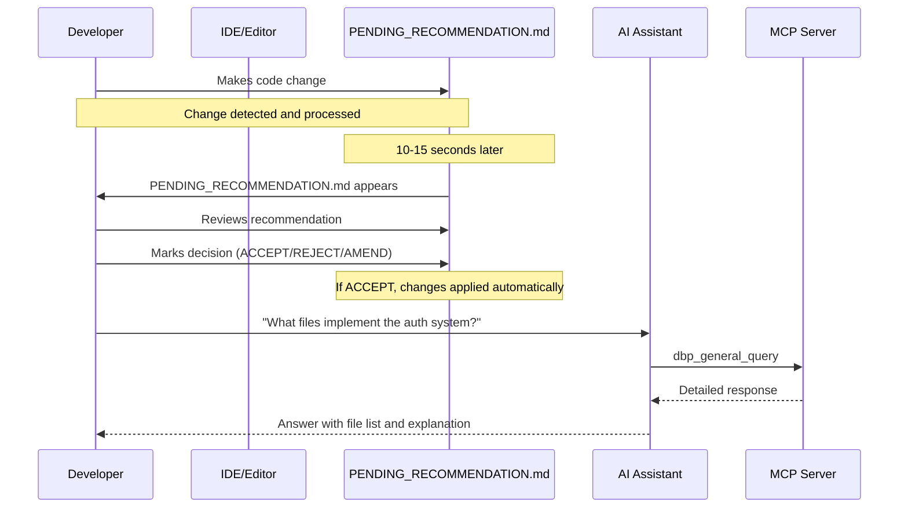
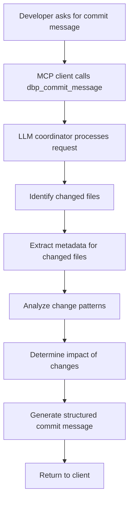

# Key Workflows

This document explains the primary workflows in the Documentation-Based Programming system, demonstrating how components interact to maintain documentation consistency.

## 1. File Change Detection and Processing

This workflow shows how the system detects and processes file changes:

**How it works:**
1. Developer creates, modifies, or deletes a file
2. Operating system file notification API detects the change
3. File system monitor filters events based on .gitignore patterns
4. Monitored files are added to the change queue
5. System waits for configured debounce period (default: 10 seconds)
6. System checks if metadata extraction is needed based on:
   - File existence
   - File size changes
   - Content hash changes
   - Missing metadata in database
7. If needed, file is queued for metadata extraction

## 2. Metadata Extraction Process

This workflow shows how metadata is extracted from files:

**How it works:**
1. Extraction worker reads file content
2. File type is determined (based on content, not just extension)
3. Extraction context is prepared including:
   - File content
   - Extraction templates
   - Expected output schema
4. Amazon Nova Lite LLM performs the extraction, identifying:
   - File header sections (intent, design principles, etc.)
   - Function/class definitions and documentation
   - Documentation references
   - Change history entries
5. Metadata is validated against JSON schema
6. Valid metadata is stored in SQLite database
7. In-memory cache is updated
8. Consistency analysis is notified of the update

## 3. Consistency Analysis

This workflow shows how the system analyzes consistency between documentation and code:

**How it works:**
1. System loads metadata for affected document(s)
2. In-memory relationship graph is updated
3. Consistency rules are applied, checking for:
   - Documentation-to-documentation consistency
   - Code-to-documentation consistency
   - Design decision compliance
   - Reference validity
4. Detected inconsistencies are recorded with:
   - Severity classification
   - Affected documents
   - Type of inconsistency
   - Suggested resolution
5. Related inconsistencies are grouped
6. Groups are queued for recommendation generation

## 4. Recommendation Generation and Processing

This workflow shows how recommendations are created and processed:

**How it works:**
1. System generates recommendation based on inconsistency group
2. Creates PENDING_RECOMMENDATION.md file with:
   - Detailed explanation of inconsistency
   - Affected files and locations
   - Specific suggested changes (in diff format)
   - Decision options (ACCEPT/REJECT/AMEND)
3. Developer reviews recommendation and makes decision
4. For ACCEPT:
   - System applies changes automatically
   - Affected files are updated
   - Inconsistencies are marked as resolved
5. For REJECT:
   - Recommendation is removed
   - Inconsistencies are marked as rejected
6. For AMEND:
   - Developer feedback is processed
   - New recommendation is generated
   - Process repeats

## 5. MCP Server Request Processing

This workflow shows how the MCP server processes requests using the LLM coordination system:

**How it works:**
1. MCP client (AI assistant) sends request to MCP server
2. Server forwards request to coordinator LLM (Amazon Nova Lite)
3. Coordinator determines which internal tools are needed based on query
4. Creates jobs with unique UUIDs for each required tool
5. Internal tools execute in parallel, each with its own LLM instance
6. Tools access application data as needed
7. Results are returned to coordinator
8. Coordinator aggregates results and formats response
9. Response is returned to client

## 6. Developer Experience

This workflow demonstrates the developer experience:

**How it works:**
1. Developer makes code or documentation changes
2. System automatically processes changes (typically within 10-15 seconds)
3. If inconsistencies are detected, PENDING_RECOMMENDATION.md appears
4. Developer reviews and decides on recommendation
5. System processes the decision automatically
6. Developer can use AI assistants that leverage the MCP server
7. AI assistants provide contextually aware responses based on up-to-date project metadata

## 7. Commit Message Generation

This workflow shows how the system generates Git commit messages:

**How it works:**
1. Developer requests commit message generation
2. MCP client calls dbp_commit_message tool
3. LLM coordinator identifies changed files using:
   - Provided diff information, or
   - Git diff from last commit, or
   - File system change detection
4. System extracts metadata for changed files
5. Change patterns are analyzed
6. Impact of changes is assessed
7. Structured commit message is generated with:
   - Subject line summarizing changes
   - Detailed body explaining modifications
   - References to documentation changes
   - Impact analysis based on defined rules
8. Commit message is returned to client

## Key Resource Constraints

The system operates with these resource constraints:

1. **CPU Usage**: <5% average CPU usage
2. **Memory Usage**: <100MB RAM for core functionality
3. **Disk Usage**: Efficient SQLite storage with automatic maintenance
4. **Response Time**: 
   - Change detection: <10 seconds
   - Metadata extraction: <5 seconds per file
   - Recommendation generation: <15 seconds
   - MCP queries: <3 seconds for simple queries, <10 seconds for complex queries

## Error Handling and Recovery

The system implements robust error handling:

1. **Extraction Failures**: Retried with exponential backoff
2. **LLM Failures**: Fallback mechanisms and clear error reporting
3. **Database Failures**: Automatic reconnection with data integrity checks
4. **File Access Errors**: Logged with retry mechanisms
5. **Recommendation Failures**: Clear error messages with suggestions

## Next Steps

Continue to the [Data Models](04_data_models.md) document to understand the core data structures used throughout the system.
