# Data Models

This document provides an overview of the core data structures used in the Documentation-Based Programming system.

## Metadata Extraction Model

The system uses Amazon Nova Lite LLM to extract the following structured metadata from code files:

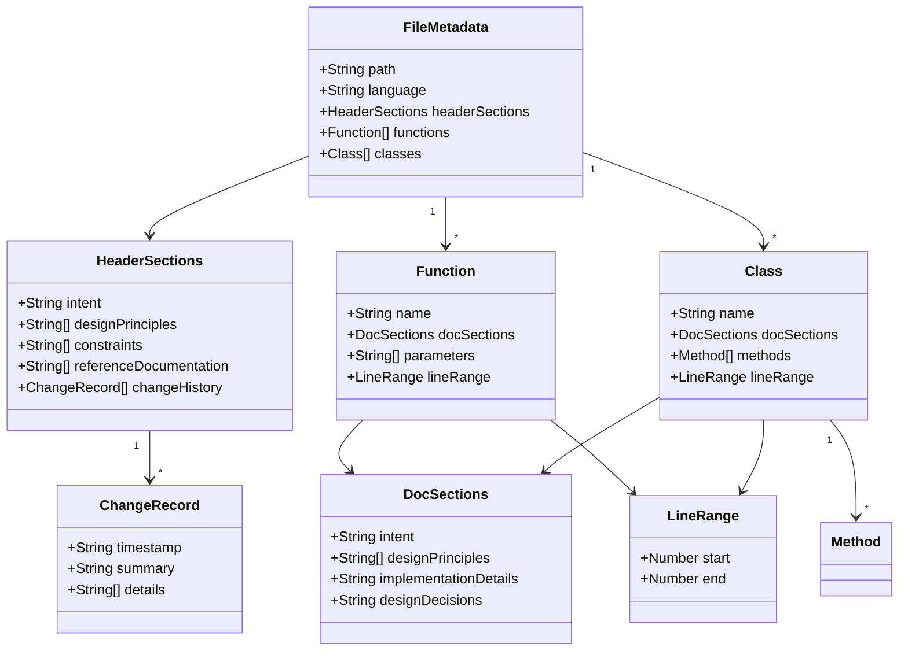

Key characteristics of the metadata extraction:

- **LLM-Exclusive Processing**: Extraction performed exclusively by LLM without programmatic fallbacks
- **Language-Agnostic**: Works across programming languages without specialized parsers
- **Content-Based Identification**: Identifies sections based on semantic meaning
- **Hierarchical Structure**: Preserves relationships between files, classes, and functions

## Core Data Entities

### Document Reference

Represents any file containing documentation or code:

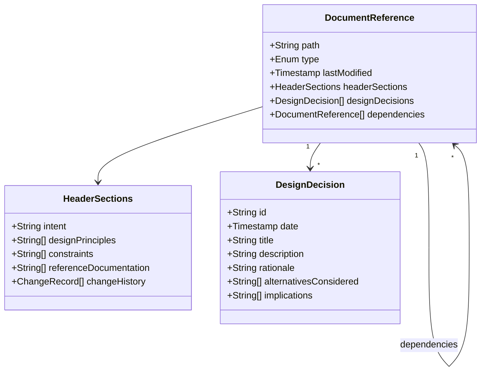

### Document Relationship

Captures relationships between documents in a directed graph:

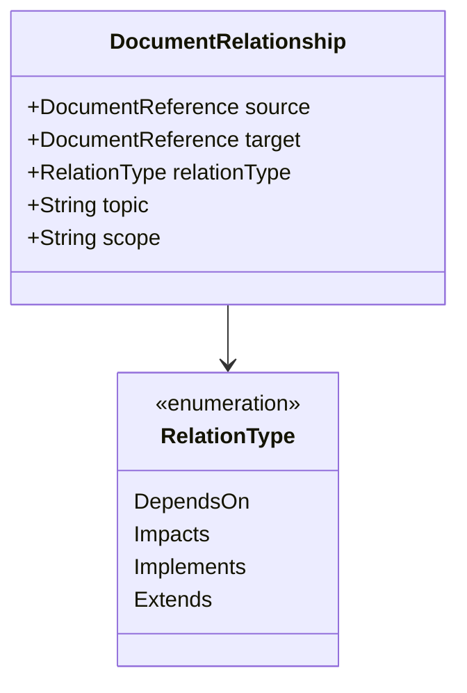

### Inconsistency Record

Records inconsistencies detected between documentation and code:

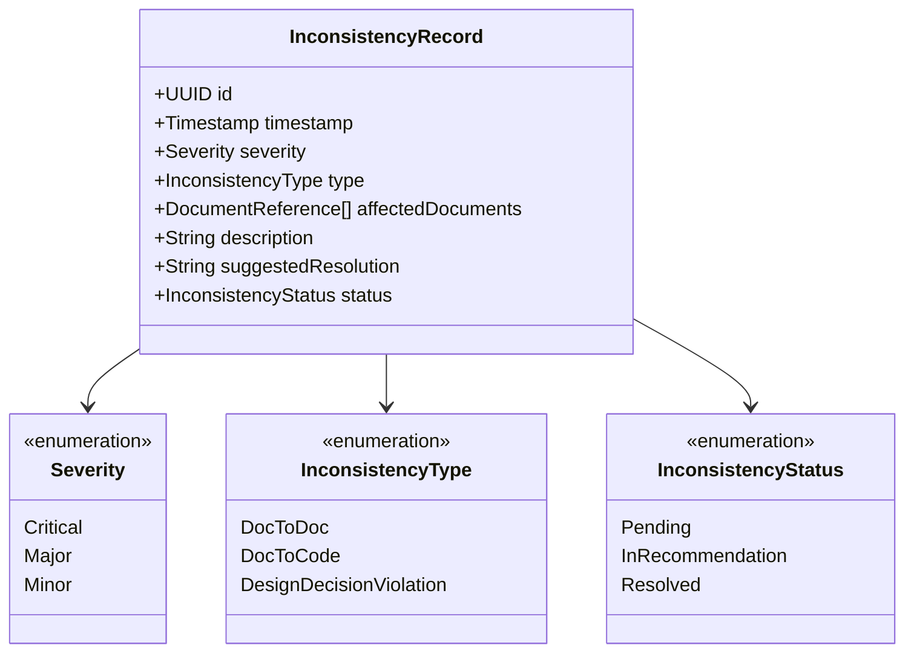

### Recommendation

Actionable suggestion generated from inconsistency records:

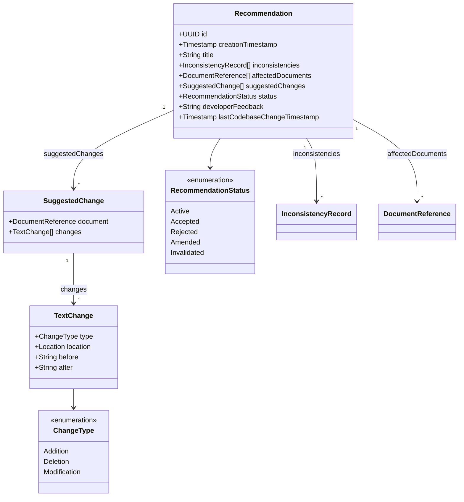

### Developer Decision

Records developer decisions on recommendations:

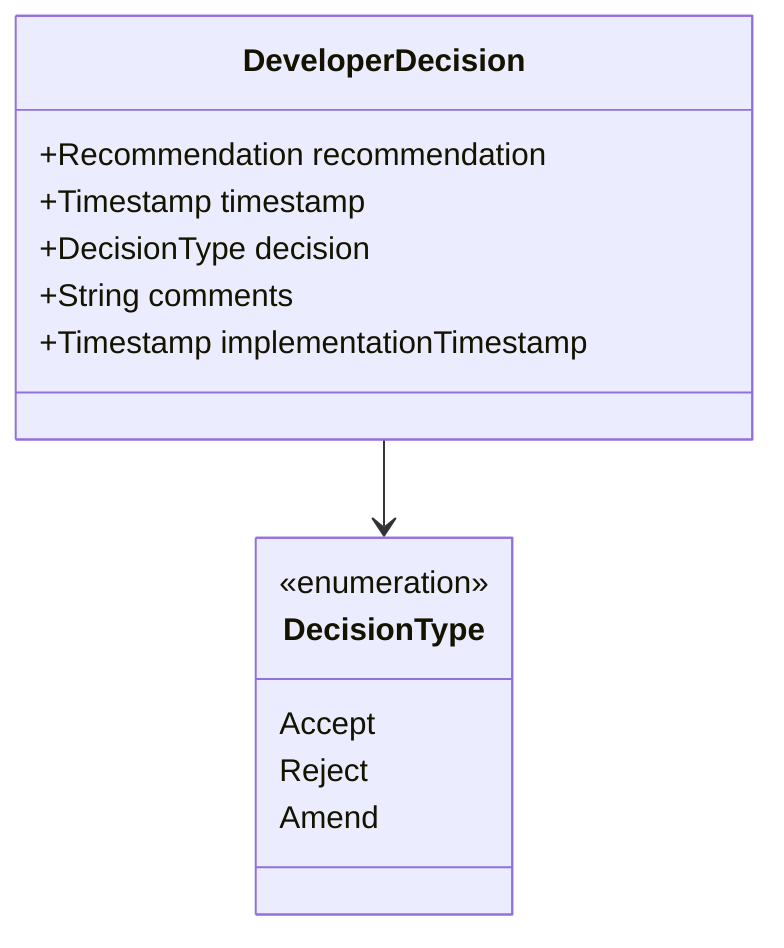

## File Formats

### PENDING_RECOMMENDATION.md Format

Each recommendation is stored as a Markdown file with this structure:

```markdown
# Documentation Consistency Recommendation

## Decision Required

Choose ONE option:
- [ ] ACCEPT - Apply these changes automatically
- [ ] REJECT - Discard this recommendation
- [ ] AMEND - Request changes to this recommendation

## Amendment Comments
<!-- If choosing AMEND, provide your feedback below this line -->


<!-- Do not modify below this line -->

## Recommendation: [TITLE]

**Created**: YYYY-MM-DD HH:MM:SS
**Priority**: [PRIORITY]

### Detected Inconsistency

[Description of the inconsistency detected between documentation and code or between multiple documentation files]

### Affected Files

- `path/to/file1.md`
- `path/to/file2.js`

### Suggested Changes

#### In `path/to/file1.md`:

```diff
- Original text that contains inconsistency
+ Suggested replacement text
```

#### In `path/to/file2.js`:

```diff
- Original code that contains inconsistency
+ Suggested replacement code
```

### Rationale

[Explanation of why these changes are recommended and how they improve consistency]
```

## MCP Server Data Models

### MCP Request Data Models

Core request models used by the MCP server:

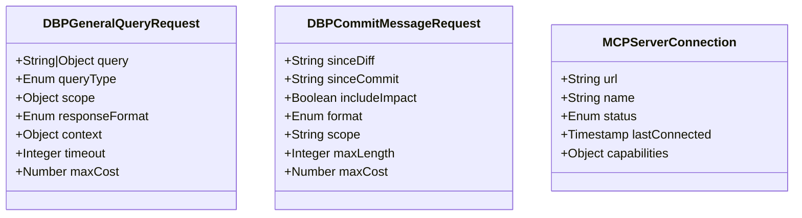

### LLM Coordination Data Models

Models used by the LLM coordination architecture:

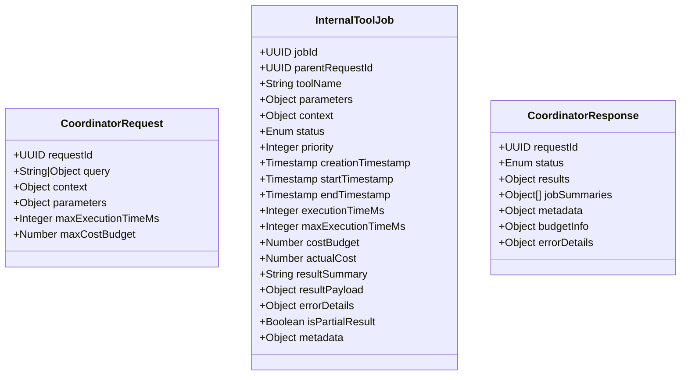

## Database Implementation

The system supports both SQLite and PostgreSQL databases:

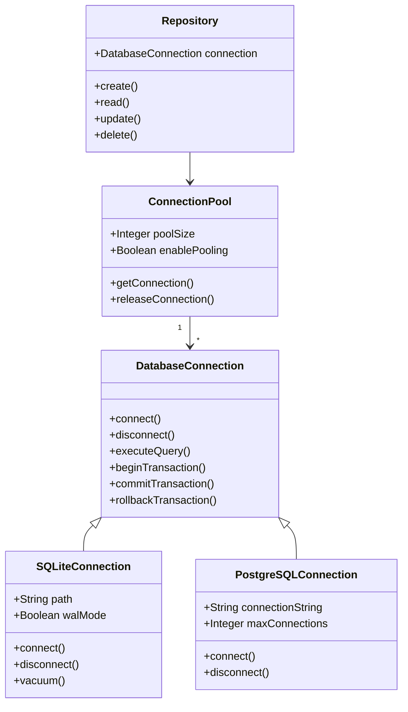

Key features of the database implementation:
- **SQLite Default**: Local SQLite database for zero-dependency operation
- **PostgreSQL Option**: Advanced deployments can use PostgreSQL
- **Write-Ahead Logging**: WAL mode for optimal concurrent access
- **Connection Pooling**: Efficient connection management
- **Alembic Migrations**: Managed schema evolution

## Change Detection Strategy

The system uses a sophisticated change detection approach:

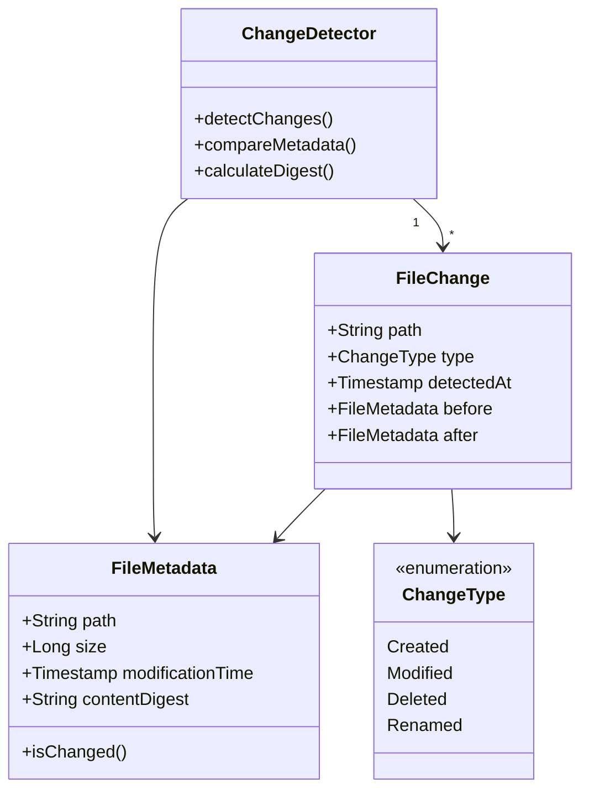

Key features:
1. **Multiple Indicators**: Uses modification time, file size, and content digest
2. **MD5 Digests**: Calculated for reliable change detection
3. **Cached Metadata**: Stored in database for fast comparison
4. **Efficient Processing**: Only processes actual content changes

## Memory vs. Database Trade-offs

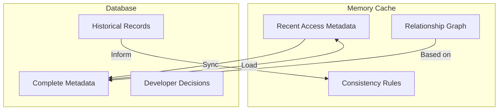

Key aspects:
1. **Memory Cache**: Frequently accessed metadata kept in memory
2. **Database Persistence**: Complete metadata stored in SQLite
3. **Lazy Loading**: Rarely accessed items loaded on demand
4. **Memory Pressure Monitoring**: Adaptive cache management
5. **Two-Tier Architecture**: Balances performance and persistence

## Security Model

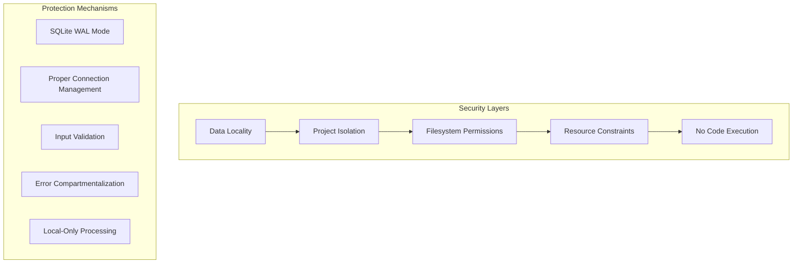

Key security features:
1. **Data Locality**: All processing performed locally, nothing leaves the system
2. **Project Isolation**: Complete separation between indexed projects
3. **Filesystem Permissions**: Uses existing file access controls
4. **No Code Execution**: System never executes arbitrary code
5. **Resource Constraints**: Limited CPU and memory usage with throttling

## Next Steps

Continue to the [Development Guide](05_development_guide.md) to learn how to start working with the DBP system.
