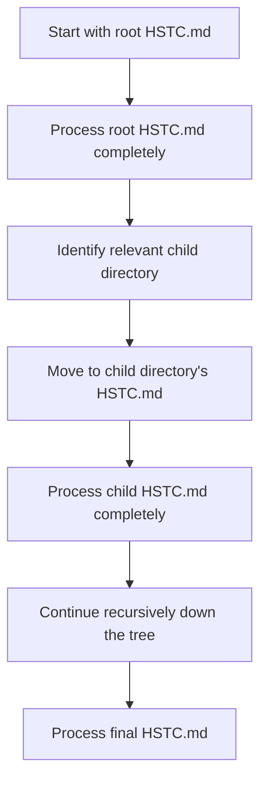
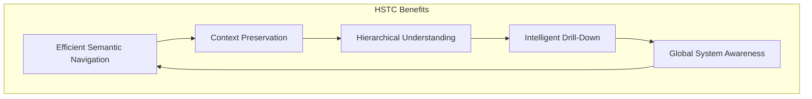
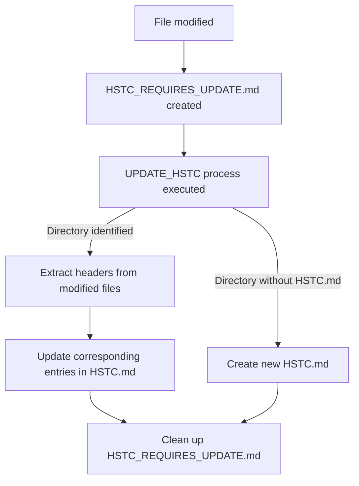
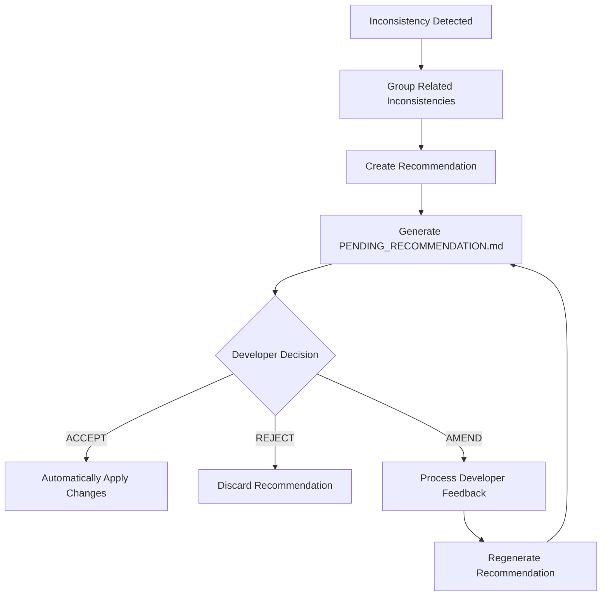
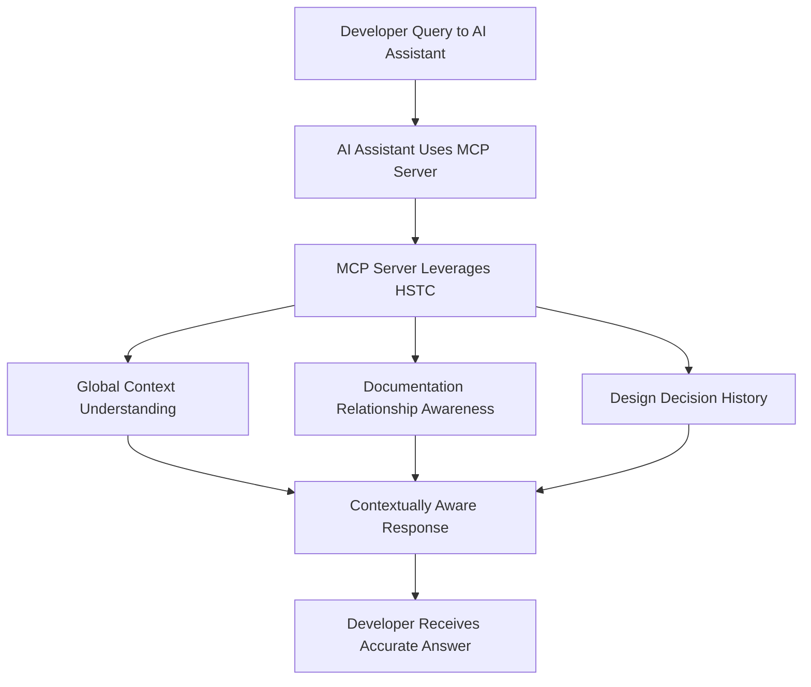

# Hierarchical Semantic Tree Context and Recommendations

This document provides a detailed explanation of the Hierarchical Semantic Tree Context (HSTC) approach and recommendation system in the Documentation-Based Programming (DBP) system, which are critical aspects for new developers to understand.

## Hierarchical Semantic Tree Context (HSTC)

The HSTC approach provides structured context data through a hierarchy of HSTC.md files located in each project directory. This creates a navigable semantic tree of the codebase that maintains valuable metadata even when original files are outside the context window.

### HSTC File Structure

Each HSTC.md file follows this standardized structure:

```markdown
# Hierarchical Semantic Tree Context: [Directory Name]

## Directory Purpose
[Brief description of this directory's purpose and role in the project architecture]

## Child Directories

### [Child Directory Name 1]
["Directory Purpose" section from child's HSTC.md]

### [Child Directory Name 2]
["Directory Purpose" section from child's HSTC.md]

## Local Files

### `filename1.py`
```yaml
source_file_intent: |
  [Content of source file intent section from file header]
  
source_file_design_principles: |
  [Content of design principles section from file header]
  
source_file_constraints: |
  [Content of constraints section from file header]
  
dependencies:
  - kind: <unknown(default)|codebase|system|other>
    dependency: <dependency>
  
change_history:
  - timestamp: "YYYY-MM-DDThh:mm:ssZ"
    summary: "[change summary]"
    details: "[change details]"
```
```

### HSTC Traversal Algorithm

When using HSTC to enrich context, the system follows this hierarchical traversal pattern:



This traversal ensures:
1. Always start from the top-level HSTC.md in the project root
2. Process each file completely before proceeding to any children
3. Follow a strict parent-to-child order, never skipping levels
4. Reach the most specific relevant directory for the current task

### Benefits of the HSTC Approach



1. **Efficient Semantic Navigation**: Quickly move through large codebases using the hierarchical structure
2. **Context Preservation**: Maintains critical file metadata even when original files are outside the context window
3. **Hierarchical Understanding**: Provides context at different levels of granularity
4. **Intelligent Drill-Down**: Enables focusing on relevant code areas based on semantic understanding
5. **Global System Awareness**: Maintains awareness of the entire system structure

### HSTC Lifecycle Management

The HSTC files are maintained through this process:



When you need to update HSTC files:
1. Run the script in coding_assistant/ to identify files to update
2. For each identified directory with HSTC_REQUIRES_UPDATE.md:
   - Read the modified filenames from the file
   - Extract headers and update corresponding entries in HSTC.md
   - Delete HSTC_REQUIRES_UPDATE.md after processing
3. For directories without HSTC.md:
   - Create new HSTC.md files with proper format

## Recommendation System

The recommendation system is a core feature that proactively helps maintain consistency between code and documentation.

### Recommendation Generation Process



### Recommendation File Structure

The PENDING_RECOMMENDATION.md file follows this structured format:

```markdown
# Documentation Consistency Recommendation

## Decision Required

Choose ONE option:
- [ ] ACCEPT - Apply these changes automatically
- [ ] REJECT - Discard this recommendation
- [ ] AMEND - Request changes to this recommendation

## Amendment Comments
<!-- If choosing AMEND, provide your feedback below this line -->


<!-- Do not modify below this line -->

## Recommendation: [TITLE]

**Created**: YYYY-MM-DD HH:MM:SS
**Priority**: [PRIORITY]

### Detected Inconsistency

[Description of the inconsistency detected between documentation and code or between multiple documentation files]

### Affected Files

- `path/to/file1.md`
- `path/to/file2.js`

### Suggested Changes

#### In `path/to/file1.md`:

```diff
- Original text that contains inconsistency
+ Suggested replacement text
```

#### In `path/to/file2.js`:

```diff
- Original code that contains inconsistency
+ Suggested replacement code
```

### Rationale

[Explanation of why these changes are recommended and how they improve consistency]
```

### Recommendation Workflow Example

To better understand the recommendation system, let's walk through a practical example:

1. **Detection**: A developer adds a new parameter to a function but doesn't update the documentation

2. **Analysis**: The system detects inconsistency between code implementation and documentation comment

3. **Recommendation Generation**: System creates PENDING_RECOMMENDATION.md with:
   ```diff
   # Documentation Consistency Recommendation
   
   ## Decision Required
   
   Choose ONE option:
   - [ ] ACCEPT - Apply these changes automatically
   - [ ] REJECT - Discard this recommendation
   - [ ] AMEND - Request changes to this recommendation
   
   ## Recommendation: Update authenticate_user function documentation
   
   **Created**: 2025-04-24 12:30:00
   **Priority**: Major
   
   ### Detected Inconsistency
   
   The authenticate_user function implementation includes a 'remember_me' parameter, but this parameter is not documented in the function docstring.
   
   ### Affected Files
   
   - `src/auth/service.py`
   
   ### Suggested Changes
   
   #### In `src/auth/service.py`:
   
   ```diff
   - def authenticate_user(credentials, options=None):
   -     """
   -     [Function intent]
   -     Authenticates a user against the system using provided credentials.
   -     
   -     [Design principles]
   -     Follows zero-trust architecture principles with complete validation.
   -     Uses stateless authentication with short-lived tokens.
   -     
   -     [Implementation details]
   -     Uses bcrypt for password verification and JWT for token generation.
   -     Applies rate limiting based on username to prevent brute force attacks.
   -     
   -     Args:
   -         credentials (dict): User login credentials
   -             - username (str): User's unique identifier
   -             - password (str): User's plaintext password
   -         options (dict, optional): Optional authentication parameters
   -             
   -     Returns:
   -         dict: Object containing JWT token and user profile
   -         
   -     Raises:
   -         AuthenticationError: When credentials are invalid
   -         ValidationError: When credentials format is incorrect
   -     """
   + def authenticate_user(credentials, options=None):
   +     """
   +     [Function intent]
   +     Authenticates a user against the system using provided credentials.
   +     
   +     [Design principles]
   +     Follows zero-trust architecture principles with complete validation.
   +     Uses stateless authentication with short-lived tokens.
   +     
   +     [Implementation details]
   +     Uses bcrypt for password verification and JWT for token generation.
   +     Applies rate limiting based on username to prevent brute force attacks.
   +     
   +     Args:
   +         credentials (dict): User login credentials
   +             - username (str): User's unique identifier
   +             - password (str): User's plaintext password
   +         options (dict, optional): Optional authentication parameters
   +             - remember_me (bool): Whether to extend token validity
   +             
   +     Returns:
   +         dict: Object containing JWT token and user profile
   +         
   +     Raises:
   +         AuthenticationError: When credentials are invalid
   +         ValidationError: When credentials format is incorrect
   +     """
   ```
   
   ### Rationale
   
   The function implementation contains a 'remember_me' parameter in the options dictionary that extends token validity, but this parameter is not documented. Adding this parameter to the documentation ensures developers know about this option and can use it correctly.
   ```

4. **Developer Review**: Developer reviews the recommendation and checks the checkbox for ACCEPT

5. **Application**: The system automatically applies the changes to the docstring in the file

6. **Completion**: The recommendation is removed, and the code and documentation are now consistent

### Invalid Recommendation Handling

Recommendations are automatically invalidated when:

1. The affected files change after the recommendation is generated
2. The inconsistency is resolved through other means
3. The recommendation is older than 7 days (configurable)

When a recommendation is invalidated:
- PENDING_RECOMMENDATION.md is removed
- System performs a fresh analysis of current state
- New recommendation is generated if inconsistencies still exist

## Integration with AI Assistants

The HSTC approach and recommendation system are critical components that enhance AI assistant interactions:



This integration ensures AI assistants:
1. Understand the entire project structure without parsing all code
2. Are aware of documentation relationships and dependencies
3. Can access the history of design decisions
4. Provide contextually accurate responses aligned with project standards

## Practical Tips for Working with HSTC and Recommendations

### When Working with HSTC Files

1. **Never Edit HSTC.md Files Directly**: Always update source files and use the update process
2. **Use the UPDATE_HSTC Process**: When modifying files, let the system update HSTC files
3. **Follow the Traversal Algorithm**: When gathering context, always start from the root
4. **Keep Directory Purpose Sections Updated**: These are used in parent HSTC.md files

### When Working with Recommendations

1. **Review Carefully**: Understand the inconsistency and suggested changes
2. **Choose AMEND When Needed**: If the suggestion isn't quite right, provide feedback
3. **Don't Manually Edit Below the Line**: Only modify the decision checkboxes and amendment comments
4. **One Decision at a Time**: Handle one recommendation before moving to the next

## Next Steps

Now that you understand both the HSTC approach and the recommendation system, you can:

1. Explore the actual HSTC.md files in the project
2. Watch for PENDING_RECOMMENDATION.md files as you work
3. Understand how your code changes impact documentation consistency
4. Use this knowledge to maintain better code-documentation alignment

Remember that the core philosophy of Documentation-Based Programming is treating documentation as the single source of truth. The HSTC approach and recommendation system are the key mechanisms that enable this philosophy to work in practice.
