# Implementation Status: Current State vs. Expected Architecture

This document provides an assessment of the current implementation state of the Documentation-Based Programming (DBP) system compared to the expected architecture. It helps new team members understand which parts of the system are implemented, which are in progress, and which are still in the planning phase.

## Table of Contents
- [Overview](#overview)
- [Implementation Status Matrix](#implementation-status-matrix)
- [Architecture vs. Implementation Gap Analysis](#architecture-vs-implementation-gap-analysis)
- [Component-by-Component Assessment](#component-by-component-assessment)
- [Integration Points Status](#integration-points-status)
- [Current Focus Areas](#current-focus-areas)
- [Development Roadmap](#development-roadmap)
- [Known Limitations and Challenges](#known-limitations-and-challenges)

## Overview

The Documentation-Based Programming system is currently in the **early development phase**, with significant portions still being implemented. While the architecture, design principles, and documentation are well-established, the actual implementation is progressing methodically with key components at various stages of completion.

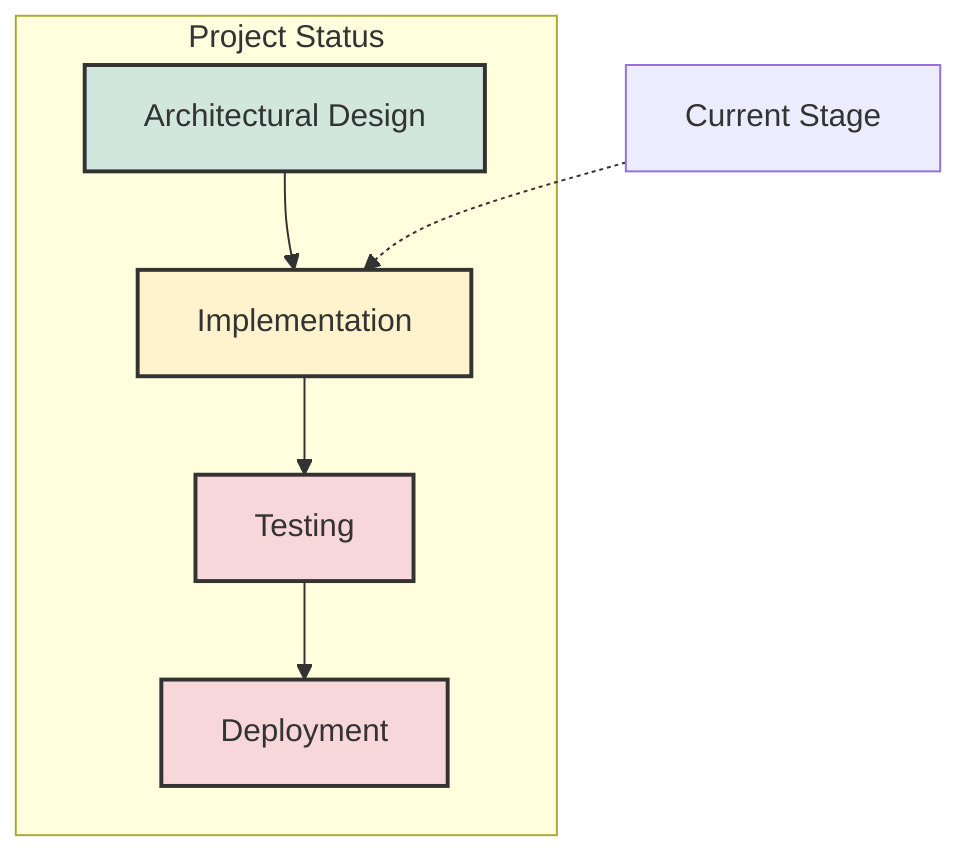

The system is in a phase where:
- Architecture and design documents are comprehensive and detailed
- Infrastructure components have early implementations
- Core logical components are in various stages of development
- Advanced features remain mostly conceptual or in planning
- Practical integration points are still being implemented
- Significant development work is needed to achieve full functionality

## Implementation Status Matrix

The following matrix provides a high-level view of the implementation status for each major component:

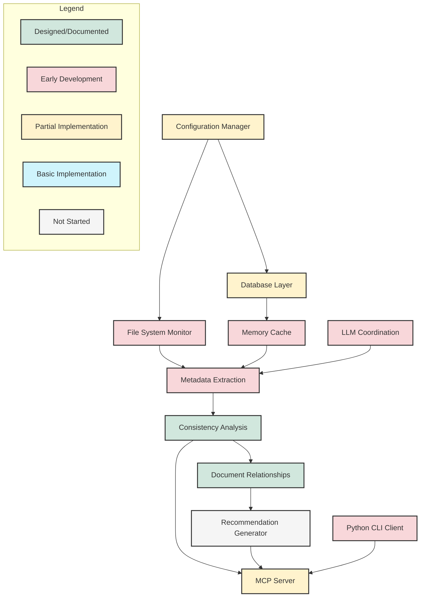

### Status Breakdown

| Component | Status | Current Phase | Documentation Status |
|-----------|--------|--------------|----------------------|
| Configuration Manager | Partial Implementation | Core functionality being implemented | Well-documented |
| Database Layer | Partial Implementation | Schema design and basic operations | Well-documented with data models |
| File System Monitor | Early Development | Framework established | Design documented |
| Memory Cache | Early Development | Basic structure | Design documented |
| Metadata Extraction | Early Development | LLM integration beginning | Design documented |
| Consistency Analysis | Designed | Preliminary prototyping | Design documented |
| Document Relationships | Designed | Early concept work | Design documented |
| Recommendation Generator | Not Started | Conceptual only | Design documented |
| MCP Server | Partial Implementation | Basic endpoints established | Well-documented |
| LLM Coordination | Early Development | Integration patterns being established | Design documented |
| Python CLI Client | Early Development | Command framework | Basic documentation |

## Architecture vs. Implementation Gap Analysis

This section provides a visual representation of the gap between the designed architecture and the current implementation state:

```mermaid
graph LR
    %% Define node styles
    classDef designed fill:#d1e7dd,stroke:#333,stroke-width:2px
    classDef inProgress fill:#fff3cd,stroke:#333,stroke-width:2px
    classDef notStarted fill:#f8d7da,stroke:#333,stroke-width:2px
    
    %% Expected architecture
    subgraph Expected["Expected Architecture"]
        E_CONFIG["Configuration Management"]:::designed
        E_DB["Database Layer"]:::designed
        E_MONITOR["File System Monitor"]:::designed
        E_META["Metadata Extraction"]:::designed
        E_CONSIST["Consistency Analysis"]:::designed
        E_REL["Document Relationships"]:::designed
        E_REC["Recommendation Generator"]:::designed
        E_MCP["MCP Server"]:::designed
        E_LLM["LLM Coordination"]:::designed
        E_CLI["Python CLI"]:::designed
    end
    
    %% Current implementation
    subgraph Current["Current Implementation"]
        C_CONFIG["Configuration Management\n(Partial Implementation)"]:::inProgress
        C_DB["Database Layer\n(Partial Implementation)"]:::inProgress
        C_MONITOR["File System Monitor\n(Early Development)"]:::inProgress
        C_META["Metadata Extraction\n(Early Development)"]:::inProgress
        C_CONSIST["Consistency Analysis\n(Designed Only)"]:::notStarted
        C_REL["Document Relationships\n(Designed Only)"]:::notStarted
        C_REC["Recommendation Generator\n(Not Started)"]:::notStarted
        C_MCP["MCP Server\n(Partial Implementation)"]:::inProgress
        C_LLM["LLM Coordination\n(Early Development)"]:::inProgress
        C_CLI["Python CLI\n(Early Development)"]:::inProgress
    end
```

The diagram illustrates the significant gap between the comprehensive architecture design and the early-stage implementation. While the design is thorough and well-documented, the implementation is in early phases for most components.

## Component-by-Component Assessment

### Configuration Management

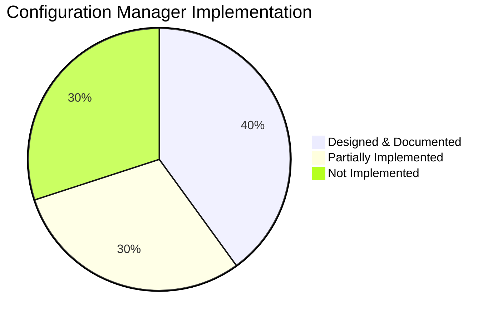

**Current Status:** Partial Implementation (~30%)

- ✅ Configuration schema design complete
- ✅ Basic file loading structure implemented
- ⚠️ Environment variable integration designed but not fully implemented
- ⚠️ Command-line parameter support partially implemented
- ❌ Schema validation not yet implemented
- ❌ Default value management system still in design phase
- ❌ Type safety with Pydantic models planned but not implemented

**Key Gaps:**
- Need to complete the implementation of the configuration loading system
- Schema validation and type safety features require implementation
- Configuration change detection not yet implemented

### Database Layer

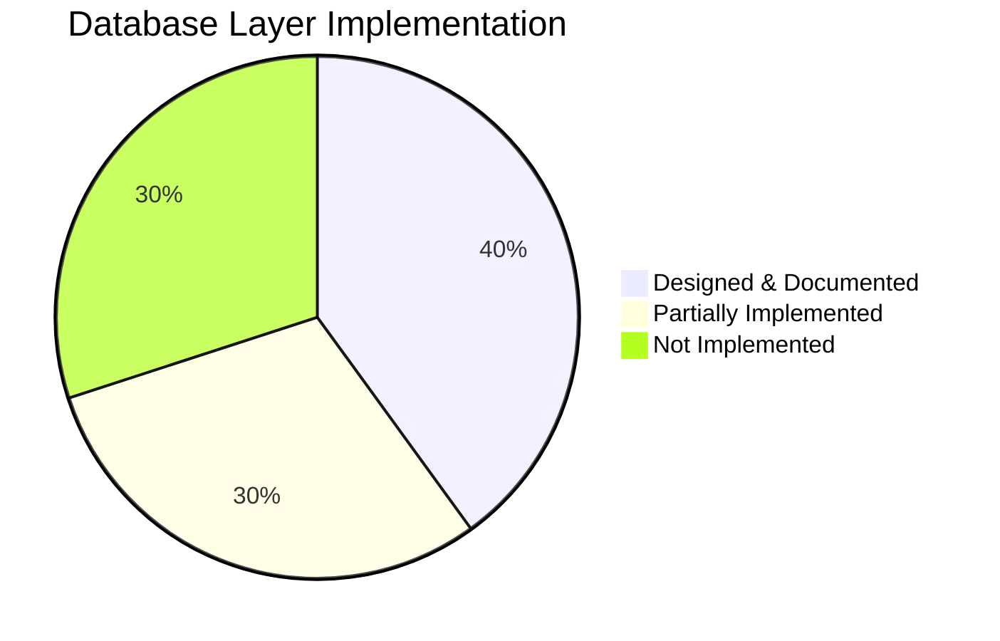

**Current Status:** Partial Implementation (~30%)

- ✅ Database schema design complete
- ✅ Basic SQLite connection structure implemented
- ⚠️ Repository pattern defined but not fully implemented
- ⚠️ Basic transaction handling partially implemented
- ❌ Migration strategy designed but not implemented
- ❌ Thread-safe connection pooling not implemented
- ❌ Alembic integration not yet started

**Key Gaps:**
- Thread safety and connection pooling implementation needed
- Schema migration system needs to be implemented
- Repository pattern implementation needs to be completed

### File System Monitor

**Current Status:** Early Development (~20%)

- ✅ Design for cross-platform monitoring complete
- ✅ Basic monitoring framework established
- ⚠️ Linux inotify implementation in early development
- ❌ macOS FSEvents integration not started
- ❌ Windows ReadDirectoryChangesW integration not started
- ❌ Event debouncing not implemented
- ❌ Gitignore pattern support not implemented

**Key Gaps:**
- Need to complete platform-specific implementations
- Event processing and debouncing system needs implementation
- Integration with other components still pending

### Memory Cache

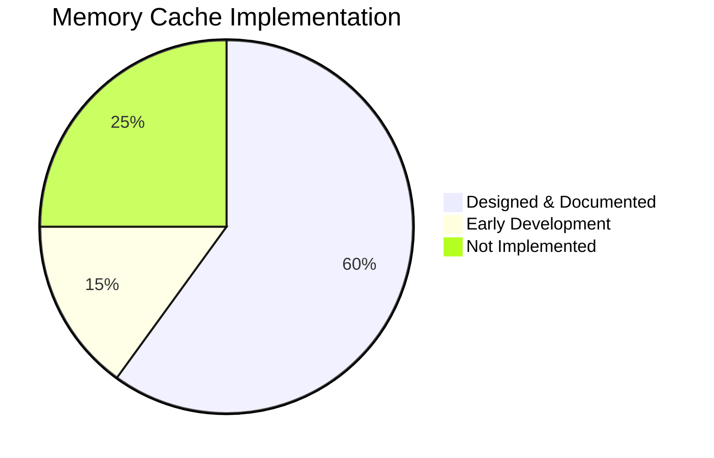

**Current Status:** Early Development (~15%)

- ✅ Cache design and structure documented
- ✅ Basic in-memory data structures defined
- ⚠️ Simple caching mechanism prototype in place
- ❌ Thread-safety not implemented
- ❌ Synchronization with database not implemented
- ❌ Cache invalidation strategies not implemented
- ❌ Performance optimization not started

**Key Gaps:**
- Thread-safe implementation required
- Database synchronization mechanism needed
- Cache management and invalidation strategies to be implemented

### Metadata Extraction

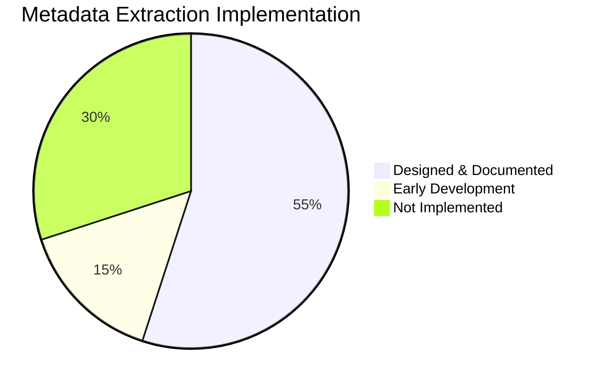

**Current Status:** Early Development (~15%)

- ✅ Metadata schema fully designed
- ✅ LLM-based extraction approach documented
- ✅ Integration approach with Claude 3.7 Sonnet defined
- ⚠️ Basic extraction structure implemented
- ❌ Multi-language support not yet implemented
- ❌ File header parsing not yet implemented
- ❌ Function and class documentation extraction not implemented
- ❌ Validation of extracted metadata not implemented

**Key Gaps:**
- LLM integration needs to be completed
- Parser for different programming languages needs implementation
- Metadata validation system needs to be built

### Consistency Analysis

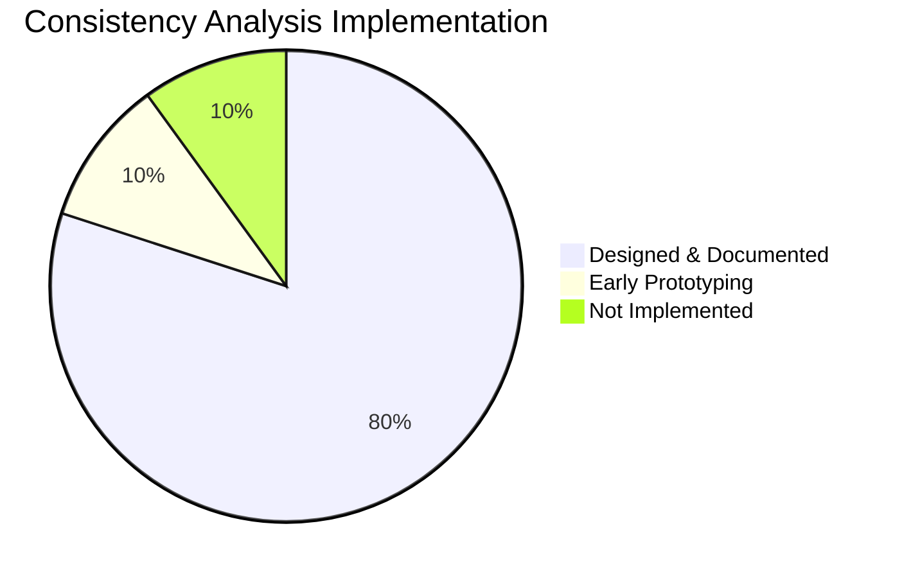

**Current Status:** Designed (~10% early prototyping)

- ✅ Consistency checking approach fully documented
- ✅ Algorithms for consistency analysis designed
- ✅ Data structures for tracking inconsistencies defined
- ⚠️ Preliminary consistency checking prototype started
- ❌ Documentation-to-documentation analysis not implemented
- ❌ Documentation-to-code verification not implemented
- ❌ Impact analysis not implemented
- ❌ Integration with other components not started

**Key Gaps:**
- Core analysis algorithms need implementation
- Integration with metadata extraction required
- Inconsistency tracking system needed

### Document Relationships

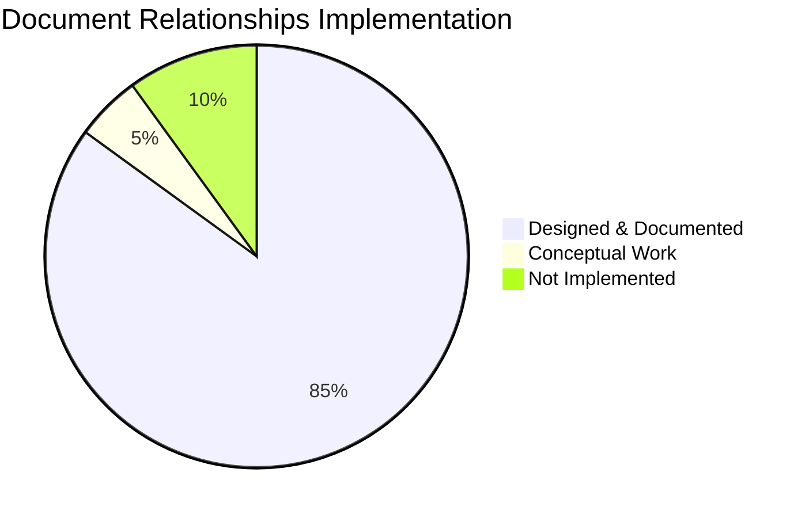

**Current Status:** Designed (~5% conceptual work)

- ✅ Relationship model fully documented
- ✅ Graph representation approach designed
- ✅ Relationship types defined
- ⚠️ Early conceptual work on graph implementation
- ❌ Relationship tracking not implemented
- ❌ Documentation dependency mapping not implemented
- ❌ Impact analysis not started
- ❌ Visualization not started

**Key Gaps:**
- Graph database or representation needs implementation
- Relationship detection and mapping requires development
- Integration with consistency analysis needed

### Recommendation Generator

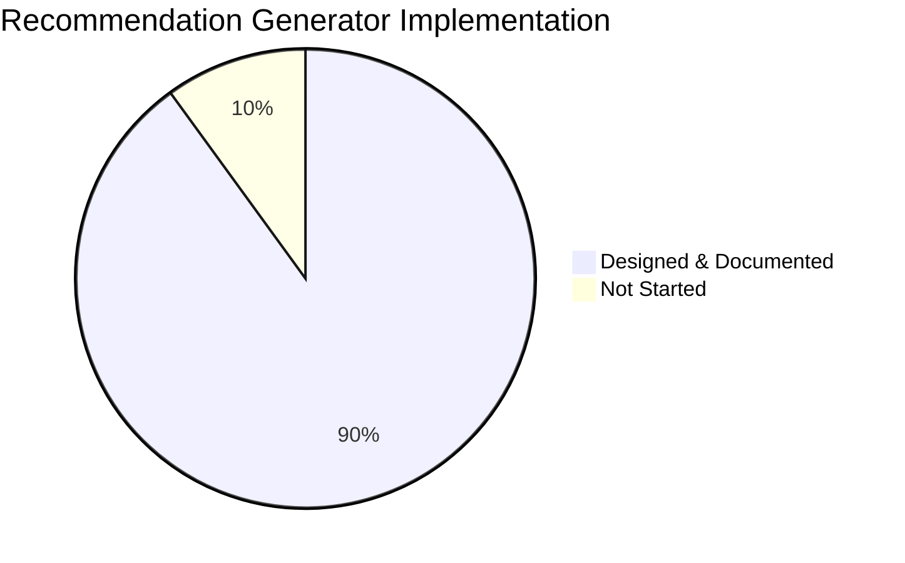

**Current Status:** Not Started (Design only)

- ✅ Recommendation format and structure documented
- ✅ Generation strategies defined
- ✅ Developer feedback system designed
- ❌ No implementation started
- ❌ Inconsistency grouping not implemented
- ❌ Recommendation prioritization not implemented
- ❌ Change suggestion generation not implemented
- ❌ Developer feedback processing not implemented

**Key Gaps:**
- Entire component needs implementation
- Integration with consistency analysis required
- Developer feedback system needs building

### MCP Server

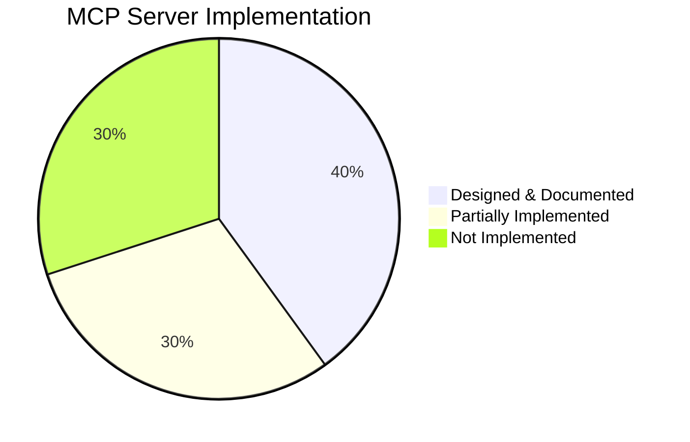

**Current Status:** Partial Implementation (~30%)

- ✅ MCP protocol fully documented
- ✅ REST API interface design complete
- ✅ Basic server infrastructure implemented
- ⚠️ Tool registration partial implementation
- ⚠️ Request handling partially implemented
- ❌ Response validation not implemented
- ❌ Error handling system not fully implemented
- ❌ Resource management not implemented
- ❌ Security controls not implemented

**Key Gaps:**
- Complete tool registration and execution system
- Implement response validation and formatting
- Add security controls and resource management

### LLM Coordination

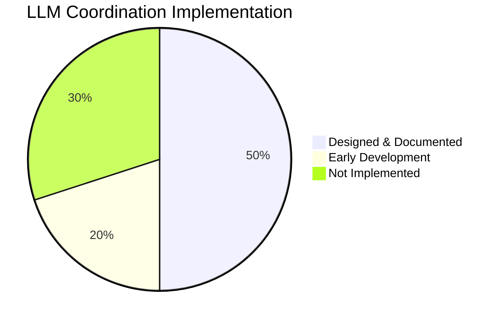

**Current Status:** Early Development (~20%)

- ✅ Multi-LLM orchestration approach documented
- ✅ Amazon Nova Lite integration design complete
- ✅ Claude 3.x model support designed
- ⚠️ Basic coordination structure implemented
- ❌ Asynchronous job management not implemented
- ❌ Result aggregation not implemented
- ❌ Cost budget management not implemented
- ❌ Timeout handling not implemented

**Key Gaps:**
- Job management system needs implementation
- LLM integration needs completion
- Cost management features require implementation

### Python CLI Client

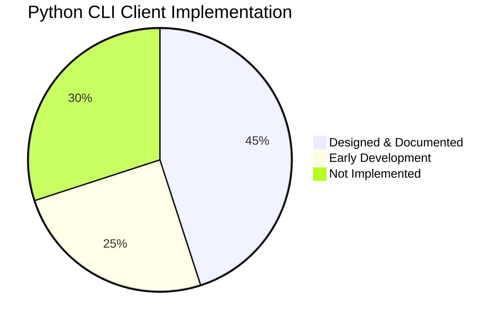

**Current Status:** Early Development (~25%)

- ✅ CLI interface design complete
- ✅ Command structure designed
- ⚠️ Basic command framework implemented
- ⚠️ Server connection handling partially implemented
- ❌ Request formatting not fully implemented
- ❌ Response display not implemented
- ❌ Error handling not fully implemented
- ❌ Scripting support not implemented

**Key Gaps:**
- Complete command implementation
- Add response formatting and display
- Implement error handling and user feedback
- Add scripting capabilities

## Integration Points Status

This diagram shows the status of integration between major system components:

```mermaid
flowchart TB
    %% Define node styles
    classDef implemented fill:#cff4fc,stroke:#333,stroke-width:2px
    classDef inProgress fill:#fff3cd,stroke:#333,stroke-width:2px
    classDef notStarted fill:#f8d7da,stroke:#333,stroke-width:2px

    %% Integration status nodes
    subgraph DB_CACHE["Database ↔ Memory Cache"]
        DB_CACHE_STATUS["EARLY PHASE"]:::inProgress
    end
    subgraph MON_META["File Monitor ↔ Metadata Extraction"]
        MON_META_STATUS["DESIGNED ONLY"]:::notStarted
    end
    subgraph META_CONSIST["Metadata Extraction ↔ Consistency Analysis"]
        META_CONSIST_STATUS["NOT STARTED"]:::notStarted
    end
    subgraph CONSIST_DOC["Consistency Analysis ↔ Document Relationships"]
        CONSIST_DOC_STATUS["NOT STARTED"]:::notStarted
    end
    subgraph DOC_REC["Document Relationships ↔ Recommendation Generator"]
        DOC_REC_STATUS["NOT STARTED"]:::notStarted
    end
    subgraph REC_MCP["Recommendation Generator ↔ MCP Server"]
        REC_MCP_STATUS["NOT STARTED"]:::notStarted
    end
    subgraph LLM_META["LLM Coordination ↔ Metadata Extraction"]
        LLM_META_STATUS["EARLY PHASE"]:::inProgress
    end
    subgraph MCP_CLI["MCP Server ↔ Python CLI"]
        MCP_CLI_STATUS["EARLY PHASE"]:::inProgress
    end
```

### Integration Status Summary

| Integration Point | Status | Notes |
|-------------------|--------|-------|
| Database ↔ Memory Cache | Early Phase | Basic connection established, synchronization not implemented |
| File Monitor ↔ Metadata Extraction | Designed Only | Interface defined but not implemented |
| Metadata Extraction ↔ Consistency Analysis | Not Started | Depends on metadata extraction completion |
| Consistency Analysis ↔ Document Relationships | Not Started | Both components in design phase |
| Document Relationships ↔ Recommendation Generator | Not Started | Recommendation generator not started |
| Recommendation Generator ↔ MCP Server | Not Started | Recommendation generator not started |
| LLM Coordination ↔ Metadata Extraction | Early Phase | Basic integration framework established |
| MCP Server ↔ Python CLI | Early Phase | Basic request/response cycle implemented |

## Current Focus Areas

The team is currently focused on these priority areas:

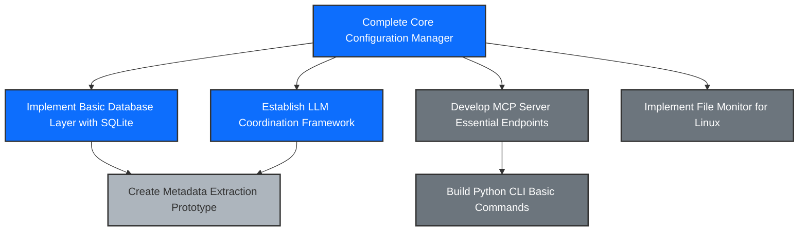

### Current Sprint Focus (April 2025)

The development team is focusing on establishing the fundamental infrastructure components:

1. **Configuration Management System**
   - Completing core configuration loading
   - Implementing validation framework
   - Adding environment variable support

2. **Database Layer**
   - Finalizing SQLite implementation
   - Establishing basic repository pattern
   - Setting up initial schema

3. **LLM Coordination Framework**
   - Building Amazon Nova Lite integration
   - Creating prompt template system
   - Establishing job management framework

4. **MCP Server Foundation**
   - Implementing REST API endpoints
   - Setting up tool registration framework
   - Building basic request/response handling

## Development Roadmap

The system development follows this strategic roadmap:

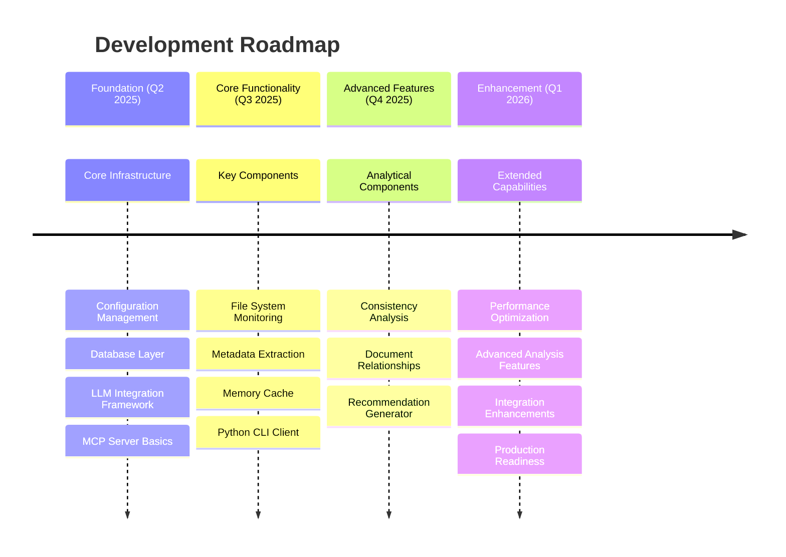

### Development Phases

#### Foundation Phase (Q2 2025)

This phase focuses on establishing the fundamental infrastructure required for the system:

- Complete Configuration Management implementation
- Implement Database Layer with SQLite
- Build LLM Coordination Framework
- Establish MCP Server foundation
- Create basic Python CLI structure

#### Core Functionality Phase (Q3 2025)

This phase will implement the essential components that enable the system's primary functions:

- Complete File System Monitoring with cross-platform support
- Implement Metadata Extraction with LLM integration
- Develop Memory Cache with database synchronization
- Enhance Python CLI with full command set
- Add comprehensive error handling

#### Advanced Features Phase (Q4 2025)

This phase will build the analytical components that provide the system's key value:

- Implement Consistency Analysis engine
- Build Document Relationships tracking
- Develop Recommendation Generator
- Create developer feedback system
- Integrate all components into cohesive workflow

#### Enhancement Phase (Q1 2026)

This phase will optimize the system and prepare it for production use:

- Performance optimization for large codebases
- Advanced analysis features
- Integration enhancements
- Production readiness improvements
- Extended capabilities

## Known Limitations and Challenges

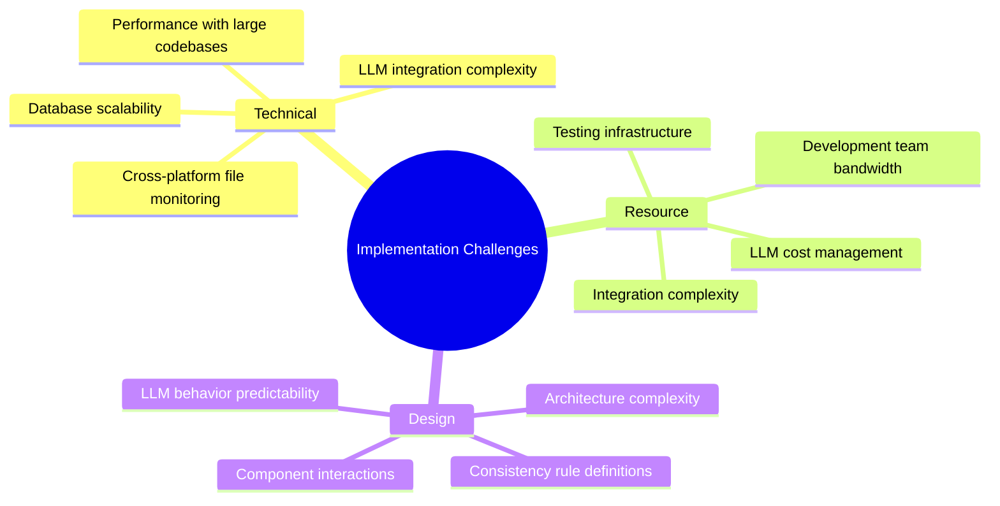

### Current Technical Challenges

1. **LLM Integration Complexity**
   - Ensuring consistent LLM behavior across different queries
   - Managing LLM context limitations
   - Dealing with LLM response variability
   - Optimizing prompt templates for specific tasks

2. **Performance Considerations**
   - Ensuring system remains performant with large codebases
   - Balancing memory usage and response time
   - Managing LLM API latency
   - Optimizing database operations

3. **Cross-Platform Compatibility**
   - Supporting different file system notification APIs
   - Ensuring consistent behavior across operating systems
   - Managing platform-specific edge cases
   - Testing across multiple environments

4. **Integration Challenges**
   - Coordinating multiple independent components
   - Managing asynchronous operations
   - Ensuring consistent error handling
   - Creating robust interfaces between components

### Implementation Risks

1. **LLM Dependency Risks**
   - Changes to LLM APIs or models could require significant rework
   - LLM performance may vary across different types of code or documentation
   - Cost management for LLM API usage
   - Handling LLM API rate limits and availability

2. **Scalability Concerns**
   - Performance degradation with very large codebases
   - Memory usage with extensive metadata
   - Database growth over time
   - Processing bottlenecks during initial indexing

3. **Complex Component Interactions**
   - Ensuring all components work together correctly
   - Managing cross-component dependencies
   - Handling partial failures in the component chain
   - Maintaining consistent state across components
