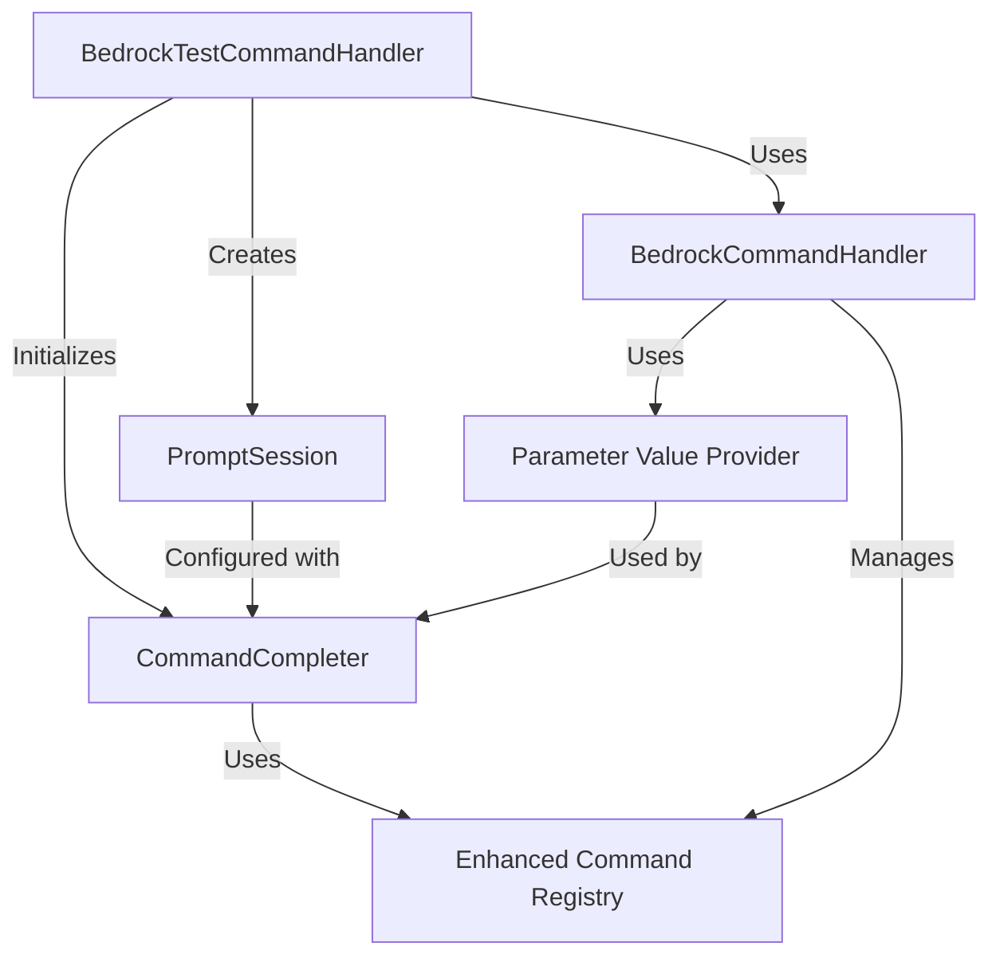

# Smart CLI Command Framework Implementation Plan

## Overview

This implementation plan outlines the approach for enhancing the Bedrock test CLI with smart command auto-completion capabilities. The solution will focus on improving the interactive command experience in the Bedrock chat interface by providing auto-completion for commands that start with "/".

## Requirements

Based on our discussions, the implementation should meet the following requirements:

1. **Scope**: Enhance only the interactive Bedrock chat commands that already use the "/" prefix
2. **Command Discovery**: Use static registration of commands in a central registry
3. **Auto-completion Features**: Provide command name and parameter value completion
4. **Framework**: Enhance the existing prompt_toolkit implementation already in use
5. **User Experience**: Provide tab completion showing all available options with descriptions

## Architecture

The solution will consist of the following components:

## Key Components

### 1. Enhanced Command Registry

We'll enhance the existing command registry in `BedrockCommandHandler` to include metadata required for auto-completion:

- Command name
- Help text
- Parameters with their own help text
- Parameter value providers (functions that return possible values)

### 2. CommandCompleter

A new class implementing prompt_toolkit's `Completer` interface to provide auto-completion for:

- Command names (e.g., `/he` → `/help`)
- Parameter names (e.g., `/config p` → `/config profile`)
- Parameter values (e.g., `/config profile c` → `/config profile claude`)

### 3. Parameter Value Providers

Functions that dynamically generate parameter value completions based on context:

- Profile names from model parameter profiles
- Enum values from parameter constraints
- Boolean values (True/False)
- Dynamic values based on current state

### 4. Integration with PromptSession

Updates to the Bedrock test CLI to use the CommandCompleter with prompt_toolkit's PromptSession.

## Implementation Strategy

The implementation will be divided into four phases:

1. **Foundation**: Create enhanced command registry and basic completer
2. **Command Completion**: Implement command name auto-completion
3. **Parameter Completion**: Add parameter name and value completion
4. **Integration**: Integrate with existing Bedrock test CLI code

## Files to Modify

1. `src/dbp_cli/commands/test/bedrock_commands.py`
   - Enhance command registry
   - Add parameter value providers

2. `src/dbp_cli/commands/test/bedrock.py`
   - Update `_run_interactive_chat` method to use enhanced completer

## Files to Create

1. `src/dbp_cli/commands/test/command_completion.py`
   - Implement `CommandCompleter` class
   - Implement parameter value providers
   - Define completion utilities

## Detailed Implementation Plan

The following sections outline the detailed implementation for each phase.
